# Flowchart: Content Acquisition Layer

This flowchart details the critical transformation step where a `GameManifest` with package-level instructions is converted into one with specific, actionable file operations.

```mermaid
%%{init: {
  'theme': 'base',
  'themeVariables': {
    'primaryColor': '#e2e8f0',
    'primaryTextColor': '#1a202c',
    'primaryBorderColor': '#4a5568',
    'lineColor': '#2d3748',
    'secondaryColor': '#f7fafc',
    'tertiaryColor': '#edf2f7',
    'background': '#ffffff',
    'mainBkg': '#f7fafc',
    'secondBkg': '#edf2f7',
    'nodeBorder': '#4a5568',
    'clusterBkg': '#f7fafc',
    'clusterBorder': '#a0aec0',
    'edgeLabelBackground': '#ffffff'
  }
}}%%

graph TB
    subgraph SI ["📥 Service Input"]
        A["📋 Resolved<br/>GameManifest<br/>From Resolution
<br>"]
        B["🎯 Provider<br/>Selection Logic<br/>Source Analysis
<br>"]
        C["⚡ AcquireContent<br/>Async Method<br/>Provider Invoke
<br>"]
    end

    subgraph PT ["🔌 Provider Types"]
        D1["🌐 HttpContent<br/>Provider<br/>Download Handler
<br>"]
        D2["🐙 GitHubContent<br/>Provider<br/>Release Manager
<br>"] 
        D3["📁 FileSystem<br/>Provider<br/>Local Access
<br>"]
    end

    subgraph HPW ["🌐 Http Provider Workflow"]
        E1["📦 Detect Package<br/>SourceType<br/>Validation Check
<br>"]
        E2["⬇️ Download<br/>Archive File<br/>Progress Tracking
<br>"]
        E3["📂 Extract Archive<br/>Temp Directory<br/>File Extraction
<br>"]
        E4["🔍 Scan Extracted<br/>Files Structure<br/>Content Analysis
<br>"]
        E5["🔄 Transform<br/>Manifest Entries<br/>Operation Mapping
<br>"]
        E6["✅ Return Updated<br/>Manifest<br/>Ready for Assembly
<br>"]
    end

    subgraph PTP ["➡️ Pass-Through Providers"]
        F1["➡️ GitHub Provider<br/>No-Op Process<br/>Remote Files Ready
<br>"]
        F2["➡️ FileSystem Provider<br/>No-Op Process<br/>Local Files Ready
<br>"]
    end

    subgraph SO ["📤 Service Output"]
        G["📋 Updated<br/>GameManifest<br/>File Operations
<br>"]
        H["🎯 Ready for<br/>Assembly Stage<br/>Workspace Creation
<br>"]
    end

    A -->|Input| B
    B -->|Route| C
    
    C -->|HTTP Source| D1
    C -->|GitHub Source| D2
    C -->|Local Source| D3
    
    D1 -->|Package Found| E1
    E1 -->|Download| E2
    E2 -->|Extract| E3
    E3 -->|Analyze| E4
    E4 -->|Transform| E5
    E5 -->|Complete| E6
    
    D2 -->|Direct Files| F1
    D3 -->|Local Files| F2
    
    E6 -->|Updated Manifest| G
    F1 -->|Pass Through| G
    F2 -->|Pass Through| G
    
    G -->|Final Output| H

    classDef service fill:#38a169,stroke:#2f855a,stroke-width:2px,color:#ffffff
    classDef provider fill:#e53e3e,stroke:#c53030,stroke-width:2px,color:#ffffff
    classDef httpWorkflow fill:#805ad5,stroke:#6b46c1,stroke-width:2px,color:#ffffff
    classDef passThrough fill:#ed8936,stroke:#dd6b20,stroke-width:2px,color:#ffffff
    classDef output fill:#3182ce,stroke:#2c5282,stroke-width:2px,color:#ffffff

    class A,B,C service
    class D1,D2,D3 provider
    class E1,E2,E3,E4,E5,E6 httpWorkflow
    class F1,F2 passThrough
    class G,H output
```

**Provider Transformation Logic:**

| Provider | Input Type | Transformation Process | Output Type | Key Operations |
|----------|------------|----------------------|-------------|----------------|
| **HttpContent** | `Package` entries | Download → Extract → Scan → Transform | `Copy`/`Patch` entries | Archive processing |
| **GitHub** | `Remote` entries | Pass-through validation | Unchanged manifest | Direct downloads |
| **FileSystem** | `Copy` entries | Path validation | Unchanged manifest | Local file access |
