# Flowchart: Workspace Assembly Layer

This flowchart details the final stage where a fully resolved and acquired `GameManifest` is used to build the isolated game workspace.

```mermaid
%%{init: {
  'theme': 'base',
  'themeVariables': {
    'primaryColor': '#e2e8f0',
    'primaryTextColor': '#1a202c',
    'primaryBorderColor': '#4a5568',
    'lineColor': '#2d3748',
    'secondaryColor': '#f7fafc',
    'tertiaryColor': '#edf2f7',
    'background': '#ffffff',
    'mainBkg': '#f7fafc',
    'secondBkg': '#edf2f7',
    'nodeBorder': '#4a5568',
    'clusterBkg': '#f7fafc',
    'clusterBorder': '#a0aec0',
    'edgeLabelBackground': '#ffffff'
  }
}}%%

graph TB
    subgraph SL ["🔧 Service Layer"]
        A["📋 Acquired<br/>GameManifest<br/>File Operations
<br>"]
        B["🏗️ WorkspaceManager<br/>PrepareWorkspace<br/>Async Method
<br>"]
        C["⚙️ Strategy<br/>Selection Logic<br/>Based on Profile
<br>"]
    end

    subgraph ST ["🛠️ Strategy Types"]
        D1["📁 FullCopy<br/>Strategy<br/>Complete Duplication
<br>"]
        D2["🔗 SymlinkOnly<br/>Strategy<br/>Link Creation
<br>"]
        D3["⚖️ HybridCopy<br/>Strategy<br/>Balanced Approach
<br>"]
        D4["🔧 HardLink<br/>Strategy<br/>Filesystem Links
<br>"]
    end

    subgraph FP ["📂 File Processing"]
        E1["🔄 ProcessManifest<br/>FilesAsync<br/>Iteration Logic
<br>"]
        E2["🎯 SourceType<br/>Switch Statement<br/>Operation Router
<br>"]
    end

    subgraph FO ["⚡ File Operations"]
        F1["📄 Copy Operation<br/>IFileOperations<br/>CopyFileAsync
<br>"]
        F2["🔗 Symlink Operation<br/>IFileOperations<br/>CreateSymlinkAsync
<br>"]
        F3["⬇️ Remote Operation<br/>IFileOperations<br/>DownloadFileAsync
<br>"]
        F4["🩹 Patch Operation<br/>IFileOperations<br/>ApplyPatchAsync
<br>"]
    end

    subgraph WR ["✅ Workspace Result"]
        G["📁 Files Placed<br/>in Workspace<br/>Directory Structure
<br>"]
        H["✅ All Files<br/>Processed<br/>Operation Complete
<br>"]
        I["📊 WorkspaceInfo<br/>Created<br/>Metadata Generated
<br>"]
        J["🎯 Installation<br/>Complete<br/>Ready for Launch
<br>"]
    end

    A -->|Input| B
    B -->|Configure| C
    
    C -->|Select| D1
    C -->|Select| D2
    C -->|Select| D3
    C -->|Select| D4
    
    D1 -->|Execute| E1
    D2 -->|Execute| E1
    D3 -->|Execute| E1
    D4 -->|Execute| E1
    
    E1 -->|Process| E2
    
    E2 -->|Copy Type| F1
    E2 -->|Symlink Type| F2
    E2 -->|Remote Type| F3
    E2 -->|Patch Type| F4
    
    F1 -->|Complete| G
    F2 -->|Complete| G
    F3 -->|Complete| G
    F4 -->|Complete| G
    
    G -->|All Done| H
    H -->|Generate| I
    I -->|Finalize| J

    classDef service fill:#38a169,stroke:#2f855a,stroke-width:2px,color:#ffffff
    classDef strategy fill:#e53e3e,stroke:#c53030,stroke-width:2px,color:#ffffff
    classDef processing fill:#805ad5,stroke:#6b46c1,stroke-width:2px,color:#ffffff
    classDef operations fill:#ed8936,stroke:#dd6b20,stroke-width:2px,color:#ffffff
    classDef result fill:#3182ce,stroke:#2c5282,stroke-width:3px,color:#ffffff

    class A,B,C service
    class D1,D2,D3,D4 strategy
    class E1,E2 processing
    class F1,F2,F3,F4 operations
    class G,H,I,J result
```

**Strategy Comparison Matrix:**

| Strategy | Disk Usage | Performance | Platform Compatibility | Admin Rights | Use Case |
|----------|------------|-------------|----------------------|--------------|----------|
| **FullCopy** | High | Fast Launch | Maximum | No | Stable releases |
| **SymlinkOnly** | Minimal | Fast Launch | Platform-dependent | Sometimes | Development |
| **HybridCopy** | Medium | Balanced | Good | No | General use |
| **HardLink** | Low | Fast Launch | Same volume only | No | Power users |
