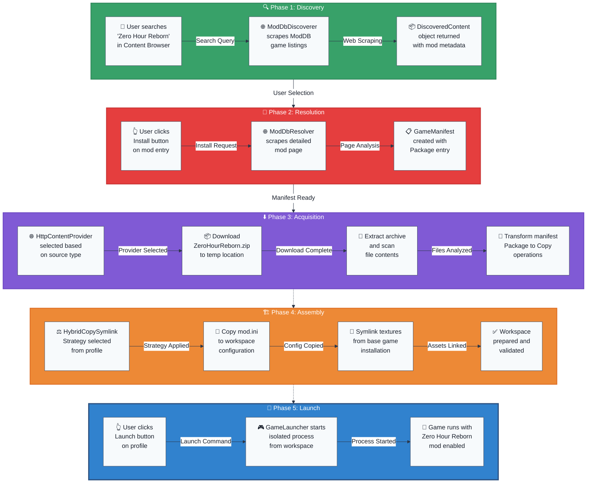

# Flowchart: Complete User Installation Flow (ModDB Example)

This flowchart illustrates the end-to-end process when a user installs a mod from ModDB, showing how all architectural layers work together.

**End-to-End Data Flow Analysis:**

| Phase | Input Data | Processing Method | Output Data | Key Transformation |
|-------|------------|-------------------|-------------|-------------------|
| **Discovery** | Search query string | Web scraping + API calls | `DiscoveredContent` collection | Raw search → Structured results |
| **Resolution** | Source URL + metadata | Page analysis + parsing | `GameManifest` (Package type) | Lightweight data → Installation plan |
| **Acquisition** | Package manifest | Download + extraction + scan | `GameManifest` (File ops) | Package reference → File operations |
| **Assembly** | File operations list | Strategy execution + file ops | Ready workspace | Operation list → Functional environment |
| **Launch** | Workspace path + config | Process creation + monitoring | Running game process | Static files → Active game session |

**Real-World Implementation Example:**

1. **Discovery**: User search "Zero Hour Reborn" → ModDB scraping → Mod metadata extraction
2. **Resolution**: Mod page analysis → Download URL identification → Package manifest creation  
3. **Acquisition**: ZIP download (150MB) → File extraction → Copy operations manifest transformation
4. **Assembly**: Strategy selection → Essential file copying → Large asset symlinking → Workspace validation
5. **Launch**: Process execution → Isolated environment → Mod-enabled gameplay experience
3. **Acquisition**: ZIP download (150MB) → File extraction → Copy operations manifest transformation
4. **Assembly**: Strategy selection → Essential file copying → Large asset symlinking → Workspace validation
5. **Launch**: Process execution → Isolated environment → Mod-enabled gameplay experience
