# Flowchart: Complete User Installation Flow (ModDB Example)

This flowchart illustrates the end-to-end process when a user installs a mod from ModDB, showing how all architectural layers work together.

```mermaid
%%{init: {
  'theme': 'base',
  'themeVariables': {
    'primaryColor': '#e2e8f0',
    'primaryTextColor': '#1a202c',
    'primaryBorderColor': '#4a5568',
    'lineColor': '#2d3748',
    'secondaryColor': '#f7fafc',
    'tertiaryColor': '#edf2f7',
    'background': '#ffffff',
    'mainBkg': '#f7fafc',
    'secondBkg': '#edf2f7',
    'nodeBorder': '#4a5568',
    'clusterBkg': '#f7fafc',
    'clusterBorder': '#a0aec0',
    'edgeLabelBackground': '#ffffff'
  }
}}%%

flowchart TD
 subgraph P1["🔍 Phase 1: Discovery"]
        A1@{ label: "👤 User searches<br>'Zero Hour Reborn'<br>in Content Browser\n<br>" }
        A2["🌐 ModDbDiscoverer<br>scrapes ModDB<br>game listings
<br>"]
        A3["📦 DiscoveredContent<br>object returned<br>with mod metadata
<br>"]
  end
 subgraph P2["🎯 Phase 2: Resolution"]
        B1["👆 User clicks<br>Install button<br>on mod entry
<br>"]
        B2["🌐 ModDbResolver<br>scrapes detailed<br>mod page
<br>"]
        B3["📋 GameManifest<br>created with<br>Package entry
<br>"]
  end
 subgraph P3["⬇️ Phase 3: Acquisition"]
        C1["🌐 HttpContentProvider<br>selected based<br>on source type
<br>"]
        C2["📦 Download<br>ZeroHourReborn.zip<br>to temp location
<br>"]
        C3["📂 Extract archive<br>and scan<br>file contents
<br>"]
        C4["🔄 Transform manifest<br>Package to Copy<br>operations
<br>"]
  end
 subgraph P4["🏗️ Phase 4: Assembly"]
        D1["⚖️ HybridCopySymlink<br>Strategy selected<br>from profile
<br>"]
        D2["📄 Copy mod.ini<br>to workspace<br>configuration
<br>"]
        D3["🔗 Symlink textures<br>from base game<br>installation
<br>"]
        D4["✅ Workspace<br>prepared and<br>validated
<br>"]
  end
 subgraph P5["🚀 Phase 5: Launch"]
        E1["👆 User clicks<br>Launch button<br>on profile
<br>"]
        E2["🎮 GameLauncher starts<br>isolated process<br>from workspace
<br>"]
        E3["🎯 Game runs with<br>Zero Hour Reborn<br>mod enabled
<br>"]
  end
    A1 -- Search Query --> A2
    A2 -- Web Scraping --> A3
    P1 -- User Selection --> P2
    B1 -- Install Request --> B2
    B2 -- Page Analysis --> B3
    P2 -- Manifest Ready --> P3
    C1 -- Provider Selected --> C2
    C2 -- Download Complete --> C3
    C3 -- Files Analyzed --> C4
    P3 -.-> P4
    D1 -- Strategy Applied --> D2
    D2 -- Config Copied --> D3
    D3 -- Assets Linked --> D4
    P4 -.-> P5
    E1 -- Launch Command --> E2
    E2 -- Process Started --> E3
    A1@{ shape: rect}
    style P1 fill:#38a169,stroke:#2f855a,stroke-width:2px,color:#ffffff
    style P2 fill:#e53e3e,stroke:#c53030,stroke-width:2px,color:#ffffff
    style P3 fill:#805ad5,stroke:#6b46c1,stroke-width:2px,color:#ffffff
    style P4 fill:#ed8936,stroke:#dd6b20,stroke-width:2px,color:#ffffff
    style P5 fill:#3182ce,stroke:#2c5282,stroke-width:3px,color:#ffffff

```

**End-to-End Data Flow Analysis:**

| Phase | Input Data | Processing Method | Output Data | Key Transformation |
|-------|------------|-------------------|-------------|-------------------|
| **Discovery** | Search query string | Web scraping + API calls | `DiscoveredContent` collection | Raw search → Structured results |
| **Resolution** | Source URL + metadata | Page analysis + parsing | `GameManifest` (Package type) | Lightweight data → Installation plan |
| **Acquisition** | Package manifest | Download + extraction + scan | `GameManifest` (File ops) | Package reference → File operations |
| **Assembly** | File operations list | Strategy execution + file ops | Ready workspace | Operation list → Functional environment |
| **Launch** | Workspace path + config | Process creation + monitoring | Running game process | Static files → Active game session |

**Real-World Implementation Example:**

1. **Discovery**: User search "Zero Hour Reborn" → ModDB scraping → Mod metadata extraction
2. **Resolution**: Mod page analysis → Download URL identification → Package manifest creation  
3. **Acquisition**: ZIP download (150MB) → File extraction → Copy operations manifest transformation
4. **Assembly**: Strategy selection → Essential file copying → Large asset symlinking → Workspace validation
5. **Launch**: Process execution → Isolated environment → Mod-enabled gameplay experience
3. **Acquisition**: ZIP download (150MB) → File extraction → Copy operations manifest transformation
4. **Assembly**: Strategy selection → Essential file copying → Large asset symlinking → Workspace validation
5. **Launch**: Process execution → Isolated environment → Mod-enabled gameplay experience
