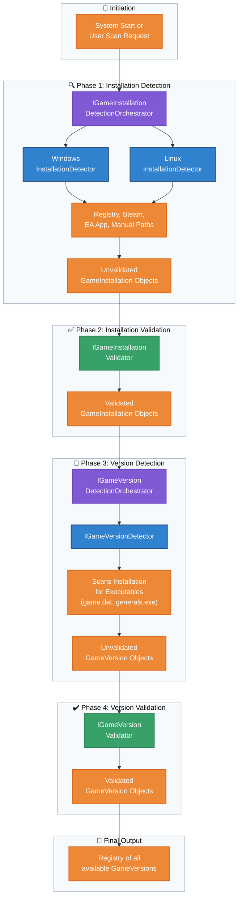

# Flowchart: Game Detection & Validation

This flowchart illustrates the pipeline for detecting, identifying, and validating game installations and their specific versions (executables).

**Detection & Validation Logic:**

| Phase | Component | Responsibility | Input | Output |
|---|---|---|---|---|
| **1. Installation Detection** | `IGameInstallationDetectionOrchestrator` | Coordinates platform-specific detectors to find game folders. | User request | `GameInstallation` objects |
| **2. Installation Validation** | `IGameInstallationValidator` | Ensures detected folders are valid, complete game installations. | `GameInstallation` | Validated `GameInstallation` |
| **3. Version Detection** | `IGameVersionDetectionOrchestrator` | Scans validated installations to find all executable versions. | Validated `GameInstallation` | `GameVersion` objects |
| **4. Version Validation** | `IGameVersionValidator` | Verifies that each executable is functional and identifiable. | `GameVersion` | Validated `GameVersion` |
