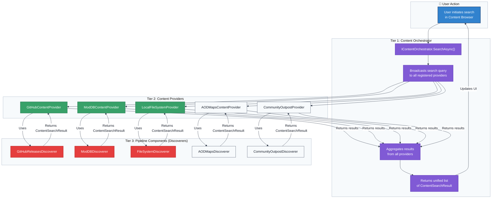

# Flowchart: Content Discovery

This flowchart details the process of discovering content from multiple sources, coordinated by the `ContentOrchestrator`.

**Discovery Workflow:**

1. **Initiation**: The user starts a search from the UI.
2. **Orchestration**: The `IContentOrchestrator` receives the request and forwards it to every registered `IContentProvider`.
3. **Provider Action**: Each `ContentProvider` invokes its specific `IContentDiscoverer` component.
4. **Discovery**: The `IContentDiscoverer` performs the source-specific action (API call, web scrape, file scan) and returns lightweight `ContentSearchResult` objects.
5
