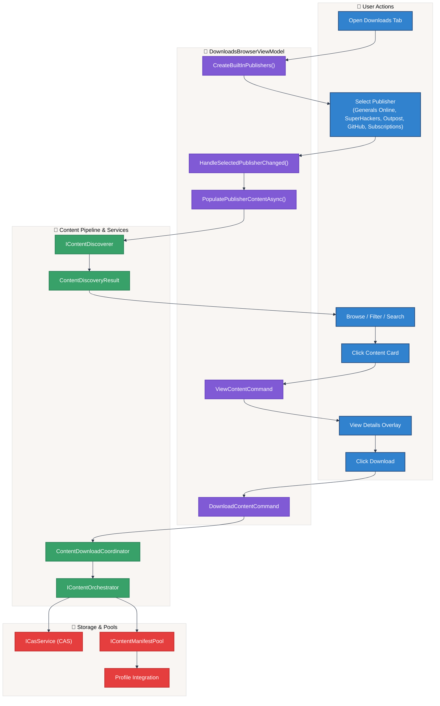
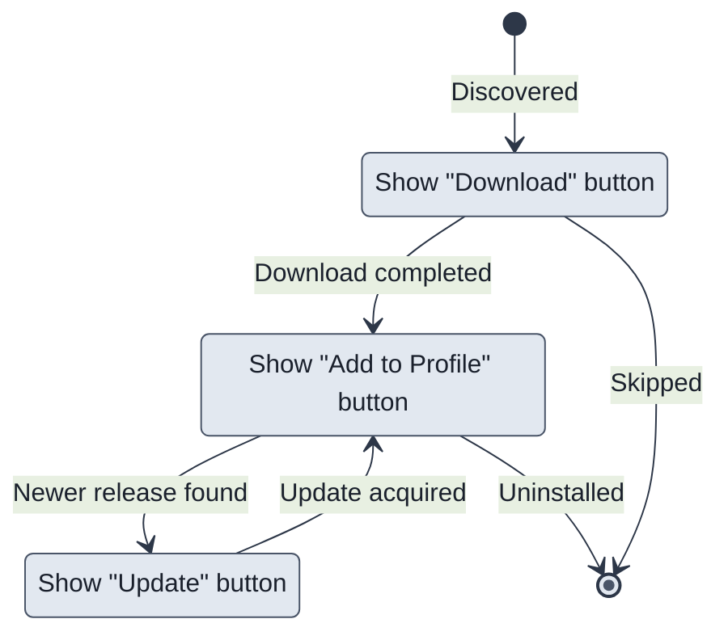
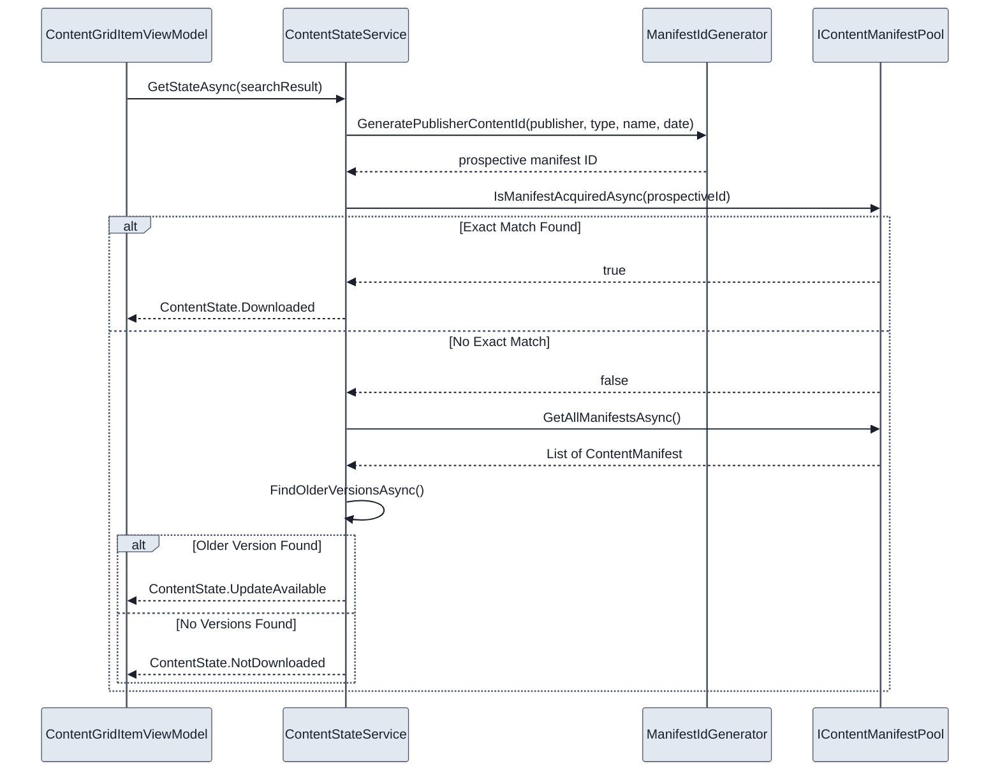
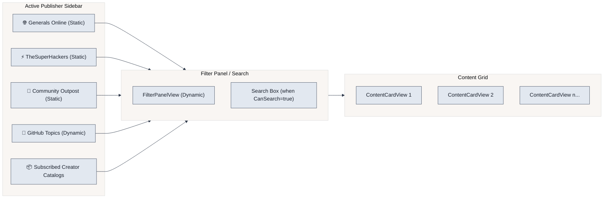
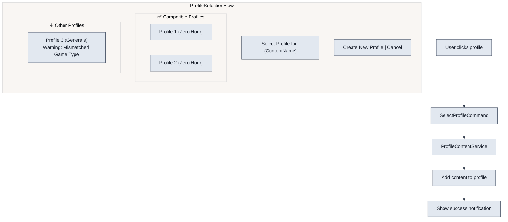
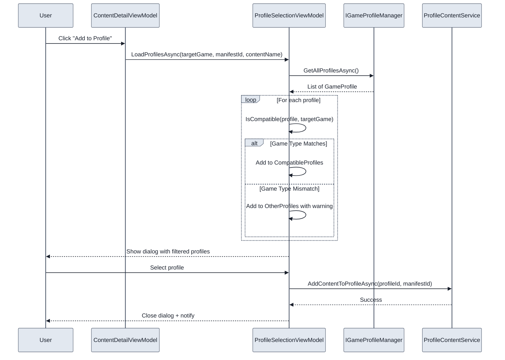
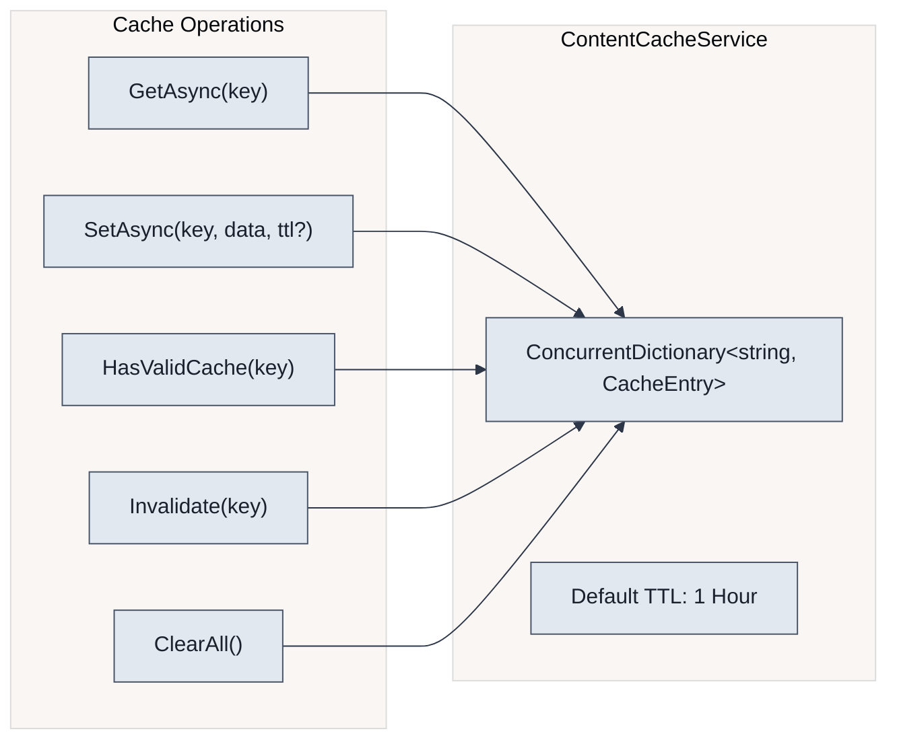
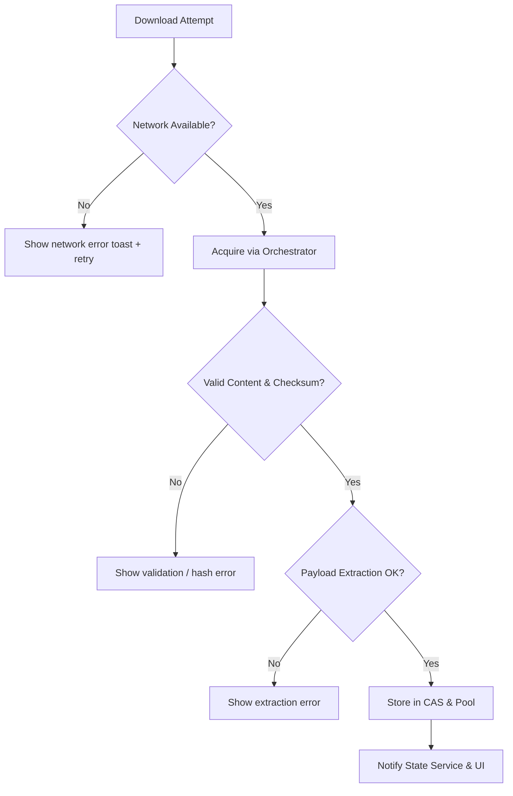

# Downloads Flow

> [!NOTE]
> This document details the **Unified Downloads User Flow** implemented in PR #443 (`feat/downloads-browser`, carved from PR #265 `feat/ui-downloads`), illustrating how user interaction in `DownloadsBrowserViewModel` connects with discovery, resolution, state tracking via `ContentStateService`, background download coordination via `ContentDownloadCoordinator`, and game profile integration.

This flowchart details the complete user journey from browsing publishers to downloading, verifying, and adding content to profiles, including state management, deduplication, and caching.

---

## Table of Contents

1. [User Browsing Flow](#user-browsing-flow)
2. [Content State Management](#content-state-management)
3. [Publisher Selection](#publisher-selection)
4. [Content Acquisition Flow](#content-acquisition-flow)
5. [Profile Selection Flow](#profile-selection-flow)
6. [Roadmap & External Web Scraper Pipeline](#roadmap--external-web-scraper-pipeline)
7. [Content Caching Layer](#content-caching-layer)
8. [Key Components](#key-components)
9. [Error Handling](#error-handling)

---

## User Browsing Flow


```mermaid
%%{init: {
  'theme': 'base',
  'themeVariables': {
    'primaryColor': '#e2e8f0',
    'primaryTextColor': '#1a202c',
    'primaryBorderColor': '#4a5568',
    'lineColor': '#2d3748',
    'background': '#ffffff'
  }
}}%%

flowchart TD
    subgraph User["👤 User Actions"]
        A["Open Downloads Tab"]
        B["Select Publisher<br/>(Generals Online, SuperHackers, Outpost, GitHub, Subscriptions)"]
        C["Browse / Filter / Search"]
        D["Click Content Card"]
        E["View Details Overlay"]
        F["Click Download"]
    end

    subgraph ViewModel["📱 DownloadsBrowserViewModel"]
        V1["CreateBuiltInPublishers()"]
        V2["HandleSelectedPublisherChanged()"]
        V3["PopulatePublisherContentAsync()"]
        V4["ViewContentCommand"]
        V5["DownloadContentCommand"]
    end

    subgraph Pipeline["🔧 Content Pipeline & Services"]
        P1["IContentDiscoverer"]
        P2["ContentDiscoveryResult"]
        P3["ContentDownloadCoordinator"]
        P4["IContentOrchestrator"]
    end

    subgraph Storage["💾 Storage & Pools"]
        S1["ICasService (CAS)"]
        S2["IContentManifestPool"]
        S3["Profile Integration"]
    end

    A --> V1
    V1 --> B
    B --> V2
    V2 --> V3
    V3 --> P1
    P1 --> P2
    P2 --> C
    C --> D
    D --> V4
    V4 --> E
    E --> F
    F --> V5
    V5 --> P3
    P3 --> P4
    P4 --> S1
    P4 --> S2
    S2 --> S3

    classDef user fill:#3182ce,stroke:#2c5282,stroke-width:2px,color:#ffffff
    classDef viewmodel fill:#805ad5,stroke:#6b46c1,stroke-width:2px,color:#ffffff
    classDef pipeline fill:#38a169,stroke:#2f855a,stroke-width:2px,color:#ffffff
    classDef storage fill:#e53e3e,stroke:#c53030,stroke-width:2px,color:#ffffff

    class A,B,C,D,E,F user
    class V1,V2,V3,V4,V5 viewmodel
    class P1,P2,P3,P4 pipeline
    class S1,S2,S3 storage
```

---

## Content State Management

The `ContentStateService` centralizes content state determination for UI display, enabling the Downloads browser to show appropriate buttons (Download, Update, Add to Profile) based on local manifest presence.

### State Transitions


```mermaid
%%{init: {
  'theme': 'base',
  'themeVariables': {
    'primaryColor': '#e2e8f0',
    'primaryTextColor': '#1a202c',
    'primaryBorderColor': '#4a5568',
    'lineColor': '#2d3748',
    'background': '#ffffff'
  }
}}%%

stateDiagram-v2
    [*] --> NotDownloaded: Discovered
    NotDownloaded --> Downloaded: Download completed
    Downloaded --> UpdateAvailable: Newer release found
    UpdateAvailable --> Downloaded: Update acquired
    Downloaded --> [*]: Uninstalled
    NotDownloaded --> [*]: Skipped

    NotDownloaded: Show "Download" button
    Downloaded: Show "Add to Profile" button
    UpdateAvailable: Show "Update" button
```

### ContentStateService Mechanics

**Location**: `GenHub/Features/Downloads/Services/ContentStateService.cs`

The service uses the 5-segment manifest ID structure to correlate content versions:

```text
Format: schemaVersion.userVersion.publisher.contentType.contentName
Example: 1.20240315.superhackers.patch.generals
```

**Detection Logic**:

1. **Exact Match**: Generates prospective manifest ID using `ManifestIdGenerator.GeneratePublisherContentId(publisher, contentType, name, releaseDate)` and checks `IContentManifestPool.IsManifestAcquiredAsync(id)`.
2. **Update Detection**: Searches for local manifests with matching publisher, contentType, and contentName but older `userVersion`.
3. **State Evaluation**:
   - `Downloaded`: Exact match found in manifest pool.
   - `UpdateAvailable`: Older version found in pool.
   - `NotDownloaded`: No matching version found.

```csharp
var state = await contentStateService.GetStateAsync(searchResult);
switch (state)
{
    case ContentState.NotDownloaded:
        // Show Download button
        break;
    case ContentState.UpdateAvailable:
        // Show Update button (orange accent)
        break;
    case ContentState.Downloaded:
        // Show "Add to Profile" button
        break;
}
```

### Content State Sequence Diagram


```mermaid
%%{init: {
  'theme': 'base',
  'themeVariables': {
    'primaryColor': '#e2e8f0',
    'primaryTextColor': '#1a202c',
    'primaryBorderColor': '#4a5568',
    'lineColor': '#2d3748',
    'background': '#ffffff'
  }
}}%%

sequenceDiagram
    participant VM as ContentGridItemViewModel
    participant CSS as ContentStateService
    participant MIG as ManifestIdGenerator
    participant Pool as IContentManifestPool

    VM->>CSS: GetStateAsync(searchResult)
    CSS->>MIG: GeneratePublisherContentId(publisher, type, name, date)
    MIG-->>CSS: prospective manifest ID
    CSS->>Pool: IsManifestAcquiredAsync(prospectiveId)

    alt Exact Match Found
        Pool-->>CSS: true
        CSS-->>VM: ContentState.Downloaded
    else No Exact Match
        Pool-->>CSS: false
        CSS->>Pool: GetAllManifestsAsync()
        Pool-->>CSS: List of ContentManifest
        CSS->>CSS: FindOlderVersionsAsync()

        alt Older Version Found
            CSS-->>VM: ContentState.UpdateAvailable
        else No Versions Found
            CSS-->>VM: ContentState.NotDownloaded
        end
    end
```

---

## Publisher Selection


```mermaid
%%{init: {
  'theme': 'base',
  'themeVariables': {
    'primaryColor': '#e2e8f0',
    'primaryTextColor': '#1a202c',
    'primaryBorderColor': '#4a5568',
    'lineColor': '#2d3748',
    'background': '#ffffff'
  }
}}%%

flowchart LR
    subgraph Sidebar["Active Publisher Sidebar"]
        P1["🌐 Generals Online (Static)"]
        P2["⚡ TheSuperHackers (Static)"]
        P3["🔧 Community Outpost (Static)"]
        P4["🐙 GitHub Topics (Dynamic)"]
        P5["📦 Subscribed Creator Catalogs"]
    end

    subgraph Filter["Filter Panel / Search"]
        F1["FilterPanelView (Dynamic)"]
        F2["Search Box (when CanSearch=true)"]
    end

    subgraph Grid["Content Grid"]
        G1["ContentCardView 1"]
        G2["ContentCardView 2"]
        G3["ContentCardView n..."]
    end

    P1 & P2 & P3 & P4 & P5 --> Filter
    Filter --> Grid
```

---

## Content Acquisition Flow

This sequence diagram illustrates the coordinated download pipeline managed by `ContentDownloadCoordinator`:

```mermaid
%%{init: {
  'theme': 'base',
  'themeVariables': {
    'primaryColor': '#e2e8f0',
    'primaryTextColor': '#1a202c',
    'primaryBorderColor': '#4a5568',
    'lineColor': '#2d3748',
    'background': '#ffffff'
  }
}}%%

sequenceDiagram
    actor User
    participant UI as ContentCardView
    participant VM as ContentGridItemViewModel
    participant BVM as DownloadsBrowserViewModel
    participant CDC as ContentDownloadCoordinator
    participant CO as ContentOrchestrator
    participant CAS as ICasService
    participant Pool as IContentManifestPool
    participant CSS as ContentStateService
    participant PS as ProfileSelectionViewModel
    participant PCS as ProfileContentService

    User->>UI: Click "Download" / "Update"
    UI->>VM: DownloadContentCommand
    VM->>VM: IsDownloading = true
    VM->>BVM: DownloadContentAsync(item)

    BVM->>CDC: DownloadContentAsync(searchResult, progress)
    Note over CDC: Deduplicate concurrent in-flight requests
    CDC->>CO: AcquireContentAsync(searchResult, progress)

    Note over CO: Download archive, extract payload,<br/>store CAS files, generate manifest
    CO->>CAS: StoreContentAsync (deduplicated payload)
    CO->>Pool: Register acquired ContentManifest
    CO-->>CDC: OperationResult&lt;ContentManifest&gt;

    CDC->>CSS: NotifyStateChanged(manifest.Id, ContentState.Downloaded)
    CDC-->>BVM: OperationResult&lt;ContentManifest&gt;

    BVM->>BVM: HandleSuccessfulAcquisitionAsync()
    BVM->>VM: CurrentState = Downloaded, IsDownloaded = true
    VM->>UI: Show "Add to Profile" button

    Note over User: Content ready for profile attachment
    User->>UI: Click "Add to Profile"
    UI->>BVM: AddContentToProfileCommand
    BVM->>PS: LoadProfilesAsync(targetGame, manifestId, contentName)

    Note over PS: Partition profiles by target game
    PS-->>User: Show ProfileSelectionView modal

    User->>PS: Select profile & confirm
    PS->>PCS: AddContentToProfileAsync(profileId, manifestId)
    PCS-->>PS: Success
    PS-->>User: Close dialog & toast success
```

---

## Profile Selection Flow

The `ProfileSelectionViewModel` provides compatibility filtering for game profiles, showing compatible profiles first and flagging incompatible profiles with warnings to prevent accidental cross-game attachment.


```mermaid
%%{init: {
  'theme': 'base',
  'themeVariables': {
    'primaryColor': '#e2e8f0',
    'primaryTextColor': '#1a202c',
    'primaryBorderColor': '#4a5568',
    'lineColor': '#2d3748',
    'background': '#ffffff'
  }
}}%%

flowchart TD
    subgraph Dialog["ProfileSelectionView"]
        direction TB
        Header["Select Profile for: {ContentName}"]

        subgraph Compatible["✅ Compatible Profiles"]
            C1["Profile 1 (Zero Hour)"]
            C2["Profile 2 (Zero Hour)"]
        end

        subgraph Incompatible["⚠️ Other Profiles"]
            I1["Profile 3 (Generals)<br/>Warning: Mismatched Game Type"]
        end

        Buttons["Create New Profile | Cancel"]
    end

    User["User clicks profile"] --> SelectProfile[SelectProfileCommand]
    SelectProfile --> PCS[ProfileContentService]
    PCS --> Profile[Add content to profile]
    Profile --> Notify[Show success notification]
```

### Profile Selection Sequence Diagram


```mermaid
%%{init: {
  'theme': 'base',
  'themeVariables': {
    'primaryColor': '#e2e8f0',
    'primaryTextColor': '#1a202c',
    'primaryBorderColor': '#4a5568',
    'lineColor': '#2d3748',
    'background': '#ffffff'
  }
}}%%

sequenceDiagram
    participant User
    participant CDVM as ContentDetailViewModel
    participant PSVM as ProfileSelectionViewModel
    participant PM as IGameProfileManager
    participant PCS as ProfileContentService

    User->>CDVM: Click "Add to Profile"
    CDVM->>PSVM: LoadProfilesAsync(targetGame, manifestId, contentName)
    PSVM->>PM: GetAllProfilesAsync()
    PM-->>PSVM: List of GameProfile

    loop For each profile
        PSVM->>PSVM: IsCompatible(profile, targetGame)
        alt Game Type Matches
            PSVM->>PSVM: Add to CompatibleProfiles
        else Game Type Mismatch
            PSVM->>PSVM: Add to OtherProfiles with warning
        end
    end

    PSVM-->>User: Show dialog with filtered profiles
    User->>PSVM: Select profile
    PSVM->>PCS: AddContentToProfileAsync(profileId, manifestId)
    PCS-->>PSVM: Success
    PSVM-->>User: Close dialog + notify
```

---

## Roadmap & External Web Scraper Pipeline

Web-scraping discoverers for external repositories (ModDB, CNC Labs, AOD Maps) are part of GenHub's content ingestion architecture:

- **ModDB Web Ingestion**: Uses Playwright for JavaScript rendering and AngleSharp for structured HTML extraction. Supports persistent browser cookies for Cloudflare clearance.
- **Section Parsing**: Handles separate `/downloads` and `/addons` sections with `FileSectionType.Downloads` vs `FileSectionType.Addons`.
- **Planned Browser Integration**: Once scraper sandboxes are finalized, these providers will be added to the downloads browser sidebar alongside static partners.

---

## Content Caching Layer

The `ContentCacheService` provides an in-memory cache for parsed content with a configurable TTL (Time To Live). This reduces redundant network traffic and page parsing.

### Cache Architecture


```mermaid
%%{init: {
  'theme': 'base',
  'themeVariables': {
    'primaryColor': '#e2e8f0',
    'primaryTextColor': '#1a202c',
    'primaryBorderColor': '#4a5568',
    'lineColor': '#2d3748',
    'background': '#ffffff'
  }
}}%%

flowchart LR
    subgraph Cache["ContentCacheService"]
        CacheStore["ConcurrentDictionary&lt;string, CacheEntry&gt;"]
        TTL["Default TTL: 1 Hour"]
    end

    subgraph Operations["Cache Operations"]
        Get["GetAsync(key)"]
        Set["SetAsync(key, data, ttl?)"]
        Has["HasValidCache(key)"]
        Invalidate["Invalidate(key)"]
        Clear["ClearAll()"]
    end

    Get --> CacheStore
    Set --> CacheStore
    Has --> CacheStore
    Invalidate --> CacheStore
    Clear --> CacheStore
```

---

## Key Components

### DownloadsBrowserViewModel

**Location**: `GenHub/Features/Downloads/ViewModels/DownloadsBrowserViewModel.cs`

| Property / Command | Type | Purpose |
| :--- | :--- | :--- |
| `Publishers` | `ObservableCollection<PublisherItemViewModel>` | Available content sources |
| `SelectedPublisher` | `PublisherItemViewModel?` | Currently selected publisher |
| `ContentItems` | `ObservableCollection<ContentGridItemViewModel>` | Discovered content items |
| `CurrentFilterViewModel` | `IFilterPanelViewModel?` | Publisher-specific filter model |
| `DownloadContentCommand` | `IAsyncRelayCommand` | Initiates content acquisition |
| `AddContentToProfileCommand` | `IAsyncRelayCommand` | Opens profile selection modal and attaches content |
| `ViewContentCommand` | `IRelayCommand` | Opens content detail view overlay |

### ContentDownloadCoordinator

**Location**: `GenHub/Features/Downloads/Services/ContentDownloadCoordinator.cs`

| Method | Return Type | Purpose |
| :--- | :--- | :--- |
| `DownloadContentAsync` | `Task<OperationResult<ContentManifest>>` | Deduplicates in-flight downloads, multiplexes progress, acquires content via `IContentOrchestrator`, and updates `ContentStateService`. |
| `IsDownloading` | `bool` | Checks whether content is actively downloading. |
| `TryGetDownloadProgress` | `bool` | Retrieves current progress percentage and message for in-flight tasks. |

### ContentGridItemViewModel

**Location**: `GenHub/Features/Downloads/ViewModels/ContentGridItemViewModel.cs`

| Property | Condition | Purpose |
| :--- | :--- | :--- |
| `ShowDownloadButton` | `CurrentState == NotDownloaded` | Shows download action |
| `ShowUpdateButton` | `CurrentState == UpdateAvailable` | Shows update action |
| `ShowAddToProfileButton` | `CurrentState == Downloaded` | Shows profile addition action |
| `CanDownload` | `!IsDownloaded && !IsDownloading` | Enables download button |

### Filter ViewModels

**Location**: `GenHub/Features/Downloads/ViewModels/Filters/`

| Publisher | Filter ViewModel | Capabilities |
| :--- | :--- | :--- |
| GitHub | `GitHubFilterViewModel` | Sort order (recent, popular), release types |
| Community Outpost | `CommunityOutpostFilterViewModel` | Content type (tools vs. patches) |
| TheSuperHackers | `SuperHackersFilterViewModel` | Game client vs. patch releases |
| Static Curated | `StaticPublisherFilterViewModel` | Content type and target game |

### ContentStateService

**Location**: `GenHub/Features/Downloads/Services/ContentStateService.cs`

| Method / Event | Purpose |
| :--- | :--- |
| `GetStateAsync(item)` | Evaluates state (`NotDownloaded`, `UpdateAvailable`, `Downloaded`) |
| `GetStateByManifestIdAsync(manifestId)` | Checks state for a specific manifest ID |
| `NotifyStateChanged(contentId, newState)` | Broadcasts state updates to UI subscribers |
| `ContentStateChanged` | Event raised when content state changes |

---

## Error Handling


```mermaid
flowchart TD
    D["Download Attempt"] --> N{"Network Available?"}
    N -->|No| E1["Show network error toast + retry"]
    N -->|Yes| DL["Acquire via Orchestrator"]
    DL --> V{"Valid Content & Checksum?"}
    V -->|No| E2["Show validation / hash error"]
    V -->|Yes| EX{"Payload Extraction OK?"}
    EX -->|No| E3["Show extraction error"]
    EX -->|Yes| S["Store in CAS & Pool"]
    S --> M["Notify State Service & UI"]
```

---

## Related Documentation

- [Downloads Browser Feature Guide](../features/downloads.md) - Complete feature documentation.
- [Downloads UI & Views Architecture](../features/downloads-ui.md) - UI controls, view models, and styling.
- [Content Pipeline Flow](../features/content/content-pipeline.md) - Detailed pipeline architecture.
