# Flowchart: Downloads User Flow

This flowchart details the complete user journey from browsing publishers to downloading and installing content.

## User Browsing Flow

## Content Acquisition Flow

## Publisher Selection

```mermaid
%%{init: {
  'theme': 'base',
  'themeVariables': {
    'primaryColor': '#e2e8f0',
    'primaryTextColor': '#1a202c',
    'primaryBorderColor': '#4a5568',
    'lineColor': '#2d3748',
    'background': '#ffffff'
  }
}}%%

flowchart LR
    subgraph Sidebar["Publisher Sidebar"]
        P1["🎮 ModDB"]
        P2["🗺️ CNC Labs"]
        P3["🗺️ AOD Maps"]
        P4["🔧 Community Outpost"]
        P5["🐙 GitHub"]
        P6["🌐 Generals Online"]
    end

    subgraph Filter["Filter Panel"]
        F1["Content Type"]
        F2["Game (Generals/ZH)"]
        F3["Search Term"]
        F4["Sort Order"]
    end

    subgraph Grid["Content Grid"]
        G1["ContentCardView 1"]
        G2["ContentCardView 2"]
        G3["ContentCardView n..."]
    end

    P1 & P2 & P3 & P4 & P5 & P6 --> Filter
    Filter --> Grid
```

## Key Components

### DownloadsBrowserViewModel

**Location**: `GenHub/Features/Downloads/ViewModels/DownloadsBrowserViewModel.cs`

| Property/Command | Type | Purpose |
| :--- | :--- | :--- |
| `Publishers` | `ObservableCollection<PublisherCardViewModel>` | Available content sources |
| `SelectedPublisher` | `PublisherCardViewModel` | Currently selected publisher |
| `ContentItems` | `ObservableCollection<ContentGridItemViewModel>` | Discovered content |
| `FilterViewModel` | `IFilterPanelViewModel` | Publisher-specific filters |
| `DownloadContentCommand` | `IAsyncRelayCommand` | Initiates download |

### ContentGridItemViewModel

**Location**: `GenHub/Features/Downloads/ViewModels/ContentGridItemViewModel.cs`

Represents a single content item in the grid with:

- Title, description, preview image
- Publisher info and tags
- Download URL and content type
- Installation status tracking

### Filter ViewModels

Each publisher has a specialized filter ViewModel:

| Publisher | Filter ViewModel | Special Filters |
| :--- | :--- | :--- |
| ModDB | `ModDBFilterViewModel` | Category, release date |
| CNC Labs | `CNCLabsFilterViewModel` | Map size, player count |
| AOD Maps | `AODMapsFilterViewModel` | Map type |
| Community Outpost | `CommunityOutpostFilterViewModel` | Tool vs patch |
| GitHub | `GitHubFilterViewModel` | Repository, release type |

## Error Handling

## Related Documentation

- [Content Pipeline](./content-pipeline.md) - Detailed pipeline architecture
- [Discovery Flow](../FlowCharts/Discovery-Flow.md) - Discovery process
- [Acquisition Flow](../FlowCharts/Acquisition-Flow.md) - Content acquisition
