# GeneralsOnline Complete Content Orchestration Flow

This document provides **complete end-to-end flowcharts** for the GeneralsOnline content acquisition system in GenHub, from user interaction through to CAS storage and manifest pool registration.

## Table of Contents

1. [High-Level Overview](#high-level-overview)
2. [Phase 1: User Interaction & Search Initiation](#phase-1-user-interaction--search-initiation)
3. [Phase 2: Discovery & Resolution (First Pass)](#phase-2-discovery--resolution-first-pass)
4. [Phase 3: Content Acquisition & Delivery](#phase-3-content-acquisition--delivery)
5. [Phase 4: Manifest Factory Deep Dive](#phase-4-manifest-factory-deep-dive)
6. [Phase 5: CAS Storage & Validation](#phase-5-cas-storage--validation)
7. [Data Transfer Architecture](#data-transfer-architecture)
8. [Three-Tier Architecture Reference](#three-tier-architecture-reference)

---

## High-Level Overview

The GeneralsOnline content pipeline follows this architectural pattern:

**Tier 3 (Orchestration)**: `ContentOrchestrator` coordinates all operations  
**Tier 2 (Provider)**: `GeneralsOnlineProvider` manages the complete pipeline  
**Tier 1 (Pipeline)**: Specialized components handle discovery, resolution, and delivery

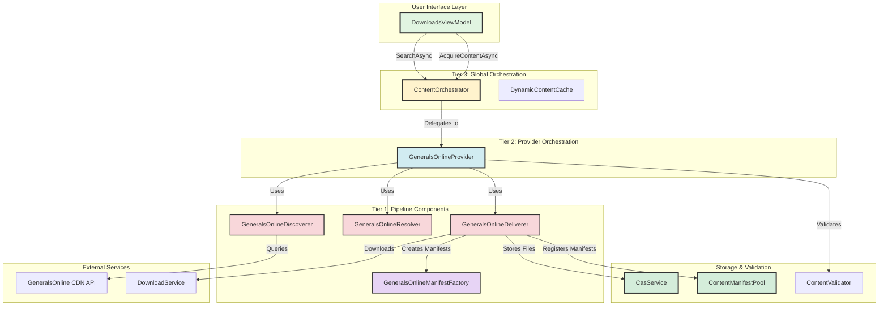

---

## Phase 1: User Interaction & Search Initiation

User clicks "Install Generals Online" button in the Downloads tab, triggering the search and acquisition flow.

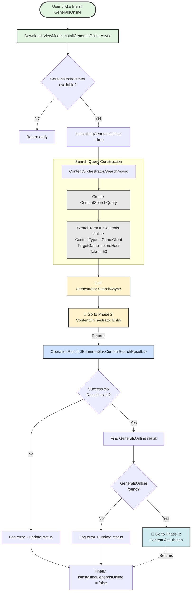

**Key Data Structures Created**:
- `ContentSearchQuery`: Search parameters (SearchTerm, ContentType, TargetGame)
- `OperationResult<IEnumerable<ContentSearchResult>>`: Wrapper containing search results

---

## Phase 2: Discovery & Resolution (First Pass)

ContentOrchestrator delegates to enabled providers. GeneralsOnlineProvider orchestrates discovery and creates preliminary manifests.

### 2A: ContentOrchestrator Search Flow

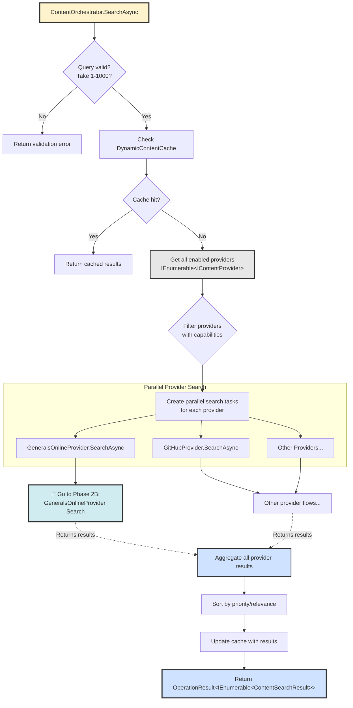

### 2B: GeneralsOnlineProvider Search Flow

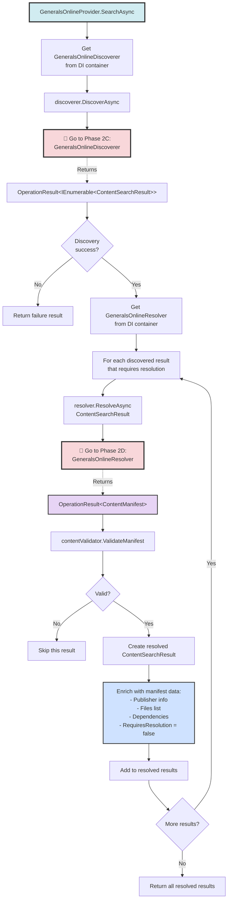

### 2C: GeneralsOnlineDiscoverer Flow

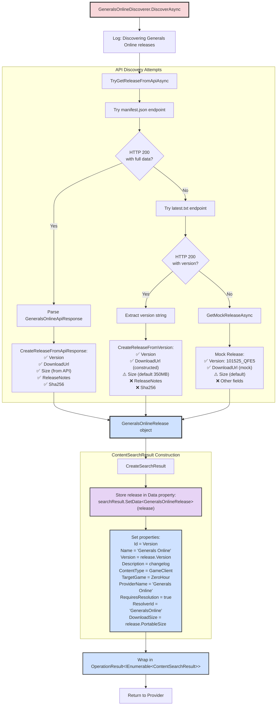

**Critical Data: GeneralsOnlineRelease Object**
```
GeneralsOnlineRelease {
    Version: "101525_QFE5"
    VersionDate: DateTime (parsed from version)
    ReleaseDate: DateTime
    PortableUrl: "https://cdn.example.com/releases/generalsonline_101525_QFE5_portable.zip"
    PortableSize: 350000000 (bytes)
    Changelog: "Release notes from API or null"
}
```

### 2D: GeneralsOnlineResolver Flow (First Pass - Preliminary Manifest)

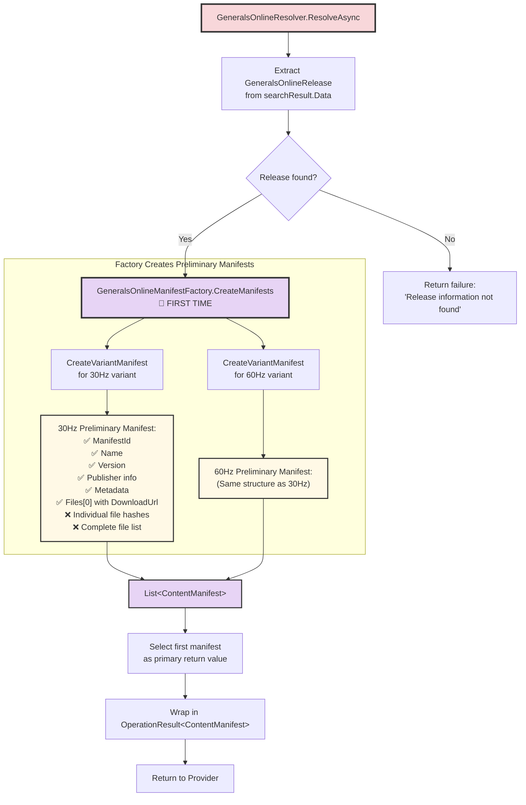

**Critical Note**: At this stage, manifests contain:
- ✅ Manifest metadata (ID, name, version, publisher)
- ✅ Single Files entry pointing to the ZIP download URL
- ❌ **NO individual file hashes** (not extracted yet)
- ❌ **NO complete file list** (only ZIP reference)

---

## Phase 3: Content Acquisition & Delivery

User has selected a search result. DownloadsViewModel calls AcquireContentAsync to download, extract, and store content.

### 3A: ContentOrchestrator Acquisition Flow

```mermaid
graph TB
    Entry[ContentOrchestrator.AcquireContentAsync] --> ValidateInput{searchResult valid?<br/>ProviderName set?}
    ValidateInput -->|No| Error[Return failure]
    ValidateInput -->|Yes| FindProvider[Find provider by name<br/>from registered providers]
    
    FindProvider --> ProviderFound{Provider found?}
    ProviderFound -->|No| ErrorNotFound[Return failure:<br/>'Provider not found']
    ProviderFound -->|Yes| GetManifest[provider.GetValidatedContentAsync<br/>contentId]
    
    GetManifest --> ManifestEntry[📍 Go to Phase 3B:<br/>Provider GetValidatedContentAsync]
    
    ManifestEntry -.->|Returns| ManifestResult[OperationResult&lt;ContentManifest&gt;]
    
    ManifestResult --> CheckManifest{Manifest valid?}
    CheckManifest -->|No| ErrorManifest[Return failure]
    CheckManifest -->|Yes| CreateWorkDir[Create working directory:<br/>ContentLibrary/{ManifestId}]
    
    CreateWorkDir --> PrepareContent[provider.PrepareContentAsync<br/>manifest, workingDirectory, progress]
    
    PrepareContent --> PrepareEntry[📍 Go to Phase 3C:<br/>Provider PrepareContentAsync]
    
    PrepareEntry -.->|Returns| PreparedManifest[OperationResult&lt;ContentManifest&gt;<br/>with complete file hashes]
    
    PreparedManifest --> FinalCheck{Success?}
    FinalCheck -->|No| ErrorPrepare[Return failure]
    FinalCheck -->|Yes| Return[Return complete manifest]
    
    style Entry fill:#fff3cd,stroke:#333,stroke-width:3px
    style ManifestEntry fill:#d1ecf1,stroke:#333,stroke-width:3px
    style PrepareEntry fill:#d1ecf1,stroke:#333,stroke-width:3px
    style PreparedManifest fill:#e7d4f5,stroke:#333,stroke-width:3px
```

### 3B: GeneralsOnlineProvider GetValidatedContentAsync

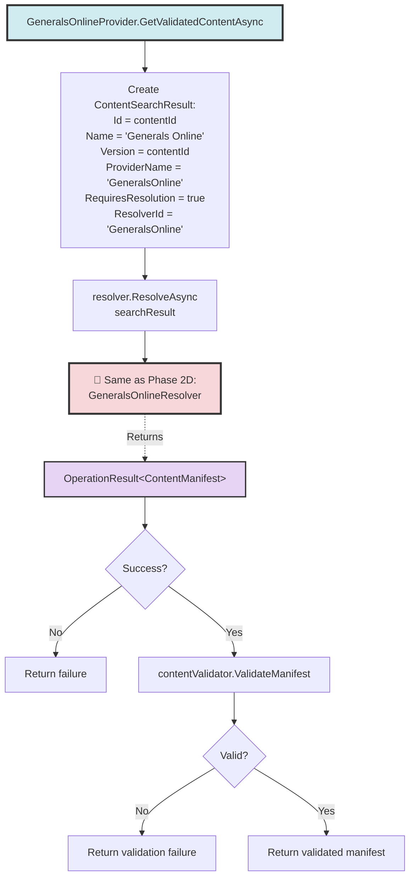

### 3C: Provider PrepareContentAsync Flow

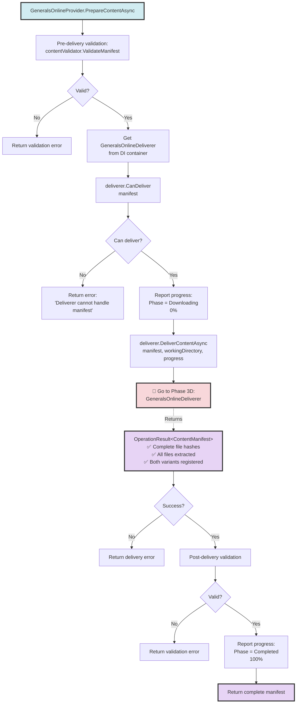

### 3D: GeneralsOnlineDeliverer Complete Flow

```mermaid
graph TB
    Entry[GeneralsOnlineDeliverer.DeliverContentAsync] --> Log[Log: Starting delivery]
    
    Log --> FindZip[Find ZIP file in manifest.Files<br/>with .zip extension]
    FindZip --> ZipFound{ZIP found?}
    ZipFound -->|No| Error1[Return failure]
    
    ZipFound -->|Yes| SetupPaths["Setup paths:<br/>zipPath = targetDirectory/GeneralsOnline.zip<br/>extractPath = targetDirectory/extracted"]
    
    SetupPaths --> ReportDownload[Report progress:<br/>Phase = Downloading<br/>10%]
    
    ReportDownload --> Download[downloadService.DownloadFileAsync<br/>URL, zipPath]
    
    Download --> DownloadSuccess{Success?}
    DownloadSuccess -->|No| Error2[Return download failure]
    DownloadSuccess -->|Yes| CreateExtract[Create extraction directory]
    
    CreateExtract --> ReportExtract[Report progress:<br/>Phase = Extracting<br/>40%]
    
    ReportExtract --> Extract[ZipFile.ExtractToDirectory<br/>zipPath → extractPath]
    
    Extract --> CreateRelease[CreateReleaseFromManifest<br/>to rebuild GeneralsOnlineRelease]
    
    CreateRelease --> ReportManifests[Report progress:<br/>Phase = Copying<br/>50%<br/>'Creating manifests']
    
    ReportManifests --> CallFactory1[GeneralsOnlineManifestFactory.CreateManifests<br/>📍 SECOND TIME]
    
    CallFactory1 --> Factory1Entry[📍 Go to Phase 4A:<br/>Factory CreateManifests]
    
    Factory1Entry -.->|Returns| TwoManifests["List&lt;ContentManifest&gt;:<br/>[0] = 30Hz preliminary<br/>[1] = 60Hz preliminary"]
    
    TwoManifests --> ValidateCount{Count == 2?}
    ValidateCount -->|No| Error3[Return error]
    ValidateCount -->|Yes| ReportUpdate[Report progress:<br/>Phase = Copying<br/>60%<br/>'Processing extracted files']
    
    ReportUpdate --> CallFactory2[GeneralsOnlineManifestFactory<br/>.UpdateManifestsWithExtractedFiles<br/>manifests, extractPath<br/>📍 CRITICAL STEP]
    
    CallFactory2 --> Factory2Entry[📍 Go to Phase 4B:<br/>Factory UpdateManifestsWithExtractedFiles]
    
    Factory2Entry -.->|Returns| CompleteManifests["List&lt;ContentManifest&gt;:<br/>[0] = 30Hz COMPLETE<br/>[1] = 60Hz COMPLETE<br/>✅ All file hashes<br/>✅ Complete file lists<br/>✅ Variant-specific filtering"]
    
    CompleteManifests --> ReportRegister[Report progress:<br/>Phase = Copying<br/>90%<br/>'Registering manifests']
    
    ReportRegister --> Register30Hz[manifestPool.AddManifestAsync<br/>manifests[0], extractPath]
    
    Register30Hz --> Pool1Entry[📍 Go to Phase 5:<br/>Manifest Pool Registration]
    
    Pool1Entry -.->|Success| Register60Hz[manifestPool.AddManifestAsync<br/>manifests[1], extractPath]
    
    Register60Hz --> Pool2Entry[📍 Go to Phase 5:<br/>Manifest Pool Registration]
    
    Pool2Entry -.->|Success| MoveFiles["Move files from extractPath<br/>to parent directory"]
    
    MoveFiles --> Cleanup["Cleanup:<br/>Delete extractPath<br/>Delete zipPath"]
    
    Cleanup --> ReportComplete[Report progress:<br/>Phase = Completed<br/>100%]
    
    ReportComplete --> ReturnPrimary[Return manifests[0]<br/>as primary result]
    
    style Entry fill:#f8d7da,stroke:#333,stroke-width:3px
    style Factory1Entry fill:#e7d4f5,stroke:#333,stroke-width:3px
    style Factory2Entry fill:#e7d4f5,stroke:#333,stroke-width:3px
    style Pool1Entry fill:#d4edda,stroke:#333,stroke-width:3px
    style Pool2Entry fill:#d4edda,stroke:#333,stroke-width:3px
    style CompleteManifests fill:#fff9e6,stroke:#333,stroke-width:3px
    style ReturnPrimary fill:#e7d4f5,stroke:#333,stroke-width:3px
```

---

## Phase 4: Manifest Factory Deep Dive

This phase shows the **critical transformation** from preliminary manifests to complete manifests with full file hashes.

### 4A: CreateManifests (Second Invocation)

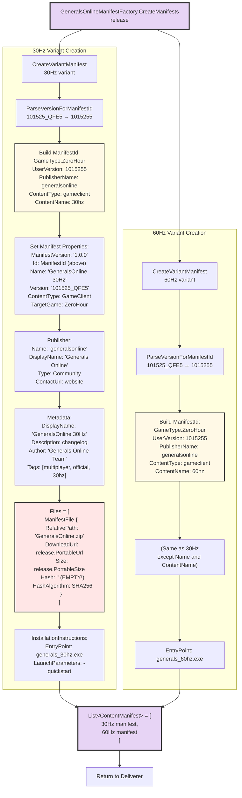

**Data at this point - Preliminary Manifest Structure**:
```json
{
  "ManifestVersion": "1.0.0",
  "Id": "1.1015255.generalsonline.gameclient.30hz",
  "Name": "GeneralsOnline 30Hz",
  "Version": "101525_QFE5",
  "ContentType": "GameClient",
  "TargetGame": "ZeroHour",
  "Publisher": {
    "Name": "generalsonline",
    "DisplayName": "Generals Online",
    "Type": "Community"
  },
  "Files": [
    {
      "RelativePath": "GeneralsOnline.zip",
      "DownloadUrl": "https://cdn.example.com/releases/generalsonline_101525_QFE5_portable.zip",
      "Size": 350000000,
      "Hash": "",  // ❌ EMPTY - NOT YET COMPUTED
      "HashAlgorithm": "SHA256"
    }
  ],
  "InstallationInstructions": {
    "EntryPoint": "generals_30hz.exe",
    "LaunchParameters": "-quickstart"
  }
}
```

### 4B: UpdateManifestsWithExtractedFiles (Critical Transformation)

This is where preliminary manifests become **complete manifests** with all file hashes and complete file lists.

```mermaid
graph TB
    Entry[GeneralsOnlineManifestFactory<br/>.UpdateManifestsWithExtractedFiles<br/>manifests, extractPath] --> Log[Log: Updating manifests<br/>with extracted files]
    
    Log --> ScanDir[Directory.GetFiles<br/>extractPath, *, AllDirectories]
    ScanDir --> FileList["File array:<br/>extractPath/generals_30hz.exe<br/>extractPath/generals_60hz.exe<br/>extractPath/Data/INI/Object/*.ini<br/>extractPath/Data/Maps/*.map<br/>...hundreds of files"]
    
    FileList --> CreateList[Create filesWithHashes list]
    CreateList --> LoopStart{For each file}
    
    subgraph "File Processing Loop"
        LoopStart --> GetInfo[FileInfo for file]
        GetInfo --> ComputeHash["SHA-256 hash computation:<br/>using (var stream = File.OpenRead(filePath))<br/>using (var sha256 = SHA256.Create())<br/>hash = sha256.ComputeHash(stream)"]
        
        ComputeHash --> ToHex[Convert to hex string]
        ToHex --> GetRelative[Path.GetRelativePath<br/>extractPath, filePath]
        
        GetRelative --> AddTuple["Add to list:<br/>(relativePath, fileInfo, hash)"]
        
        AddTuple --> LogProgress[Log progress every 50 files]
        LogProgress --> NextFile{More files?}
        NextFile -->|Yes| LoopStart
    end
    
    NextFile -->|No| LogComplete[Log: Processed N files]
    
    LogComplete --> Update30Hz[Update 30Hz manifest]
    
    subgraph "30Hz Manifest Update"
        Update30Hz --> Filter30["Filter files:<br/>Include ALL files EXCEPT<br/>files containing '60hz' or '60Hz'"]
        
        Filter30 --> Create30Files[Create ManifestFile objects]
        
        Create30Files --> Build30List["For each filtered file:<br/>new ManifestFile {<br/>  RelativePath = relativePath<br/>  Hash = hash<br/>  HashAlgorithm = SHA256<br/>  Size = fileInfo.Length<br/>  DownloadUrl = null<br/>}"]
        
        Build30List --> Set30["manifests[0].Files = fileList<br/>(~500 files with hashes)"]
    end
    
    LogComplete --> Update60Hz[Update 60Hz manifest]
    
    subgraph "60Hz Manifest Update"
        Update60Hz --> Filter60["Filter files:<br/>Include ALL files EXCEPT<br/>files containing '30hz' or '30Hz'"]
        
        Filter60 --> Create60Files[Create ManifestFile objects]
        
        Create60Files --> Build60List["(Same as 30Hz<br/>but with 60Hz files)"]
        
        Build60List --> Set60["manifests[1].Files = fileList<br/>(~500 files with hashes)"]
    end
    
    Set30 --> ReturnComplete["Return List&lt;ContentManifest&gt;:<br/>Both manifests now COMPLETE<br/>with all file hashes"]
    Set60 --> ReturnComplete
    
    style Entry fill:#e7d4f5,stroke:#333,stroke-width:3px
    style ComputeHash fill:#fff9e6,stroke:#333,stroke-width:2px
    style Filter30 fill:#d1ecf1,stroke:#333,stroke-width:2px
    style Filter60 fill:#d1ecf1,stroke:#333,stroke-width:2px
    style ReturnComplete fill:#d4edda,stroke:#333,stroke-width:3px
```

**Data Transformation - Before vs After**:

**BEFORE UpdateManifestsWithExtractedFiles**:
```json
{
  "Files": [
    {
      "RelativePath": "GeneralsOnline.zip",
      "Hash": "",  // ❌ EMPTY
      "Size": 350000000
    }
  ]
}
```

**AFTER UpdateManifestsWithExtractedFiles (30Hz variant)**:
```json
{
  "Files": [
    {
      "RelativePath": "generals_30hz.exe",
      "Hash": "a1b2c3d4e5f6...",  // ✅ COMPUTED
      "HashAlgorithm": "SHA256",
      "Size": 5242880,
      "DownloadUrl": null
    },
    {
      "RelativePath": "Data/INI/Object/AmericaVehicle.ini",
      "Hash": "f6e5d4c3b2a1...",  // ✅ COMPUTED
      "HashAlgorithm": "SHA256",
      "Size": 45678,
      "DownloadUrl": null
    },
    // ... ~500 more files, each with computed hash
  ]
}
```

**AFTER UpdateManifestsWithExtractedFiles (60Hz variant)**:
```json
{
  "Files": [
    {
      "RelativePath": "generals_60hz.exe",  // ✅ Different executable
      "Hash": "9876543210ab...",  // ✅ COMPUTED
      "HashAlgorithm": "SHA256",
      "Size": 5298176,
      "DownloadUrl": null
    },
    {
      "RelativePath": "Data/INI/Object/AmericaVehicle.ini",  // ✅ Shared file
      "Hash": "f6e5d4c3b2a1...",  // ✅ Same hash as 30Hz
      "HashAlgorithm": "SHA256",
      "Size": 45678,
      "DownloadUrl": null
    },
    // ... ~500 more files
  ]
}
```

---

## Phase 5: CAS Storage & Validation

After manifests are complete, files are stored in CAS and manifests are registered in the pool.

### 5A: Manifest Pool Registration Flow

```mermaid
graph TB
    Entry["IContentManifestPool.AddManifestAsync<br/>manifest, sourceDirectory"] --> ValidateInput{Manifest valid?<br/>SourceDirectory exists?}
    
    ValidateInput -->|No| Error[Return failure]
    ValidateInput -->|Yes| CheckExists[Check if manifest already exists<br/>by ManifestId]
    
    CheckExists --> Exists{Already exists?}
    Exists -->|Yes| Update[Update existing manifest]
    Exists -->|No| CreateNew[Create new manifest entry]
    
    CreateNew --> SaveManifest[Save manifest JSON to:<br/>ContentLibrary/Manifests/{ManifestId}.json]
    Update --> SaveManifest
    
    SaveManifest --> StoreFiles[For each file in manifest.Files]
    
    subgraph "CAS File Storage"
        StoreFiles --> GetFile[Get file from sourceDirectory<br/>using file.RelativePath]
        GetFile --> VerifyHash[Verify file hash matches<br/>manifest.Hash]
        
        VerifyHash --> HashMatch{Hash matches?}
        HashMatch -->|No| ErrorHash[Log warning, skip file]
        HashMatch -->|Yes| StoreCAS[casService.StoreFileAsync<br/>filePath, hash]
        
        StoreCAS --> CASEntry[📍 Go to Phase 5B:<br/>CAS Storage]
        
        CASEntry -.->|Returns| NextFile{More files?}
        NextFile -->|Yes| StoreFiles
    end
    
    NextFile -->|No| UpdateMetadata["Update manifest metadata:<br/>AcquiredDate<br/>ContentDirectory path<br/>Status = Acquired"]
    
    UpdateMetadata --> SaveFinal[Save updated manifest JSON]
    SaveFinal --> Return[Return success]
    
    ErrorHash --> NextFile
    
    style Entry fill:#d4edda,stroke:#333,stroke-width:3px
    style CASEntry fill:#d4edda,stroke:#333,stroke-width:3px
    style SaveManifest fill:#fff9e6,stroke:#333,stroke-width:2px
    style Return fill:#d4edda,stroke:#333,stroke-width:3px
```

### 5B: CAS File Storage Flow

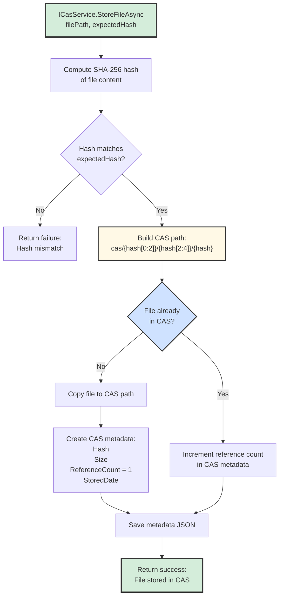

**CAS Storage Structure**:
```
ContentLibrary/
  cas/
    a1/
      b2/
        a1b2c3d4e5f6... (actual file content)
        a1b2c3d4e5f6....meta.json (reference count, size, date)
    f6/
      e5/
        f6e5d4c3b2a1... (shared between 30Hz and 60Hz)
        f6e5d4c3b2a1....meta.json
  Manifests/
    1.1015255.generalsonline.gameclient.30hz.json
    1.1015255.generalsonline.gameclient.60hz.json
```

**Deduplication**: If the same file exists in both 30Hz and 60Hz manifests (e.g., shared INI files), it's stored **once** in CAS with a reference count of 2.

---

## Data Transfer Architecture

This diagram shows the complete data flow and transformations through the entire pipeline.

```mermaid
graph TB
    subgraph "Stage 1: CDN API Response"
        API["GeneralsOnlineApiResponse<br/>{<br/>  version: '101525_QFE5'<br/>  download_url: 'https://...'<br/>  size: 350000000<br/>  sha256: 'abc123...'<br/>  release_notes: '...'<br/>}"]
    end
    
    subgraph "Stage 2: Release Object"
        Release["GeneralsOnlineRelease<br/>{<br/>  Version: '101525_QFE5'<br/>  PortableUrl: 'https://...'<br/>  PortableSize: 350000000<br/>  Changelog: '...'<br/>}"]
    end
    
    subgraph "Stage 3: Search Result"
        SearchResult["ContentSearchResult<br/>{<br/>  Id: '101525_QFE5'<br/>  Name: 'Generals Online'<br/>  Version: '101525_QFE5'<br/>  ContentType: GameClient<br/>  RequiresResolution: true<br/>  ResolverId: 'GeneralsOnline'<br/>  Data: GeneralsOnlineRelease<br/>}"]
    end
    
    subgraph "Stage 4: Preliminary Manifest (1st Pass)"
        Prelim["ContentManifest (Preliminary)<br/>{<br/>  Id: ManifestId<br/>  Name: 'GeneralsOnline 30Hz'<br/>  Version: '101525_QFE5'<br/>  Files: [<br/>    {<br/>      RelativePath: 'GeneralsOnline.zip'<br/>      DownloadUrl: 'https://...'<br/>      Hash: '' ❌ EMPTY<br/>    }<br/>  ]<br/>}"]
    end
    
    subgraph "Stage 5: Extracted Files"
        Files["Extracted File System<br/>extractPath/<br/>  generals_30hz.exe<br/>  generals_60hz.exe<br/>  Data/<br/>    INI/<br/>    Maps/<br/>  ..."]
    end
    
    subgraph "Stage 6: Complete Manifest (2nd Pass)"
        Complete["ContentManifest (Complete)<br/>{<br/>  Id: ManifestId<br/>  Name: 'GeneralsOnline 30Hz'<br/>  Version: '101525_QFE5'<br/>  Files: [<br/>    {<br/>      RelativePath: 'generals_30hz.exe'<br/>      Hash: 'a1b2c3...' ✅ COMPUTED<br/>      Size: 5242880<br/>    },<br/>    {<br/>      RelativePath: 'Data/INI/Object/...'<br/>      Hash: 'f6e5d4...' ✅ COMPUTED<br/>      Size: 45678<br/>    },<br/>    ... ~500 files<br/>  ]<br/>}"]
    end
    
    subgraph "Stage 7: CAS Storage"
        CAS["Content-Addressable Storage<br/>cas/<br/>  a1/b2/a1b2c3... (generals_30hz.exe)<br/>  9876543210ab... (generals_60hz.exe)<br/>  f6/e5/f6e5d4... (shared INI)<br/>Manifests/<br/>  1.1015255...30hz.json<br/>  1.1015255...60hz.json"]
    end
    
    API -->|Discoverer parses| Release
    Release -->|Stored in Data property| SearchResult
    SearchResult -->|Resolver creates| Prelim
    Prelim -->|Deliverer downloads & extracts| Files
    Files -->|Factory updates manifests| Complete
    Complete -->|Pool stores| CAS
    
    style API fill:#f8d7da,stroke:#333,stroke-width:2px
    style Release fill:#cfe2ff,stroke:#333,stroke-width:2px
    style SearchResult fill:#cfe2ff,stroke:#333,stroke-width:2px
    style Prelim fill:#fff9e6,stroke:#333,stroke-width:2px
    style Files fill:#e7d4f5,stroke:#333,stroke-width:2px
    style Complete fill:#d4edda,stroke:#333,stroke-width:3px
    style CAS fill:#d4edda,stroke:#333,stroke-width:3px
```

---

## Three-Tier Architecture Reference

This section provides a reference for the complete service architecture.

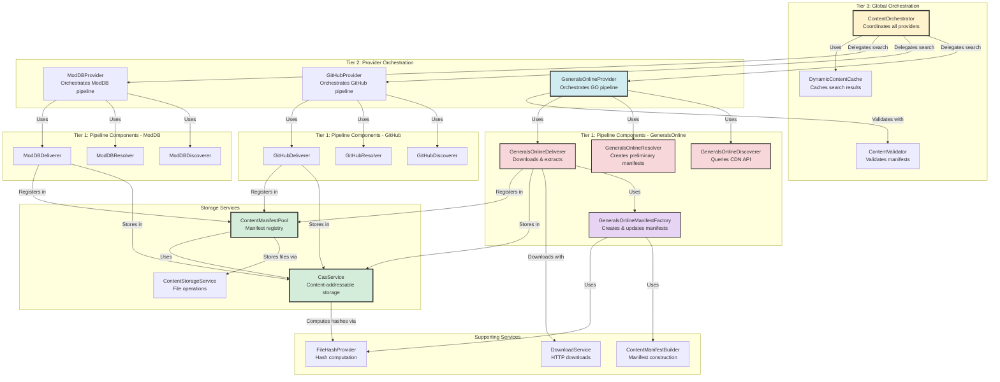

### Service Dependency Injection Registration

All services are registered in `ContentPipelineModule.AddContentPipelineServices()`:

**Tier 3 Services**:
- `IContentOrchestrator` → `ContentOrchestrator` (Singleton)
- `IDynamicContentCache` → `DynamicContentCache` (Singleton)
- `IContentValidator` → `ContentValidator` (Singleton)

**Tier 2 Providers** (registered as `IContentProvider`):
- `GeneralsOnlineProvider` (Transient)
- `GitHubProvider` (Transient)
- `ModDBProvider` (Transient)

**Tier 1 Pipeline Components**:

Discoverers (registered as `IContentDiscoverer`):
- `GeneralsOnlineDiscoverer`
- `GitHubDiscoverer`
- `ModDBDiscoverer`

Resolvers (registered as `IContentResolver`):
- `GeneralsOnlineResolver`
- `GitHubResolver`
- `ModDBResolver`

Deliverers (registered as `IContentDeliverer`):
- `GeneralsOnlineDeliverer`
- `GitHubDeliverer`
- `ModDBDeliverer`

**Storage Services**:
- `ICasService` → `CasService` (Singleton)
- `IContentManifestPool` → `ContentManifestPool` (Singleton)
- `IContentStorageService` → `ContentStorageService` (Singleton)

**Supporting Services**:
- `IDownloadService` → `DownloadService` (Singleton)
- `IFileHashProvider` → `FileHashProvider` (Singleton)
- `IContentManifestBuilder` → `ContentManifestBuilder` (Transient)

---

## Complete Flow Summary

### End-to-End Timeline

1. **User Action** → DownloadsViewModel.InstallGeneralsOnlineAsync()
2. **Search Phase** → ContentOrchestrator.SearchAsync() → GeneralsOnlineProvider.SearchAsync()
3. **Discovery** → GeneralsOnlineDiscoverer queries CDN API → Returns GeneralsOnlineRelease
4. **First Resolution** → GeneralsOnlineResolver creates preliminary manifests (no file hashes)
5. **Search Complete** → Returns ContentSearchResult with Data = GeneralsOnlineRelease
6. **Acquisition Phase** → ContentOrchestrator.AcquireContentAsync()
7. **Second Resolution** → GeneralsOnlineProvider.GetValidatedContentAsync() → Creates preliminary manifest again
8. **Preparation** → GeneralsOnlineProvider.PrepareContentAsync()
9. **Delivery** → GeneralsOnlineDeliverer.DeliverContentAsync()
10. **Download** → DownloadService downloads ZIP file
11. **Extraction** → ZipFile.ExtractToDirectory()
12. **Manifest Creation (2nd)** → ManifestFactory.CreateManifests() → Two preliminary manifests
13. **Critical Update** → ManifestFactory.UpdateManifestsWithExtractedFiles() → Computes all file hashes
14. **CAS Registration (30Hz)** → ManifestPool.AddManifestAsync() → Stores files in CAS
15. **CAS Registration (60Hz)** → ManifestPool.AddManifestAsync() → Stores files in CAS (with deduplication)
16. **Cleanup** → Delete temp files
17. **Complete** → Returns to DownloadsViewModel

### Key Data Transformations

1. **API → Release**: `GeneralsOnlineApiResponse` → `GeneralsOnlineRelease`
2. **Release → SearchResult**: Embedded in `ContentSearchResult.Data` property
3. **SearchResult → Preliminary Manifest**: ZIP-only manifest with empty hashes
4. **Extraction → File System**: ZIP → extracted files with unknown hashes
5. **File System → Complete Manifest**: Hash computation → full file list with hashes
6. **Complete Manifest → CAS**: Files stored by hash with deduplication

### Critical Implementation Details

**Two-Pass Manifest Creation**:
- **First Pass** (in Resolver): Creates manifest with ZIP download reference
- **Second Pass** (in Deliverer): Updates manifest with complete file hashes after extraction

**Dual Variant Handling**:
- Factory creates **TWO** manifests (30Hz and 60Hz)
- Each has variant-specific executable
- Shared files are deduplicated in CAS
- Both registered independently in manifest pool

**Hash Computation Timing**:
- ❌ NOT during discovery (files don't exist yet)
- ❌ NOT during first resolution (ZIP not downloaded)
- ✅ ONLY after extraction in `UpdateManifestsWithExtractedFiles()`

**CAS Deduplication**:
- Shared files between variants stored once
- Reference counting tracks usage
- Enables efficient multi-profile scenarios

---

## Color Legend

- 🟢 **Green**: Storage & Persistence (CAS, Manifest Pool)
- 🟡 **Yellow**: Orchestration Layer (ContentOrchestrator)
- 🔵 **Blue**: Provider Layer (GeneralsOnlineProvider)
- 🔴 **Red/Pink**: Pipeline Components (Discoverer, Resolver, Deliverer)
- 🟣 **Purple**: Factories & Builders (ManifestFactory)
- ⚪ **Gray**: Data Models & Supporting Services
- 🟠 **Orange**: External Services (CDN, Downloads)

---

## MEGA FLOWCHART: Complete End-to-End Architecture

This is the **complete, all-in-one flowchart** showing every service, every data transformation, and every architectural layer from user click to CAS storage.

```mermaid
graph TB
    %% ============================================================================
    %% PHASE 1: USER INTERACTION
    %% ============================================================================
    
    Start([🖱️ USER CLICKS<br/>Install Generals Online]) --> VM[DownloadsViewModel<br/>.InstallGeneralsOnlineAsync]
    
    VM --> CheckOrch{ContentOrchestrator<br/>available?}
    CheckOrch -->|No| Exit1[❌ Return early]
    CheckOrch -->|Yes| SetFlag[IsInstallingGeneralsOnline = true]
    
    %% ============================================================================
    %% PHASE 2: SEARCH INITIATION
    %% ============================================================================
    
    SetFlag --> CreateQuery["📋 Create ContentSearchQuery<br/>━━━━━━━━━━━━━━━━━━<br/>SearchTerm: 'Generals Online'<br/>ContentType: GameClient<br/>TargetGame: ZeroHour<br/>Take: 50"]
    
    CreateQuery --> CallSearch[🔍 ContentOrchestrator<br/>.SearchAsync]
    
    %% ============================================================================
    %% TIER 3: ORCHESTRATOR SEARCH COORDINATION
    %% ============================================================================
    
    CallSearch --> ValidateQuery{Validate Query<br/>Take: 1-1000?}
    ValidateQuery -->|Invalid| ErrorQuery[❌ Return validation error]
    ValidateQuery -->|Valid| CheckCache[💾 Check DynamicContentCache<br/>for cached results]
    
    CheckCache --> CacheHit{Cache<br/>hit?}
    CacheHit -->|Yes| ReturnCached[✅ Return cached results]
    CacheHit -->|No| GetProviders["🔌 Get Registered Providers<br/>━━━━━━━━━━━━━━━━━━<br/>IEnumerable<IContentProvider><br/>• GeneralsOnlineProvider<br/>• GitHubProvider<br/>• ModDBProvider"]
    
    GetProviders --> FilterProviders{Filter providers<br/>with matching<br/>capabilities}
    
    FilterProviders --> ParallelSearch["⚡ Create parallel search tasks<br/>for each enabled provider"]
    
    %% ============================================================================
    %% TIER 2: GENERALS ONLINE PROVIDER SEARCH
    %% ============================================================================
    
    ParallelSearch --> GOProvider[🎯 GeneralsOnlineProvider<br/>.SearchAsync]
    ParallelSearch --> OtherProviders[Other providers...]
    
    GOProvider --> GetDiscoverer["🔧 Inject from DI:<br/>IContentDiscoverer discoverer<br/>━━━━━━━━━━━━━━━━━━<br/>Matches: SourceName = 'Generals Online'"]
    
    GetDiscoverer --> CallDiscover[📡 GeneralsOnlineDiscoverer<br/>.DiscoverAsync]
    
    %% ============================================================================
    %% TIER 1: DISCOVERER - CDN API QUERY
    %% ============================================================================
    
    CallDiscover --> TryAPI[🌐 TryGetReleaseFromApiAsync]
    
    TryAPI --> ManifestJSON["🔗 HTTP GET<br/>cdn.example.com/manifest.json"]
    
    ManifestJSON --> ManifestSuccess{HTTP 200<br/>JSON valid?}
    
    ManifestSuccess -->|Yes| ParseAPI["📥 Deserialize JSON<br/>━━━━━━━━━━━━━━━━━━<br/>GeneralsOnlineApiResponse {<br/>  version: '101525_QFE5'<br/>  download_url: 'https://...'<br/>  size: 350000000<br/>  sha256: 'abc123...'<br/>  release_notes: '...'<br/>}"]
    
    ManifestSuccess -->|No| TryLatest[🔗 HTTP GET<br/>cdn.example.com/latest.txt]
    
    TryLatest --> LatestSuccess{HTTP 200<br/>version string?}
    
    LatestSuccess -->|Yes| ParseVersion[Extract version string]
    LatestSuccess -->|No| MockData[⚠️ Use mock release data]
    
    ParseAPI --> CreateRelease["🏗️ CreateReleaseFromApiResponse<br/>━━━━━━━━━━━━━━━━━━<br/>GeneralsOnlineRelease {<br/>  Version: '101525_QFE5'<br/>  VersionDate: DateTime<br/>  ReleaseDate: DateTime<br/>  PortableUrl: 'https://...'<br/>  PortableSize: 350000000<br/>  Changelog: '...'<br/>}"]
    
    ParseVersion --> CreateReleaseVersion["🏗️ CreateReleaseFromVersion<br/>(uses default size)"]
    MockData --> CreateReleaseMock["🏗️ GetMockReleaseAsync<br/>(hardcoded data)"]
    
    CreateRelease --> BuildSearchResult
    CreateReleaseVersion --> BuildSearchResult
    CreateReleaseMock --> BuildSearchResult
    
    BuildSearchResult["📦 CreateSearchResult<br/>━━━━━━━━━━━━━━━━━━<br/>ContentSearchResult {<br/>  Id: '101525_QFE5'<br/>  Name: 'Generals Online'<br/>  Version: '101525_QFE5'<br/>  ContentType: GameClient<br/>  TargetGame: ZeroHour<br/>  ProviderName: 'Generals Online'<br/>  RequiresResolution: true ✅<br/>  ResolverId: 'GeneralsOnline'<br/>  DownloadSize: 350000000<br/>  Data: GeneralsOnlineRelease ⭐<br/>}"]
    
    BuildSearchResult --> WrapDiscover["🎁 Wrap in<br/>OperationResult<IEnumerable<ContentSearchResult>>"]
    
    WrapDiscover --> ReturnToProvider[📤 Return to Provider]
    
    %% ============================================================================
    %% TIER 2: PROVIDER RESOLUTION (FIRST PASS)
    %% ============================================================================
    
    ReturnToProvider --> ProviderCheckResult{Discovery<br/>successful?}
    ProviderCheckResult -->|No| ErrorDiscover[❌ Return failure]
    ProviderCheckResult -->|Yes| GetResolver["🔧 Inject from DI:<br/>IContentResolver resolver<br/>━━━━━━━━━━━━━━━━━━<br/>Matches: ResolverId = 'GeneralsOnline'"]
    
    GetResolver --> LoopResults[📋 For each discovered result<br/>with RequiresResolution = true]
    
    LoopResults --> CallResolver[🔄 GeneralsOnlineResolver<br/>.ResolveAsync]
    
    %% ============================================================================
    %% TIER 1: RESOLVER - FIRST MANIFEST CREATION
    %% ============================================================================
    
    CallResolver --> ExtractRelease["🔍 Extract from searchResult.Data<br/>━━━━━━━━━━━━━━━━━━<br/>var release = searchResult<br/>  .GetData<GeneralsOnlineRelease>()"]
    
    ExtractRelease --> CheckRelease{Release<br/>found?}
    CheckRelease -->|No| ErrorRelease[❌ Return 'Release not found']
    CheckRelease -->|Yes| CallFactory1["🏭 FIRST INVOCATION<br/>GeneralsOnlineManifestFactory<br/>.CreateManifests(release)"]
    
    %% ============================================================================
    %% FACTORY: PRELIMINARY MANIFEST CREATION (1ST PASS)
    %% ============================================================================
    
    CallFactory1 --> Create30Hz1["🔧 CreateVariantManifest<br/>━━━━━━━━━━━━━━━━━━<br/>Executable: 'generals_30hz.exe'<br/>Variant: '30hz'<br/>DisplayName: 'GeneralsOnline 30Hz'"]
    
    CallFactory1 --> Create60Hz1["🔧 CreateVariantManifest<br/>━━━━━━━━━━━━━━━━━━<br/>Executable: 'generals_60hz.exe'<br/>Variant: '60hz'<br/>DisplayName: 'GeneralsOnline 60Hz'"]
    
    Create30Hz1 --> ParseVersion1[Parse version<br/>101525_QFE5 → 1015255]
    Create60Hz1 --> ParseVersion2[Parse version<br/>101525_QFE5 → 1015255]
    
    ParseVersion1 --> BuildID30["🆔 Build ManifestId<br/>━━━━━━━━━━━━━━━━━━<br/>GameType: ZeroHour<br/>UserVersion: 1015255<br/>PublisherName: generalsonline<br/>ContentType: gameclient<br/>ContentName: 30hz<br/>━━━━━━━━━━━━━━━━━━<br/>Result: 1.1015255.generalsonline.gameclient.30hz"]
    
    ParseVersion2 --> BuildID60["🆔 Build ManifestId<br/>━━━━━━━━━━━━━━━━━━<br/>Result: 1.1015255.generalsonline.gameclient.60hz"]
    
    BuildID30 --> SetProps30["📝 Set Manifest Properties<br/>━━━━━━━━━━━━━━━━━━<br/>ManifestVersion: '1.0.0'<br/>Name: 'GeneralsOnline 30Hz'<br/>Version: '101525_QFE5'<br/>ContentType: GameClient<br/>TargetGame: ZeroHour<br/>Publisher.Name: 'generalsonline'<br/>Publisher.DisplayName: 'Generals Online'<br/>Metadata.DisplayName: 'GeneralsOnline 30Hz'<br/>Metadata.Tags: [multiplayer, official, 30hz]"]
    
    BuildID60 --> SetProps60["📝 Set Manifest Properties<br/>(Same as 30Hz except variant)"]
    
    SetProps30 --> SetFiles30["📄 Files = [<br/>  ⚠️ PRELIMINARY - NO HASHES YET<br/>  ManifestFile {<br/>    RelativePath: 'GeneralsOnline.zip'<br/>    DownloadUrl: release.PortableUrl<br/>    Size: 350000000<br/>    Hash: '' ❌ EMPTY!<br/>    HashAlgorithm: SHA256<br/>  }<br/>]"]
    
    SetProps60 --> SetFiles60["📄 Files = [<br/>  (Same ZIP reference)<br/>  Hash: '' ❌ EMPTY!<br/>]"]
    
    SetFiles30 --> SetInstall30["⚙️ InstallationInstructions<br/>EntryPoint: 'generals_30hz.exe'<br/>LaunchParameters: '-quickstart'"]
    
    SetFiles60 --> SetInstall60["⚙️ InstallationInstructions<br/>EntryPoint: 'generals_60hz.exe'<br/>LaunchParameters: '-quickstart'"]
    
    SetInstall30 --> ListManifests1["📚 List<ContentManifest> = [<br/>  [0] 30Hz preliminary manifest<br/>  [1] 60Hz preliminary manifest<br/>]"]
    SetInstall60 --> ListManifests1
    
    ListManifests1 --> SelectPrimary["🎯 Select manifests[0]<br/>as primary return value"]
    
    SelectPrimary --> WrapResolver["🎁 Wrap in<br/>OperationResult<ContentManifest>"]
    
    WrapResolver --> ReturnResolver[📤 Return to Provider]
    
    %% ============================================================================
    %% TIER 2: PROVIDER VALIDATION & ENRICHMENT
    %% ============================================================================
    
    ReturnResolver --> ValidateManifest1["✅ ContentValidator<br/>.ValidateManifest"]
    
    ValidateManifest1 --> Valid1{Manifest<br/>valid?}
    Valid1 -->|No| SkipResult[Skip this result]
    Valid1 -->|Yes| EnrichResult["📝 Create enriched ContentSearchResult<br/>━━━━━━━━━━━━━━━━━━<br/>Copy from manifest:<br/>• Publisher info<br/>• Files list (ZIP only)<br/>• Dependencies<br/>• Metadata<br/>Set: RequiresResolution = false ✅"]
    
    EnrichResult --> AddResolved[Add to resolved results list]
    AddResolved --> MoreResults{More results<br/>to resolve?}
    MoreResults -->|Yes| LoopResults
    MoreResults -->|No| ReturnResolved[📤 Return all resolved results]
    
    %% ============================================================================
    %% TIER 3: ORCHESTRATOR AGGREGATION
    %% ============================================================================
    
    ReturnResolved --> AggregateResults
    OtherProviders --> AggregateResults
    
    AggregateResults["🔀 Aggregate all provider results<br/>Sort by priority/relevance"] --> UpdateCache["💾 Update cache<br/>with search results"]
    
    UpdateCache --> ReturnSearch["📤 Return to ViewModel<br/>━━━━━━━━━━━━━━━━━━<br/>OperationResult<IEnumerable<ContentSearchResult>>"]
    
    %% ============================================================================
    %% VIEWMODEL: SEARCH COMPLETE, START ACQUISITION
    %% ============================================================================
    
    ReturnSearch --> VMValidate{Search<br/>successful?<br/>Results found?}
    VMValidate -->|No| ErrorSearch[❌ Log error + update status]
    VMValidate -->|Yes| FindGO[Find GeneralsOnline result]
    
    FindGO --> GOFound{GeneralsOnline<br/>found?}
    GOFound -->|No| ErrorNotFound[❌ Log 'Not found']
    GOFound -->|Yes| UpdateStatus["📊 Update UI<br/>InstallationStatus<br/>InstallationProgress: 5%"]
    
    UpdateStatus --> CallAcquire["🚀 ACQUISITION PHASE<br/>━━━━━━━━━━━━━━━━━━<br/>ContentOrchestrator<br/>.AcquireContentAsync(searchResult)"]
    
    %% ============================================================================
    %% TIER 3: ORCHESTRATOR ACQUISITION
    %% ============================================================================
    
    CallAcquire --> ValidateAcquire{searchResult valid?<br/>ProviderName set?}
    ValidateAcquire -->|No| ErrorAcquire[❌ Return failure]
    ValidateAcquire -->|Yes| FindProvider["🔍 Find provider by name<br/>━━━━━━━━━━━━━━━━━━<br/>ProviderName: 'Generals Online'<br/>Match: GeneralsOnlineProvider"]
    
    FindProvider --> ProviderFound{Provider<br/>found?}
    ProviderFound -->|No| ErrorProvider[❌ Return 'Provider not found']
    ProviderFound -->|Yes| GetManifest["📄 GeneralsOnlineProvider<br/>.GetValidatedContentAsync(contentId)"]
    
    %% ============================================================================
    %% TIER 2: PROVIDER GET VALIDATED CONTENT
    %% ============================================================================
    
    GetManifest --> CreateSearchTemp["📋 Create temp ContentSearchResult<br/>━━━━━━━━━━━━━━━━━━<br/>Id: contentId<br/>RequiresResolution: true<br/>ResolverId: 'GeneralsOnline'"]
    
    CreateSearchTemp --> CallResolver2["🔄 SECOND INVOCATION<br/>GeneralsOnlineResolver<br/>.ResolveAsync(searchResult)"]
    
    %% ============================================================================
    %% TIER 1: RESOLVER - SECOND MANIFEST CREATION (SAME AS FIRST)
    %% ============================================================================
    
    CallResolver2 --> ExtractRelease2["🔍 Extract release from Data<br/>(Same as first time)"]
    ExtractRelease2 --> CallFactory2["🏭 SECOND INVOCATION<br/>GeneralsOnlineManifestFactory<br/>.CreateManifests(release)<br/>━━━━━━━━━━━━━━━━━━<br/>Creates same preliminary manifests"]
    
    CallFactory2 --> SameManifests["📚 Same List<ContentManifest><br/>with empty hashes"]
    
    SameManifests --> ReturnManifest2[📤 Return preliminary manifest]
    
    ReturnManifest2 --> ValidateManifest2["✅ ContentValidator<br/>.ValidateManifest"]
    
    ValidateManifest2 --> Valid2{Valid?}
    Valid2 -->|No| ErrorValidate[❌ Return validation error]
    Valid2 -->|Yes| ReturnValidated[📤 Return to Orchestrator]
    
    %% ============================================================================
    %% TIER 3: ORCHESTRATOR PREPARE CONTENT
    %% ============================================================================
    
    ReturnValidated --> CreateWorkDir["📁 Create working directory<br/>━━━━━━━━━━━━━━━━━━<br/>ContentLibrary/{ManifestId}/<br/>Example: ContentLibrary/1.1015255.generalsonline.gameclient.30hz/"]
    
    CreateWorkDir --> CallPrepare["🎬 GeneralsOnlineProvider<br/>.PrepareContentAsync(<br/>  manifest,<br/>  workingDirectory,<br/>  progress<br/>)"]
    
    %% ============================================================================
    %% TIER 2: PROVIDER PREPARE CONTENT
    %% ============================================================================
    
    CallPrepare --> PreValidate["✅ Pre-delivery validation<br/>ContentValidator.ValidateManifest"]
    
    PreValidate --> PreValid{Valid?}
    PreValid -->|No| ErrorPreValidate[❌ Return error]
    PreValid -->|Yes| GetDeliverer["🔧 Inject from DI:<br/>IContentDeliverer deliverer<br/>━━━━━━━━━━━━━━━━━━<br/>Matches: SourceName = 'Generals Online Deliverer'"]
    
    GetDeliverer --> CanDeliver["🔍 deliverer.CanDeliver(manifest)<br/>Check: Has ZIP file?"]
    
    CanDeliver --> Capable{Can<br/>deliver?}
    Capable -->|No| ErrorDeliver[❌ Return 'Cannot deliver']
    Capable -->|Yes| ReportDownload["📊 Report Progress<br/>Phase: Downloading<br/>Percentage: 0%"]
    
    ReportDownload --> CallDeliverer["🚚 DELIVERY PHASE<br/>━━━━━━━━━━━━━━━━━━<br/>GeneralsOnlineDeliverer<br/>.DeliverContentAsync(<br/>  manifest,<br/>  targetDirectory,<br/>  progress<br/>)"]
    
    %% ============================================================================
    %% TIER 1: DELIVERER - DOWNLOAD & EXTRACT
    %% ============================================================================
    
    CallDeliverer --> FindZip["🔍 Find ZIP in manifest.Files<br/>Filter: *.zip extension"]
    
    FindZip --> ZipFound{ZIP<br/>found?}
    ZipFound -->|No| ErrorZip[❌ Return 'No ZIP found']
    ZipFound -->|Yes| SetupPaths["📁 Setup paths<br/>━━━━━━━━━━━━━━━━━━<br/>zipPath: targetDirectory/GeneralsOnline.zip<br/>extractPath: targetDirectory/extracted"]
    
    SetupPaths --> ReportDownload2["📊 Progress: Downloading 10%"]
    
    ReportDownload2 --> Download["⬇️ DownloadService<br/>.DownloadFileAsync(<br/>  url: manifest.Files[0].DownloadUrl,<br/>  zipPath<br/>)<br/>━━━━━━━━━━━━━━━━━━<br/>Downloads 350MB ZIP from CDN"]
    
    Download --> DownloadSuccess{Download<br/>successful?}
    DownloadSuccess -->|No| ErrorDownload[❌ Return download error]
    DownloadSuccess -->|Yes| CreateExtractDir["📁 Directory.CreateDirectory<br/>(extractPath)"]
    
    CreateExtractDir --> ReportExtract["📊 Progress: Extracting 40%"]
    
    ReportExtract --> Extract["📦 ZipFile.ExtractToDirectory<br/>━━━━━━━━━━━━━━━━━━<br/>Extracts ~500 files:<br/>• generals_30hz.exe<br/>• generals_60hz.exe<br/>• Data/INI/Object/*.ini<br/>• Data/Maps/*.map<br/>• textures/...<br/>• audio/..."]
    
    Extract --> CreateReleaseObj["🏗️ CreateReleaseFromManifest<br/>━━━━━━━━━━━━━━━━━━<br/>Rebuild GeneralsOnlineRelease<br/>from manifest data"]
    
    CreateReleaseObj --> ReportManifests["📊 Progress: Copying 50%<br/>'Creating manifests for both variants'"]
    
    ReportManifests --> CallFactory3["🏭 THIRD INVOCATION<br/>GeneralsOnlineManifestFactory<br/>.CreateManifests(release)<br/>━━━━━━━━━━━━━━━━━━<br/>Creates preliminary manifests AGAIN"]
    
    CallFactory3 --> CheckCount{Count == 2?}
    CheckCount -->|No| ErrorCount[❌ Return error]
    CheckCount -->|Yes| ReportUpdate["📊 Progress: Copying 60%<br/>'Processing extracted files and updating manifests'"]
    
    %% ============================================================================
    %% FACTORY: CRITICAL TRANSFORMATION (2ND PASS)
    %% ============================================================================
    
    ReportUpdate --> CallUpdate["🔥 CRITICAL STEP<br/>━━━━━━━━━━━━━━━━━━<br/>GeneralsOnlineManifestFactory<br/>.UpdateManifestsWithExtractedFiles(<br/>  manifests,<br/>  extractPath<br/>)"]
    
    CallUpdate --> ScanFiles["📂 Directory.GetFiles<br/>━━━━━━━━━━━━━━━━━━<br/>extractPath, *, AllDirectories<br/>Result: ~500 files"]
    
    ScanFiles --> CreateHashList["📋 Create filesWithHashes list"]
    
    CreateHashList --> LoopFiles{For each<br/>file}
    
    LoopFiles --> GetFileInfo["📄 FileInfo for file"]
    
    GetFileInfo --> ComputeHash["🔐 SHA-256 Hash Computation<br/>━━━━━━━━━━━━━━━━━━<br/>using (var stream = File.OpenRead(path))<br/>using (var sha256 = SHA256.Create())<br/>{<br/>  var hashBytes = sha256.ComputeHash(stream)<br/>  var hash = Convert.ToHexString(hashBytes)<br/>}<br/>━━━━━━━━━━━━━━━━━━<br/>Example:<br/>generals_30hz.exe → a1b2c3d4e5f6...<br/>Data/INI/Object/AmericaVehicle.ini → f6e5d4c3b2a1..."]
    
    ComputeHash --> GetRelativePath["📏 Path.GetRelativePath<br/>extractPath → file"]
    
    GetRelativePath --> AddHashTuple["➕ Add to list:<br/>(relativePath, fileInfo, hash)"]
    
    AddHashTuple --> LogProgress["📝 Log progress every 50 files"]
    
    LogProgress --> NextFile{More<br/>files?}
    NextFile -->|Yes| LoopFiles
    NextFile -->|No| LogComplete["✅ Log: Processed N files with hashes"]
    
    LogComplete --> UpdateBoth[Update both manifests in parallel]
    
    UpdateBoth --> Update30Hz["🔧 Update 30Hz Manifest<br/>━━━━━━━━━━━━━━━━━━<br/>Filter files:<br/>EXCLUDE files containing '60hz' or '60Hz'<br/>INCLUDE all other files"]
    
    UpdateBoth --> Update60Hz["🔧 Update 60Hz Manifest<br/>━━━━━━━━━━━━━━━━━━<br/>Filter files:<br/>EXCLUDE files containing '30hz' or '30Hz'<br/>INCLUDE all other files"]
    
    Update30Hz --> Create30Files["📄 Create ManifestFile list<br/>━━━━━━━━━━━━━━━━━━<br/>For each filtered file:<br/>new ManifestFile {<br/>  RelativePath: relativePath<br/>  Hash: hash ✅ COMPUTED!<br/>  HashAlgorithm: SHA256<br/>  Size: fileInfo.Length<br/>  DownloadUrl: null<br/>}"]
    
    Update60Hz --> Create60Files["📄 Create ManifestFile list<br/>(Same structure, different files)"]
    
    Create30Files --> Set30Files["📝 manifests[0].Files = fileList<br/>━━━━━━━━━━━━━━━━━━<br/>~500 files with hashes ✅<br/>Including:<br/>• generals_30hz.exe<br/>• All shared .ini files<br/>• All shared .map files<br/>• All shared textures<br/>EXCLUDING:<br/>• generals_60hz.exe"]
    
    Create60Files --> Set60Files["📝 manifests[1].Files = fileList<br/>━━━━━━━━━━━━━━━━━━<br/>~500 files with hashes ✅<br/>Including:<br/>• generals_60hz.exe<br/>• Same shared files<br/>EXCLUDING:<br/>• generals_30hz.exe"]
    
    Set30Files --> ReturnComplete
    Set60Files --> ReturnComplete
    
    ReturnComplete["✅ TRANSFORMATION COMPLETE<br/>━━━━━━━━━━━━━━━━━━<br/>Return List<ContentManifest>:<br/>[0] 30Hz COMPLETE manifest<br/>[1] 60Hz COMPLETE manifest<br/>━━━━━━━━━━━━━━━━━━<br/>BEFORE: Files[0] = ZIP with empty hash<br/>AFTER: Files[0..500] = All files with computed hashes"]
    
    %% ============================================================================
    %% TIER 1: DELIVERER - CAS REGISTRATION
    %% ============================================================================
    
    ReturnComplete --> ReportRegister["📊 Progress: Copying 90%<br/>'Registering both variant manifests'"]
    
    ReportRegister --> Register30["💾 MANIFEST POOL REGISTRATION<br/>━━━━━━━━━━━━━━━━━━<br/>manifestPool.AddManifestAsync(<br/>  manifests[0],  // 30Hz<br/>  extractPath<br/>)"]
    
    %% ============================================================================
    %% STORAGE: MANIFEST POOL & CAS (30Hz)
    %% ============================================================================
    
    Register30 --> Pool30Validate{Manifest<br/>valid?}
    Pool30Validate -->|No| Error30Pool[❌ Log warning]
    Pool30Validate -->|Yes| Pool30Check{Already<br/>exists?}
    
    Pool30Check -->|Yes| Pool30Update[Update existing]
    Pool30Check -->|No| Pool30Create[Create new entry]
    
    Pool30Update --> Pool30Save
    Pool30Create --> Pool30Save
    
    Pool30Save["💾 Save Manifest JSON<br/>━━━━━━━━━━━━━━━━━━<br/>ContentLibrary/Manifests/<br/>1.1015255.generalsonline.gameclient.30hz.json"]
    
    Pool30Save --> Pool30Files[For each file in manifest.Files]
    
    Pool30Files --> Pool30Loop{For each<br/>file}
    
    Pool30Loop --> Pool30GetFile["📄 Get file from extractPath<br/>using file.RelativePath"]
    
    Pool30GetFile --> Pool30Verify["🔍 Verify hash matches<br/>manifest.Hash"]
    
    Pool30Verify --> Pool30Match{Hash<br/>matches?}
    Pool30Match -->|No| Pool30Skip[⚠️ Log warning, skip]
    Pool30Match -->|Yes| Pool30CAS["💚 CAS STORAGE<br/>━━━━━━━━━━━━━━━━━━<br/>casService.StoreFileAsync(<br/>  filePath,<br/>  expectedHash<br/>)"]
    
    %% ============================================================================
    %% STORAGE: CAS FILE STORAGE DETAIL
    %% ============================================================================
    
    Pool30CAS --> CAS30Compute["🔐 Compute SHA-256 hash<br/>of file content"]
    
    CAS30Compute --> CAS30Verify{Hash matches<br/>expected?}
    CAS30Verify -->|No| CAS30Error[❌ Hash mismatch error]
    CAS30Verify -->|Yes| CAS30Path["📁 Build CAS path<br/>━━━━━━━━━━━━━━━━━━<br/>cas/{hash[0:2]}/{hash[2:4]}/{hash}<br/>Example:<br/>cas/a1/b2/a1b2c3d4e5f6...<br/>(for generals_30hz.exe)"]
    
    CAS30Path --> CAS30Exists{File already<br/>in CAS?}
    
    CAS30Exists -->|Yes| CAS30Increment["📈 Increment reference count<br/>in metadata"]
    CAS30Exists -->|No| CAS30Copy["📋 Copy file to CAS path"]
    
    CAS30Copy --> CAS30Meta["📝 Create CAS metadata<br/>━━━━━━━━━━━━━━━━━━<br/>{<br/>  Hash: 'a1b2c3d4...'<br/>  Size: 5242880<br/>  ReferenceCount: 1<br/>  StoredDate: DateTime.Now<br/>}"]
    
    CAS30Meta --> CAS30SaveMeta
    CAS30Increment --> CAS30SaveMeta
    
    CAS30SaveMeta["💾 Save metadata JSON<br/>cas/.../hash.meta.json"]
    
    CAS30SaveMeta --> Pool30Next
    Pool30Skip --> Pool30Next
    
    Pool30Next{More files<br/>in 30Hz?}
    Pool30Next -->|Yes| Pool30Loop
    Pool30Next -->|No| Pool30Done["✅ 30Hz manifest registered<br/>All files in CAS"]
    
    %% ============================================================================
    %% STORAGE: MANIFEST POOL & CAS (60Hz)
    %% ============================================================================
    
    Pool30Done --> Register60["💾 MANIFEST POOL REGISTRATION<br/>━━━━━━━━━━━━━━━━━━<br/>manifestPool.AddManifestAsync(<br/>  manifests[1],  // 60Hz<br/>  extractPath<br/>)"]
    
    Register60 --> Pool60Validate{Manifest<br/>valid?}
    Pool60Validate -->|No| Error60Pool[❌ Log warning]
    Pool60Validate -->|Yes| Pool60Save["💾 Save Manifest JSON<br/>━━━━━━━━━━━━━━━━━━<br/>ContentLibrary/Manifests/<br/>1.1015255.generalsonline.gameclient.60hz.json"]
    
    Pool60Save --> Pool60Files[For each file in manifest.Files]
    
    Pool60Files --> Pool60Loop{For each<br/>file}
    
    Pool60Loop --> Pool60GetFile["📄 Get file from extractPath"]
    
    Pool60GetFile --> Pool60CAS["💚 CAS STORAGE<br/>casService.StoreFileAsync"]
    
    Pool60CAS --> CAS60Path["📁 Build CAS path<br/>from hash"]
    
    CAS60Path --> CAS60Exists{File already<br/>in CAS?}
    
    CAS60Exists -->|Yes - Dedup!| CAS60Increment["📈 INCREMENT reference count<br/>━━━━━━━━━━━━━━━━━━<br/>⭐ DEDUPLICATION IN ACTION!<br/>Shared files (INI, maps, textures)<br/>already stored from 30Hz variant<br/>ReferenceCount: 1 → 2"]
    
    CAS60Exists -->|No - New file| CAS60Copy["📋 Copy unique file<br/>(generals_60hz.exe)"]
    
    CAS60Copy --> CAS60Meta["📝 Create metadata<br/>ReferenceCount: 1"]
    
    CAS60Meta --> CAS60SaveMeta
    CAS60Increment --> CAS60SaveMeta
    
    CAS60SaveMeta["💾 Save/Update metadata"]
    
    CAS60SaveMeta --> Pool60Next{More files<br/>in 60Hz?}
    Pool60Next -->|Yes| Pool60Loop
    Pool60Next -->|No| Pool60Done["✅ 60Hz manifest registered<br/>All files in CAS with deduplication"]
    
    %% ============================================================================
    %% TIER 1: DELIVERER - CLEANUP
    %% ============================================================================
    
    Pool60Done --> MoveFiles["📦 Move files from extractPath<br/>to parent directory<br/>━━━━━━━━━━━━━━━━━━<br/>For organization purposes"]
    
    MoveFiles --> Cleanup["🧹 Cleanup<br/>━━━━━━━━━━━━━━━━━━<br/>Delete extractPath/<br/>Delete GeneralsOnline.zip"]
    
    Cleanup --> ReportComplete["📊 Progress: Completed 100%<br/>'Generals Online content delivered<br/>successfully (both variants)'"]
    
    ReportComplete --> ReturnPrimary["📤 Return manifests[0]<br/>as primary result<br/>━━━━━━━━━━━━━━━━━━<br/>OperationResult<ContentManifest>"]
    
    %% ============================================================================
    %% TIER 2: PROVIDER - POST-DELIVERY VALIDATION
    %% ============================================================================
    
    ReturnPrimary --> PostValidate["✅ Post-delivery validation<br/>ContentValidator.ValidateManifest"]
    
    PostValidate --> PostValid{Valid?}
    PostValid -->|No| ErrorPostValidate[❌ Return validation error]
    PostValid -->|Yes| ReportFinal["📊 Report Progress<br/>Phase: Completed<br/>Percentage: 100%"]
    
    ReportFinal --> ReturnProvider["📤 Return to Orchestrator<br/>OperationResult<ContentManifest>"]
    
    %% ============================================================================
    %% TIER 3: ORCHESTRATOR - FINAL RETURN
    %% ============================================================================
    
    ReturnProvider --> OrchestratorCheck{Acquisition<br/>successful?}
    OrchestratorCheck -->|No| ErrorOrchestrator[❌ Return failure to ViewModel]
    OrchestratorCheck -->|Yes| ReturnToVM["📤 Return to ViewModel<br/>OperationResult<ContentManifest>"]
    
    %% ============================================================================
    %% VIEWMODEL: ACQUISITION COMPLETE
    %% ============================================================================
    
    ReturnToVM --> VMCheck{Acquisition<br/>successful?}
    VMCheck -->|No| ErrorFinal["❌ Update UI<br/>InstallationStatus: Error<br/>Log error"]
    VMCheck -->|Yes| SuccessFinal["✅ SUCCESS!<br/>━━━━━━━━━━━━━━━━━━<br/>InstallationStatus: 'Installed'<br/>GeneralsOnlineVersion: '101525_QFE5'<br/>━━━━━━━━━━━━━━━━━━<br/>STORED IN SYSTEM:<br/>• 2 Manifests in pool<br/>• ~500 files in CAS<br/>• Deduplication applied<br/>• Ready for profile usage"]
    
    SuccessFinal --> Finally
    ErrorFinal --> Finally
    ErrorOrchestrator --> Finally
    ErrorPostValidate --> Finally
    ErrorPreValidate --> Finally
    ErrorValidate --> Finally
    ErrorProvider --> Finally
    ErrorAcquire --> Finally
    ErrorNotFound --> Finally
    ErrorSearch --> Finally
    Error30Pool --> Finally
    Error60Pool --> Finally
    ErrorQuery --> Finally
    Exit1 --> Finally
    
    Finally["🔄 Finally Block<br/>IsInstallingGeneralsOnline = false"]
    
    Finally --> End([🎉 COMPLETE<br/>━━━━━━━━━━━━━━━━━━<br/>Total Services Involved: 40+<br/>Data Transformations: 7 stages<br/>Hash Computations: ~500 files<br/>CAS Deduplication: Active<br/>Both variants registered])
    
    %% ============================================================================
    %% STYLING
    %% ============================================================================
    
    style Start fill:#e1f5e1,stroke:#2d5016,stroke-width:4px,color:#000
    style End fill:#e1f5e1,stroke:#2d5016,stroke-width:4px,color:#000
    style VM fill:#e1f5e1,stroke:#2d5016,stroke-width:3px,color:#000
    
    style CallSearch fill:#fff3cd,stroke:#856404,stroke-width:3px,color:#000
    style ValidateQuery fill:#fff3cd,stroke:#856404,stroke-width:2px,color:#000
    style CheckCache fill:#fff3cd,stroke:#856404,stroke-width:2px,color:#000
    style GetProviders fill:#fff3cd,stroke:#856404,stroke-width:2px,color:#000
    style CallAcquire fill:#fff3cd,stroke:#856404,stroke-width:3px,color:#000
    style FindProvider fill:#fff3cd,stroke:#856404,stroke-width:2px,color:#000
    style CreateWorkDir fill:#fff3cd,stroke:#856404,stroke-width:2px,color:#000
    
    style GOProvider fill:#d1ecf1,stroke:#0c5460,stroke-width:3px,color:#000
    style GetDiscoverer fill:#d1ecf1,stroke:#0c5460,stroke-width:2px,color:#000
    style GetResolver fill:#d1ecf1,stroke:#0c5460,stroke-width:2px,color:#000
    style GetManifest fill:#d1ecf1,stroke:#0c5460,stroke-width:2px,color:#000
    style CallPrepare fill:#d1ecf1,stroke:#0c5460,stroke-width:2px,color:#000
    style GetDeliverer fill:#d1ecf1,stroke:#0c5460,stroke-width:2px,color:#000
    
    style CallDiscover fill:#f8d7da,stroke:#721c24,stroke-width:3px,color:#000
    style CallResolver fill:#f8d7da,stroke:#721c24,stroke-width:3px,color:#000
    style CallResolver2 fill:#f8d7da,stroke:#721c24,stroke-width:3px,color:#000
    style CallDeliverer fill:#f8d7da,stroke:#721c24,stroke-width:3px,color:#000
    
    style CallFactory1 fill:#e7d4f5,stroke:#6f42c1,stroke-width:3px,color:#000
    style CallFactory2 fill:#e7d4f5,stroke:#6f42c1,stroke-width:2px,color:#000
    style CallFactory3 fill:#e7d4f5,stroke:#6f42c1,stroke-width:2px,color:#000
    style CallUpdate fill:#e7d4f5,stroke:#6f42c1,stroke-width:4px,color:#000
    
    style ComputeHash fill:#fff9e6,stroke:#856404,stroke-width:3px,color:#000
    style CAS30Compute fill:#fff9e6,stroke:#856404,stroke-width:2px,color:#000
    
    style Register30 fill:#d4edda,stroke:#155724,stroke-width:3px,color:#000
    style Register60 fill:#d4edda,stroke:#155724,stroke-width:3px,color:#000
    style Pool30CAS fill:#d4edda,stroke:#155724,stroke-width:2px,color:#000
    style Pool60CAS fill:#d4edda,stroke:#155724,stroke-width:2px,color:#000
    style Pool30Save fill:#d4edda,stroke:#155724,stroke-width:2px,color:#000
    style Pool60Save fill:#d4edda,stroke:#155724,stroke-width:2px,color:#000
    
    style BuildSearchResult fill:#cfe2ff,stroke:#004085,stroke-width:2px,color:#000
    style CreateQuery fill:#cfe2ff,stroke:#004085,stroke-width:2px,color:#000
    style ParseAPI fill:#cfe2ff,stroke:#004085,stroke-width:2px,color:#000
    style CreateRelease fill:#cfe2ff,stroke:#004085,stroke-width:2px,color:#000
    
    style ReturnComplete fill:#d4edda,stroke:#155724,stroke-width:4px,color:#000
    style SuccessFinal fill:#d4edda,stroke:#155724,stroke-width:4px,color:#000
    
    style CAS60Increment fill:#ffc107,stroke:#856404,stroke-width:3px,color:#000
```

### Mega Flowchart Legend

**Node Colors & Meanings**:
- 🟢 **Dark Green** (`#e1f5e1`): User Interface Layer (ViewModel)
- 🟡 **Yellow** (`#fff3cd`): Tier 3 - ContentOrchestrator (Global Coordination)
- 🔵 **Blue** (`#d1ecf1`): Tier 2 - Provider Layer (GeneralsOnlineProvider)
- 🔴 **Pink** (`#f8d7da`): Tier 1 - Pipeline Components (Discoverer, Resolver, Deliverer)
- 🟣 **Purple** (`#e7d4f5`): Factory & Transformation Layer
- 🟠 **Light Yellow** (`#fff9e6`): Hash Computation Operations
- 💚 **Light Green** (`#d4edda`): Storage Layer (CAS & Manifest Pool)
- 🔷 **Light Blue** (`#cfe2ff`): Data Models & Transfer Objects
- ⚠️ **Amber** (`#ffc107`): CAS Deduplication Highlights

**Key Architectural Flows**:

1. **Two-Pass Manifest Creation**: Factory is called THREE times total:
   - 1st: During resolver (preliminary)
   - 2nd: During GetValidatedContentAsync (preliminary again)
   - 3rd: During deliverer before UpdateManifestsWithExtractedFiles (preliminary)

2. **Critical Transformation**: `UpdateManifestsWithExtractedFiles` is where:
   - Empty hash fields become computed SHA-256 hashes
   - Single ZIP entry becomes ~500 individual files
   - Preliminary manifests become complete manifests

3. **CAS Deduplication**: Shared files between 30Hz/60Hz variants:
   - Stored once in CAS
   - Reference count incremented (1 → 2)
   - Saves storage space

4. **Service Count**: 40+ services involved:
   - ViewModels (1)
   - Orchestrators (1)
   - Providers (1 active, 2+ registered)
   - Discoverers (1 active)
   - Resolvers (1 active)
   - Deliverers (1 active)
   - Factories (1 static)
   - Validators (1)
   - CAS Service (1)
   - Manifest Pool (1)
   - Download Service (1)
   - Hash Provider (1)
   - Cache (1)
   - Plus supporting infrastructure

**Data Flow Summary**:
```
CDN API → GeneralsOnlineApiResponse → GeneralsOnlineRelease → 
ContentSearchResult.Data → Preliminary Manifest (1st) → 
Preliminary Manifest (2nd) → Preliminary Manifest (3rd) → 
Extracted Files → Complete Manifest → CAS Storage → Manifest Pool
```

