# Flowchart: GitHub Content Pipeline

This flowchart details how GitHub content flows through the three-tier content pipeline architecture, from discovery through delivery and integration.

```mermaid
%%{init: {
  'theme': 'base',
  'themeVariables': {
    'primaryColor': '#e2e8f0',
    'primaryTextColor': '#1a202c',
    'primaryBorderColor': '#4a5568',
    'lineColor': '#2d3748',
    'secondaryColor': '#f7fafc',
    'tertiaryColor': '#edf2f7',
    'background': '#ffffff'
  }
}}%%

graph TD
    subgraph Input ["📥 Input"]
        A["User request or<br/>scheduled scan"]
    end

    subgraph Tier1 ["Tier 1: Content Orchestrator"]
        B["IContentOrchestrator"]
        C["Route to appropriate<br/>provider"]
        D["Aggregate results"]
        E["Cache management"]
    end

    subgraph Tier2 ["Tier 2: GitHub Content Provider"]
        F["GitHubContentProvider"]
        G{Operation<br/>Type?}
        H["Orchestrate Discovery"]
        I["Orchestrate Resolution"]
        J["Orchestrate Delivery"]
    end

    subgraph Tier3Disc ["Tier 3: Discovery"]
        K["GitHubDiscoverer"]
        L["Query GitHub API"]
        M["Filter releases"]
        N["Return ContentSearchResult"]
    end

    subgraph Tier3Res ["Tier 3: Resolution"]
        O["GitHubResolver"]
        P["Fetch release details"]
        Q["Analyze assets"]
        R["Build ContentManifest"]
    end

    subgraph Tier3Del ["Tier 3: Delivery"]
        S["GitHubContentDeliverer"]
        T["Download assets"]
        U{ZIP files<br/>present?}
        V["Extract archives"]
        W["Scan files & mark<br/>executables"]
        X["Build updated manifest"]
    end

    subgraph PostProcess ["🎮 ContentOrchestrator Post-Processing"]
        Y["Validate manifest"]
        Z["Add to<br/>ContentManifestPool"]
    end

    subgraph Storage ["💾 Content Storage"]
        AA["IContentStorageService"]
        AB["Store content files"]
    end

    subgraph Output ["📤 Output"]
        AC["Content available<br/>in system"]
        AD["Profile integration"]
        AE["Workspace usage"]
    end

    A --> B
    B --> C
    C --> F
    F --> G
    
    G -->|Search| H
    G -->|Get Details| I
    G -->|Install| J
    
    H --> K
    K --> L
    L --> M
    M --> N
    N --> D
    
    I --> O
    O --> P
    P --> Q
    Q --> R
    R --> D
    
    J --> S
    S --> T
    T --> U
    U -->|Yes| V
    U -->|No| X
    V --> W
    W --> X
    X --> Y
    Y --> Z
    Z --> AA
    AA --> AB
    AB --> AC
    
    D --> E
    E --> AC
    AC --> AD
    AD --> AE

    classDef input fill:#3182ce,stroke:#2c5282,stroke-width:2px,color:#ffffff
    classDef tier1 fill:#805ad5,stroke:#6b46c1,stroke-width:2px,color:#ffffff
    classDef tier2 fill:#38a169,stroke:#2f855a,stroke-width:2px,color:#ffffff
    classDef tier3 fill:#e53e3e,stroke:#c53030,stroke-width:2px,color:#ffffff
    classDef postproc fill:#d97706,stroke:#b45309,stroke-width:2px,color:#ffffff
    classDef storage fill:#0891b2,stroke:#0e7490,stroke-width:2px,color:#ffffff
    classDef output fill:#7c3aed,stroke:#6d28d9,stroke-width:2px,color:#ffffff

    class A input
    class B,C,D,E tier1
    class F,G,H,I,J tier2
    class K,L,M,N,O,P,Q,R,S,T,U,V,W,X tier3
    class Y,Z postproc
    class AA,AB storage
    class AC,AD,AE output
```

**Pipeline Flow Overview:**

1. **Request Routing**: Orchestrator routes GitHub requests to GitHubContentProvider
2. **Operation Determination**: Provider determines operation type (Search/Details/Install)
3. **Pipeline Execution**: Provider orchestrates appropriate Tier 3 components
4. **Content Processing**: Components perform specialized operations
5. **Storage Integration**: Processed content stored in storage services
6. **System Integration**: Content becomes available throughout system

## Discovery Pipeline Detail

### GitHubDiscoverer Operation Flow

**Discovery Steps:**

1. **Repository Selection**: Query configured GitHub repositories
2. **API Interaction**: Fetch releases using GitHub API client
3. **Filtering**: Apply search criteria and content type filters
4. **Inference**: Determine content and game types from metadata
5. **Result Creation**: Build ContentSearchResult objects
6. **Provider Return**: Return lightweight results for aggregation

## Resolution Pipeline Detail

### GitHubResolver Operation Flow

**Resolution Steps:**

1. **Input Processing**: Receive ContentSearchResult from discovery
2. **Data Fetching**: Retrieve complete release metadata from GitHub
3. **Asset Analysis**: Examine release assets for content structure
4. **File Classification**: Determine file types and purposes
5. **Manifest Building**: Construct ContentManifest with all details
6. **Validation**: Ensure manifest completeness and correctness
7. **Provider Return**: Return complete manifest for use

## Delivery Pipeline Detail

### GitHubContentDeliverer Operation Flow

**Delivery Steps:**

1. **Download Phase**: Download all manifest files from GitHub
2. **Content Type Check**: Determine if GameClient with ZIP archives
3. **Extraction Phase**: Extract ZIP archives if applicable (in-place)
4. **File Scanning**: Recursively scan extracted directory for all files
5. **Executable Marking**: Mark .exe files with IsExecutable flag
6. **Manifest Update**: Build new manifest with extracted file paths
7. **Return Phase**: Return updated manifest to ContentOrchestrator
8. **Orchestrator Validation**: ContentOrchestrator validates manifest
9. **Storage Phase**: ContentOrchestrator stores content and adds manifest to pool

## ContentOrchestrator Integration

### Post-Delivery Processing

After GitHubContentDeliverer returns the updated manifest, ContentOrchestrator:

1. **Validation**: Validates delivered content against manifest
2. **Progress Reporting**: Reports validation progress to UI
3. **Storage**: Stores content files via IContentStorageService
4. **Pool Addition**: Adds validated manifest to IContentManifestPool
5. **Cleanup**: Removes temporary staging directories
6. **Profile Availability**: Content immediately accessible in GameProfiles via ProfileContentLoader

## Manifest Pool Integration

### Storage and Retrieval Flow

**Pool Integration Steps:**

1. **Addition Request**: ContentOrchestrator requests manifest addition after delivery
2. **Validation**: Pool validates manifest structure
3. **Duplicate Check**: Ensures no duplicate ManifestIds
4. **Collection Storage**: Adds to in-memory collection
5. **Persistence**: Saves to disk for durability
6. **Indexing**: Indexes by ManifestId for fast lookup
7. **Game Type Filtering**: Enables filtering by TargetGame
8. **Profile Access**: Makes content available for profile queries via ProfileContentLoader

## Error Handling in Pipeline

### Delivery Error Recovery

### Extraction Error Handling

## Performance Characteristics

### Caching Layers

The pipeline implements multiple caching layers for performance:

**Tier 1 Caching:**
- Orchestrator caches search results across providers
- System-wide manifest caching
- Cross-provider result aggregation cache

**Tier 2 Caching:**
- Provider-level operation result caching
- Discovery result caching for expensive API calls
- Resolution manifest caching

**Tier 3 Caching:**
- Component-level GitHub API response caching
- Release metadata caching
- Asset information caching

### Parallel Processing

The pipeline supports parallel operations:

- Multiple asset downloads in parallel
- Concurrent file extraction
- Parallel file system scanning
- Simultaneous manifest validation

### Resource Optimization

Efficient resource usage throughout:

- Streaming downloads for large files
- Incremental extraction with progress
- Memory-efficient file operations
- Automatic temporary file cleanup
