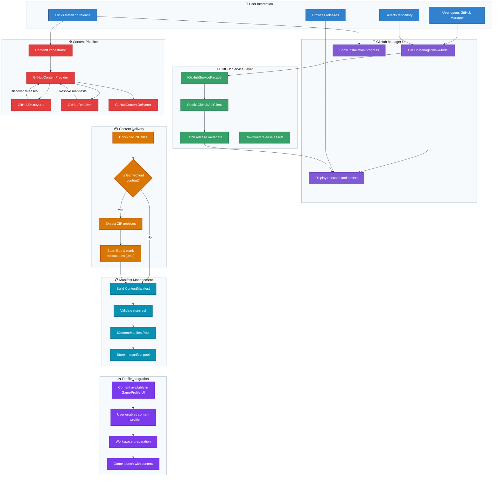
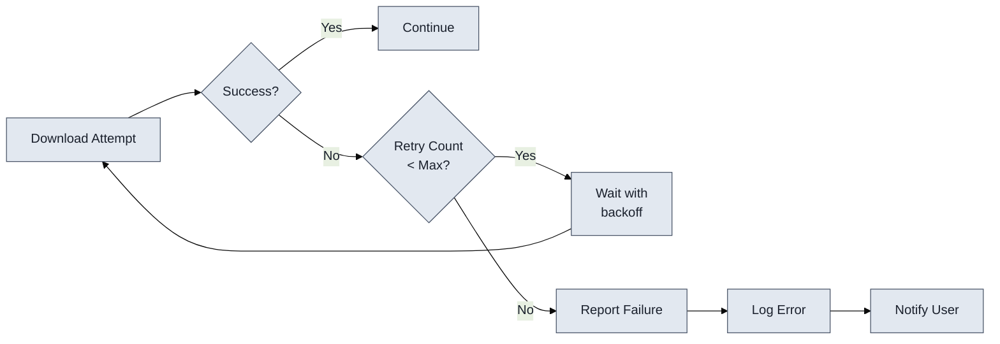
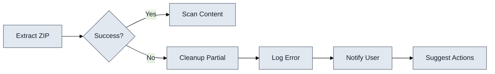

# Flowchart: GitHub Manager Workflow

This flowchart illustrates the complete workflow of the GitHub Manager feature, from repository configuration through content installation and profile integration.

**GitHub Manager Workflow Overview:**

1. **User Interaction**: User navigates GitHub Manager UI to discover and select content
2. **Repository Browsing**: UI displays available releases through GitHub Service Layer
3. **Content Selection**: User selects release for installation
4. **Pipeline Activation**: Content Orchestrator routes to GitHub Content Provider
5. **Download**: GitHubContentDeliverer downloads release assets
6. **GameClient Extraction**: For ZIP archives, system extracts and marks executable files
7. **Manifest Generation**: System builds ContentManifest with extracted file references and IsExecutable flags
8. **Validation**: Manifest validated and stored in manifest pool
9. **Profile Integration**: Content immediately available in GameProfile UI
10. **Launch Integration**: User enables content in profile for game launching

## Key Decision Points

### Content Type Determination

The workflow includes a critical decision point for GameClient content:

**Is GameClient Content?**
- **Yes**: Extract ZIP, scan for executables, generate detailed manifest
- **No**: Use manifest as-is, store without extraction

### ZIP Archive Handling

For GameClient content with ZIP archives:

1. Downloads complete successfully
2. System detects ZIP file extensions
3. Extracts to target directory (in-place)
4. Recursively scans extracted directory for all files
5. Builds new manifest with extracted file paths
6. Marks .exe files with IsExecutable flag
7. Removes original ZIP files
8. Returns updated manifest to ContentOrchestrator
9. ContentOrchestrator validates and stores in manifest pool

### Manifest Pool Storage

After validation, manifests are stored in the pool:

1. ManifestId generated deterministically
2. Manifest added to IContentManifestPool
3. Content becomes queryable by GameProfile system
4. Appears immediately in profile content dropdowns

## Component Interactions

### GitHub Manager → GitHub Service Facade

- UI requests release information
- Facade coordinates API calls
- Returns structured GitHubRelease objects
- Handles authentication and rate limiting

### Content Provider → Deliverer

- Provider orchestrates pipeline
- Deliverer downloads assets
- Returns OperationResult with success/failure
- Provides progress reporting

### Content Deliverer → ContentOrchestrator

- Deliverer downloads and extracts content
- Scans extracted files and marks executables
- Builds updated ContentManifest
- Returns manifest to ContentOrchestrator
- Orchestrator validates and adds to manifest pool

### Manifest Pool → GameProfile

- Profile queries pool for available content
- Pool returns manifests matching GameType
- Profile displays content in UI
- User selects content for enabling

## Error Handling Flow

### Download Failures

### Extraction Failures

## Performance Optimizations

### Caching Strategy

The workflow includes multiple caching layers:

1. **API Response Cache**: GitHub release metadata cached
2. **Manifest Cache**: Resolved manifests cached
3. **Search Results Cache**: Discovery results cached
4. **Pool Query Cache**: Manifest pool queries cached

### Parallel Operations

Where possible, operations execute in parallel:

- Multiple asset downloads from same release
- Concurrent file extraction from archives
- Parallel manifest validation checks

### Resource Management

The system manages resources efficiently:

- Streaming downloads for large files
- Incremental extraction with progress
- Memory-efficient file scanning
- Automatic cleanup of temporary files
