# Flowchart: GameManifest Creation

This flowchart outlines the process of creating a `GameManifest` file, either programmatically via a builder or automatically through a generation service.

```mermaid
%%{init: {
  'theme': 'base',
  'themeVariables': {
    'primaryColor': '#e2e8f0',
    'primaryTextColor': '#1a202c',
    'primaryBorderColor': '#4a5568',
    'lineColor': '#2d3748',
    'secondaryColor': '#f7fafc',
    'tertiaryColor': '#edf2f7',
    'background': '#ffffff',
    'mainBkg': '#f7fafc',
    'secondBkg': '#edf2f7',
    'nodeBorder': '#4a5568',
    'clusterBkg': '#f7fafc',
    'clusterBorder': '#a0aec0',
    'edgeLabelBackground': '#ffffff'
  }
}}%%

graph TD
    subgraph InputSource ["📥 Input Source"]
        A1["Local Directory<br/>(e.g., a mod folder)"]
        A2["Game Installation<br/>(for base game manifest)"]
        A3["Programmatic Need<br/>(e.g., resolver logic)"]
    end

    subgraph GenerationService ["🛠️ Generation Service"]
        B["IManifestGenerationService"]
        C["CreateFromDirectoryAsync()"]
        D["CreateFromInstallationAsync()"]
    end

    subgraph Builder ["🏗️ Fluent Builder: IContentManifestBuilder"]
        E["WithBasicInfo(...)"]
        F["WithContentType(...)"]
        G["WithPublisher(...)"]
        H["WithMetadata(...)"]
        I["AddFileAsync(...)<br/>AddFilesFromDirectoryAsync(...)"]
        J["AddDependency(...)"]
        K["WithInstallationInstructions(...)"]
        L["Build()"]
    end

    subgraph Output ["📤 Output"]
        M["📋 Complete<br/>GameManifest Object"]
        N["💾 Serialized to<br/>manifest.json"]
    end

    A1 --> C
    A2 --> D
    A3 --> E
    
    C --> E
    D --> E

    E --> F --> G --> H --> I --> J --> K --> L

    I -.->|Loop for each file| I
    J -.->|Loop for each dependency| J

    L --> M
    M --> N

    classDef service fill:#38a169,stroke:#2f855a,stroke-width:2px,color:#ffffff
    classDef builder fill:#805ad5,stroke:#6b46c1,stroke-width:2px,color:#ffffff
    classDef input fill:#3182ce,stroke:#2c5282,stroke-width:2px,color:#ffffff
    classDef output fill:#ed8936,stroke:#dd6b20,stroke-width:2px,color:#ffffff

    class B,C,D service
    class E,F,G,H,I,J,K,L builder
    class A1,A2,A3 input
    class M,N output
```

**Manifest Creation Workflow:**

1.  **Initiation**: The process starts from a source, like a local folder of a mod, an existing game installation, or a service that needs to construct a manifest dynamically.
2.  **Service Layer (Optional)**: For common tasks like creating a manifest from a directory, the `IManifestGenerationService` provides high-level methods. This service internally uses the builder.
3.  **Builder Pattern**: The `IContentManifestBuilder` provides a fluent API to construct the `GameManifest` step-by-step. This allows for fine-grained control over every property of the manifest.
4.  **File Population**: Methods like `AddFileAsync` and `AddFilesFromDirectoryAsync` are used to populate the `Files` list. These methods calculate hashes and other metadata automatically.
5.  **Finalization**: The `Build()` method is called to assemble all the provided information into a final, validated `GameManifest` object.
6.  **Output**: The resulting `GameManifest` object can be used by the system or serialized to a `manifest.json` file for distribution.
