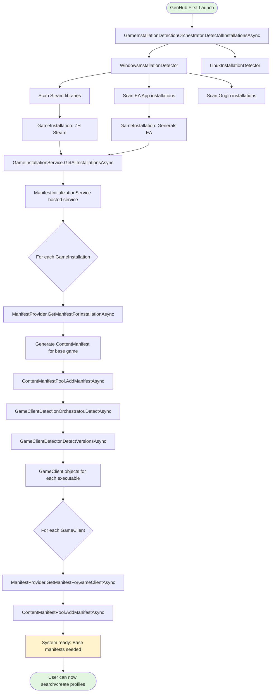
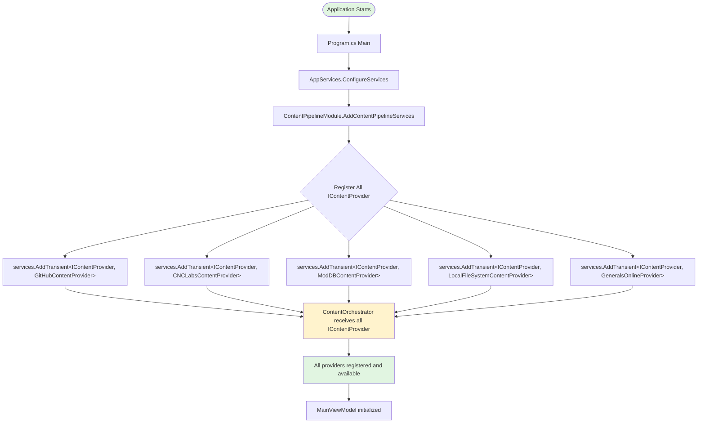
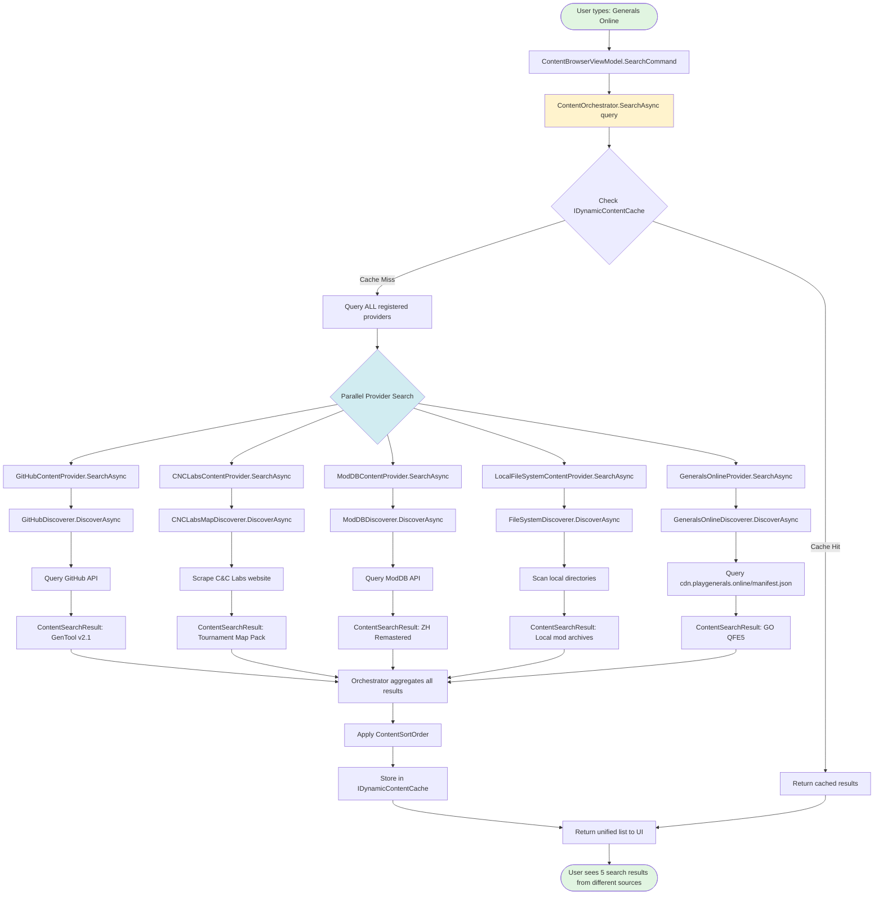
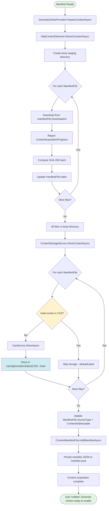
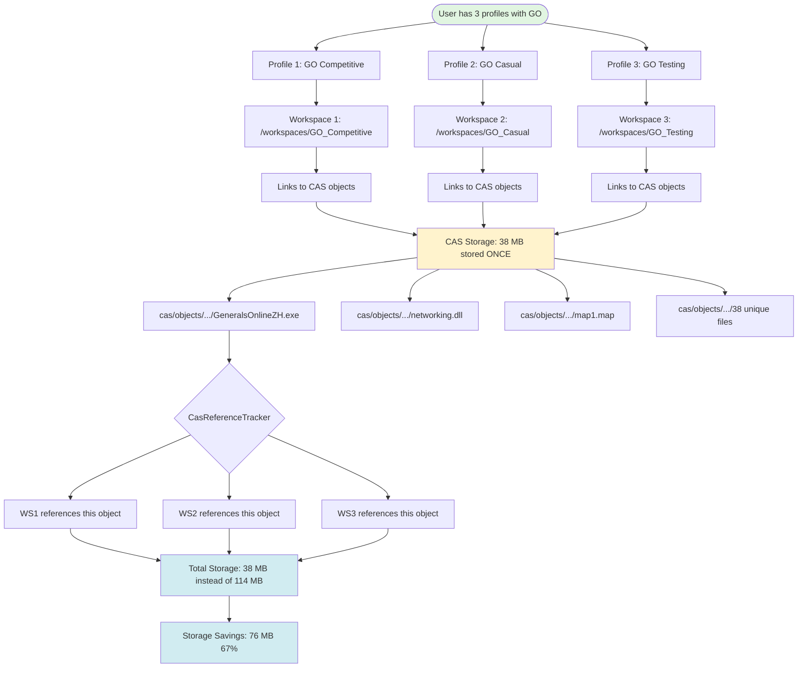
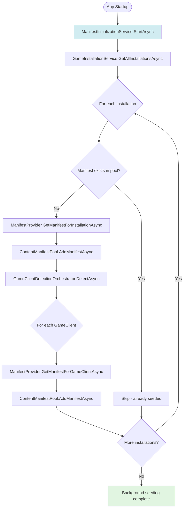
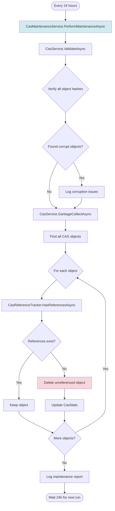

# Publisher Discovery Flow: Complete End-to-End Implementation (Merged & Enhanced)

## Overview

This document provides the **complete publisher discovery flow** for GenHub, merging the core user-facing workflows (from application startup through game launch, multi-profile support, and updates) with essential system initialization, background maintenance, dependency resolution, and facade orchestration details.

The flows represent **concrete implementations** from the GenHub codebase, covering:

- **System Bootstrap** (initial detection and manifest seeding)
- **Provider Registration** (all built-in providers)
- **Content Search** (with caching and parallel execution)
- **Content Resolution** (with manifest factory and fallbacks)
- **Content Delivery & CAS Storage** (with deduplication and progress)
- **Profile Integration & Workspace Preparation** (with full launch phases and facades)
- **Dependency Resolution** (detailed graph building and conflict detection)
- **Multi-Profile Scenario** (CAS deduplication across profiles)
- **Update Scenario** (with hash comparison and GC)
- **Background Services** (manifest initialization and CAS maintenance)

The architecture follows a three-tier model:

- **Tier 3: ContentOrchestrator & Facades** (global coordination)
- **Tier 2: ContentProviders** (source-specific orchestration)
- **Tier 1: Pipeline Components** (discoverers, resolvers, deliverers, strategies)

All flows use Dependency Injection (DI) for services, with `ContentManifestPool` as the central registry for manifests.

---

## Flow 0: Initial System Bootstrap (Game Detection & Manifest Seeding)

This prerequisite flow occurs on first launch, detecting installations and seeding base manifests before user interaction.

**Key Points**:

- Detects base game installations (e.g., Steam ZH v1.04) via platform-specific scanners.
- `ManifestProvider` generates or loads base `ContentManifest`s (e.g., for core files, no mods).
- Seeds `ContentManifestPool` with deterministic IDs (e.g., `CnC_ZeroHour_Base_Steam_v104`).
- Runs as a hosted service on startup; ensures base content is available without user action.
- Integrates with `ManifestInitializationService` for periodic re-seeding (see Flow 8).

---

## Flow 1: Application Startup → Provider Registration

**Key Points**:

- All providers (GitHub, CNC Labs, ModDB, Local FS, GeneralsOnline) registered statically in `ContentPipelineModule`.
- All injected into `ContentOrchestrator` for unified querying.
- No plugin system - GeneralsOnline is a built-in provider.

---

## Flow 2: User Initiates Content Search

**Key Points**:

- Fans out to all providers in parallel via `Task.WhenAll`.
- Each uses source-specific `IContentDiscoverer` (e.g., API calls, scraping).
- GeneralsOnlineProvider queries CDN manifest API alongside other sources.
- Aggregates into source-agnostic `ContentSearchResult`s, sorted and cached.

---

## Flow 3: Content Resolution with Fallbacks (User Selects "Generals Online QFE5")

```mermaid
graph TB
    User([User clicks: Generals Online QFE5]) --> UI[ContentItemViewModel.InstallCommand]
    
    UI --> Orchestrator[ContentOrchestrator.AcquireContentAsync searchResult]
    
    Orchestrator --> CheckResolution{searchResult.RequiresResolution?}
    
    CheckResolution -->|false| HasManifest[ContentManifest in searchResult.Data]
    CheckResolution -->|true| NeedsResolution[Identify IContentResolver]
    
    NeedsResolution --> FindProvider[Find provider by searchResult.ResolverId]
    FindProvider --> GenOnlineProvider[GeneralsOnlineProvider identified]
    
    GenOnlineProvider --> Resolver[GeneralsOnlineResolver.ResolveAsync]
    
    Resolver --> FetchDetails[Fetch full release details from CDN]
    FetchDetails --> ManifestFactory[GeneralsOnlineManifestFactory.CreateManifest]
    
    ManifestFactory --> BuildManifest{Build ContentManifest}
    
    BuildManifest --> SetId[ManifestId: GeneralsOnline_101525_QFE5_Mod_ZeroHour]
    SetId --> SetFiles[Files: 38 files with DownloadUrls]
    SetFiles --> SetDeps[Dependencies: C&C ZH v1.04+]
    SetDeps --> SetMetadata[Metadata: description, tags, publisher]
    
    SetMetadata --> CompleteManifest[Complete ContentManifest]
    
    HasManifest --> CompleteManifest
    
    CompleteManifest --> Validate[ContentValidator.ValidateManifestAsync]
    Validate --> ValidResult{Validation OK?}
    
    ValidResult -->|No| ValidationErrors[Log errors, return failure]
    ValidResult -->|Yes| FallbackCheck{Primary resolution failed?}
    
    ValidationErrors --> UserError([User sees error message])
    
    FallbackCheck -->|No| ReadyForAcquisition[Manifest ready for acquisition]
    FallbackCheck -->|Yes| TryFallbacks[Try ManifestProvider fallbacks]
    
    TryFallbacks --> LocalCache[Check ContentManifestPool for cached manifest]
    LocalCache --> CacheHit{Cache available?}
    CacheHit -->|Yes| UseCached[Use cached manifest]
    CacheHit -->|No| EmbeddedResources[Check embedded manifest resources]
    
    EmbeddedResources --> EmbeddedHit{Embedded available?}
    EmbeddedHit -->|Yes| UseEmbedded[Use embedded manifest]
    EmbeddedHit -->|No| GenerateFromScan[Generate manifest from file scan]
    
    UseCached --> ReadyForAcquisition
    UseEmbedded --> ReadyForAcquisition
    GenerateFromScan --> ScanFiles[Scan installation directory]
    ScanFiles --> BuildFromScan[Build manifest from scanned files]
    BuildFromScan --> ReadyForAcquisition
    
    ReadyForAcquisition --> NextPhase[Continue to Delivery phase]
    
    style User fill:#e1f5e1
    style CompleteManifest fill:#fff3cd
    style Validate fill:#d1ecf1
    style TryFallbacks fill:#fff3cd
```

**Enhanced Key Points**:

- **Provider Chain Resolution**: IManifestProvider implementations tried in priority order
- **Fallback to Local Manifests**: System falls back to locally cached manifests when remote providers fail
- **Generated Manifest Creation**: For content without explicit manifests, generates basic manifests from file analysis
- **Cross-Provider Manifest Sharing**: Manifests from one provider can be used as fallbacks for content from other providers
- **Offline Mode Support**: System maintains functionality with cached manifests when network providers are unavailable

---

## Flow 4: Content Delivery & CAS Storage

**Key Points**:

- Downloads to temp, hashes for CAS lookup (deduplication).
- `CasService` stores by hash path (e.g., `cas/objects/{hash[0:2]}/{hash[2:4]}/{hash}`).
- Updates manifest with CAS references; persists to pool.

---

## Flow 5: Facade-Orchestrated Profile Creation & Launch (with Dependency Resolution & CAS Preflight)

Merges profile integration, workspace preparation, dependency resolution, and facades with CAS preflight validation.

```mermaid
graph TB
    User([User creates profile: GO Multiplayer]) --> Facade[ProfileEditorFacade.CreateProfileAsync]
    
    Facade --> Validate1[Validate CreateProfileRequest]
    Validate1 --> Manager[GameProfileManager.CreateProfileAsync]
    
    Manager --> Repository[GameProfileRepository.SaveProfileAsync]
    Repository --> ProfileCreated[GameProfile persisted]
    
    ProfileCreated --> AutoEnable{Auto-enable base content}
    
    AutoEnable --> FindInstall[Find matching GameInstallation by GameType]
    FindInstall --> PoolSearch[ContentManifestPool.GetManifestByTypeAsync]
    PoolSearch --> InstallManifest[Found base installation manifest]
    
    InstallManifest --> FindClient{GameClient available?}
    FindClient -->|Yes| ClientManifest[Found GameClient manifest]
    FindClient -->|No| SkipClient[No client manifest]
    
    ClientManifest --> EnableBoth[Add both to profile.EnabledContentIds]
    SkipClient --> EnableInstall[Add installation to profile.EnabledContentIds]
    
    EnableBoth --> ResolveDeps[DependencyResolver.ResolveDependenciesAsync]
    EnableInstall --> ResolveDeps
    
    ResolveDeps --> GetManifests[Get all ContentManifests for EnabledContentIds]
    GetManifests --> BuildGraph[Build dependency graph]
    
    BuildGraph --> Extract[Extract all ContentDependency objects]
    Extract --> Group[Group by DependencyType: Required/Optional/Conflicting]
    
    Group --> CheckRequired{For each required dep}
    CheckRequired --> InPool{Exists in ContentManifestPool?}
    
    InPool -->|No| Error[Add error: Missing required dep]
    InPool -->|Yes| ValidateVersion[Check version constraints]
    
    ValidateVersion --> VersionOK{Compatible?}
    VersionOK -->|No| Error
    VersionOK -->|Yes| AddResolved[Add to resolved list]
    
    Group --> CheckOptional{For each optional dep}
    CheckOptional --> InPoolOpt{Exists?}
    InPoolOpt -->|Yes| AddResolved
    InPoolOpt -->|No| SkipOpt[Skip]
    
    Group --> CheckConflict{For each conflict}
    CheckConflict --> InPoolConf{Exists?}
    InPoolConf -->|Yes| Error2[Add error: Conflicting content]
    InPoolConf -->|No| SkipConf[No conflict]
    
    AddResolved --> Next1{More deps?}
    SkipOpt --> Next1
    SkipConf --> Next1
    Error --> Next2{More to check?}
    Error2 --> Next2
    
    Next1 -->|No| ResolutionResult[Return DependencyResolutionResult]
    Next2 -->|No| ResolutionResult
    
    ResolutionResult --> HasErrors{Has errors?}
    HasErrors -->|Yes| FailProfile[Profile validation fails - user sees errors]
    HasErrors -->|No| CASPreflight[Perform CAS preflight check]
    
    CASPreflight --> CollectHashes[Collect all CAS hashes from manifests]
    CollectHashes --> CheckExistence{For each hash}
    CheckExistence --> Exists[CasService.ExistsAsync]
    Exists --> Available{Hash exists?}
    Available -->|Yes| NextHash{More hashes?}
    Available -->|No| PreflightFail[CAS preflight failed - missing content]
    
    NextHash -->|Yes| CheckExistence
    NextHash -->|No| PreflightPass[CAS preflight passed]
    
    PreflightFail --> UserError([Show error: Content not fully downloaded])
    PreflightPass --> PrepWorkspace[WorkspaceManager.PrepareWorkspaceAsync]
    
    PrepWorkspace --> BuildConfig[WorkspaceConfiguration]
    BuildConfig --> AddBaseManifest[Add base game manifest]
    AddBaseManifest --> AddGOManifest[Add GO manifest]
    AddGOManifest --> SelectStrategy[Strategy: profile.PreferredStrategy HybridCopySymlink]
    
    SelectStrategy --> Strategy[HybridCopySymlinkStrategy.PrepareAsync]
    
    Strategy --> ClassifyFiles{Classify each file}
    
    ClassifyFiles --> Essential[Executables, DLLs, configs → COPY]
    ClassifyFiles --> Media[Maps, textures, audio → SYMLINK]
    
    Essential --> CopyFromCAS[FileOperationsService.CopyFromCasAsync]
    Media --> LinkFromCAS[FileOperationsService.CreateSymlinkAsync to CAS]
    
    CopyFromCAS --> TrackRef[CasReferenceTracker.AddReferenceAsync]
    LinkFromCAS --> TrackRef
    
    TrackRef --> ValidateWorkspace[WorkspaceValidator.ValidateWorkspaceAsync]
    ValidateWorkspace --> WorkspaceReady[WorkspaceInfo with executables, symlinks]
    
    WorkspaceReady --> UserLaunch([User clicks Launch])
    UserLaunch --> LauncherFacade[ProfileLauncherFacade.LaunchProfileAsync]
    
    LauncherFacade --> Launcher[GameLauncher.LaunchProfileAsync]
    
    Launcher --> ValidatePhase[LaunchPhase: ValidatingProfile]
    ValidatePhase --> LoadProfile[Load GameProfile from repository]
    LoadProfile --> ResolvingPhase[LaunchPhase: ResolvingContent]
    
    ResolvingPhase --> WorkspaceReady
    
    WorkspaceReady --> LaunchProcess[GameProcessManager.StartProcessAsync]
    LaunchProcess --> Running[LaunchPhase: Running]
    Running --> RegisterSession[LaunchRegistry.RegisterLaunchAsync]
    RegisterSession --> GameRunning([Generals Online running in isolated workspace])
    
    style User fill:#e1f5e1
    style GameRunning fill:#e1f5e1
    style Facade fill:#fff3cd
    style LauncherFacade fill:#fff3cd
    style ClassifyFiles fill:#d1ecf1
    style Error fill:#f8d7da
    style Error2 fill:#f8d7da
    style CASPreflight fill:#fff3cd
    style PreflightFail fill:#f8d7da
```

**Key Points** (Merged Enhancements with CAS Preflight):

- `ProfileEditorFacade`/`ProfileLauncherFacade` orchestrate creation/launch, auto-enabling base manifests via `ManifestProvider`.
- `DependencyResolver` builds graph, validates required/optional/conflicts (e.g., GO requires ZH v1.04, conflicts with incompatible mods).
- **CAS Preflight**: Validates all CAS hashes referenced by manifests exist before workspace preparation (fail early).
- `HybridCopySymlinkStrategy`: Copies essentials (to avoid breakage), symlinks assets (for space efficiency).
- Launches in isolated `/workspaces/{profileId}` with `CasReferenceTracker` for ref counting.
- Errors (e.g., missing deps, missing CAS content) surface to UI early.

---

## Flow 6: Multi-Profile Scenario (CAS Deduplication)

**Key Points**:

- Shared CAS objects across workspaces via symlinks/hardlinks.
- `CasReferenceTracker` increments/decrements refs on workspace prep/teardown.
- Enables efficient multi-profile use without redundant storage.

---

## Flow 7: Update Scenario (GO QFE5 → QFE6)

```mermaid
graph TB
    Start([GO Team releases QFE6]) --> CDN[Update cdn.playgenerals.online/manifest.json]
    
    CDN --> Poll[GenHub polls API every 24h]
    Poll --> Detect[Detect new version available]
    Detect --> Notify[Notify user: Update available]
    
    Notify --> UserAccept([User clicks: Update Generals Online])
    
    UserAccept --> Search[ContentOrchestrator.SearchAsync]
    Search --> Discover[GeneralsOnlineDiscoverer finds QFE6]
    Discover --> Resolve[GeneralsOnlineResolver creates new manifest]
    
    Resolve --> NewManifest[ManifestId: GeneralsOnline_101625_QFE6_Mod_ZeroHour]
    
    NewManifest --> Acquire[ContentOrchestrator.AcquireContentAsync]
    
    Acquire --> Download[Download QFE6 ZIP]
    Download --> ExtractHash[Extract and hash all files]
    
    ExtractHash --> CompareHashes{For each file compare hash}
    
    CompareHashes --> Unchanged[File hash matches QFE5 → Reuse CAS object]
    CompareHashes --> Changed[File hash different → Store new in CAS]
    
    Unchanged --> SkipStorage[Skip download/storage - already in CAS]
    Changed --> StoreNew[CasService.StoreAsync new version]
    
    SkipStorage --> NewManifestComplete[Complete QFE6 manifest]
    StoreNew --> NewManifestComplete
    
    NewManifestComplete --> UpdateProfile[User updates profile to enable QFE6]
    UpdateProfile --> DisableQFE5[Disable QFE5 in profile]
    DisableQFE5 --> EnableQFE6[Enable QFE6 in profile]
    
    EnableQFE6 --> RecreateWS[WorkspaceManager.PrepareWorkspaceAsync]
    RecreateWS --> Relink[Relink workspace to new CAS objects]
    
    Relink --> UnrefQFE5[CasReferenceTracker unreference QFE5 objects]
    UnrefQFE5 --> RefQFE6[CasReferenceTracker reference QFE6 objects]
    
    RefQFE6 --> GC{CAS Garbage Collection}
    
    GC --> KeepQFE5[QFE5 objects kept if other profiles use them]
    GC --> RemoveQFE5[QFE5 objects removed if no references]
    
    KeepQFE5 --> Updated([User launches with QFE6])
    RemoveQFE5 --> Updated
    
    style Start fill:#e1f5e1
    style Updated fill:#e1f5e1
    style CompareHashes fill:#fff3cd
    style GC fill:#d1ecf1
```

**Key Points**:

- Polling via background service detects updates.
- Hash comparison minimizes downloads/storage (only changed files).
- Profile swap triggers workspace recreation; GC via `CasReferenceTracker`.

---

## Flow 8: Background Services (Manifest Initialization & CAS Maintenance)

Hosted services for autonomous system health.

### Sub-Flow 8.1: ManifestInitializationService

**Key Points**:

- Re-runs on startup or schedule to re-seed if installations change (e.g., new Steam game).
- Ensures base manifests are always pool-ready.

### Sub-Flow 8.2: CasMaintenanceService

**Key Points**:

- Validates integrity and GCs unreferenced objects (e.g., old mod versions).
- Runs periodically; logs stats (e.g., space reclaimed).

---

## Summary: Complete Publisher Discovery Ecosystem

### Built-in Content Providers

- **GitHubContentProvider** → GitHub releases, repositories
- **CNCLabsContentProvider** → C&C Labs maps
- **ModDBContentProvider** → ModDB mods
- **LocalFileSystemContentProvider** → Local archives/directories
- **GeneralsOnlineProvider** → GO multiplayer client (built-in)

### Pipeline Flow

1. **Discovery**: All providers queried in parallel
2. **Resolution**: Selected content resolved to full manifest
3. **Delivery**: Files downloaded to staging
4. **Storage**: Files stored in CAS (deduplicated)
5. **Pooling**: Manifests persisted in pool
6. **Integration**: Content enabled in profiles
7. **Workspace**: Files assembled via strategy
8. **Launch**: Game runs in isolated environment

### Key Architectural Benefits

- ✅ **Dynamic provider registration** - all via DI container
- ✅ **Unified search** - single interface for all sources
- ✅ **CAS deduplication** - massive storage savings
- ✅ **Multi-profile support** - shared content across profiles
- ✅ **Update-friendly** - version tracking and rollback
- ✅ **Isolated execution** - no conflicts between profiles
- ✅ **Background maintenance** - autonomous system health
- ✅ **Dependency resolution** - conflict detection and validation
- ✅ **Facade coordination** - high-level orchestration for UI

This is the **complete end-to-end publisher discovery flow** using actual GenHub implementations, with GeneralsOnline as a built-in content provider alongside the existing providers.
