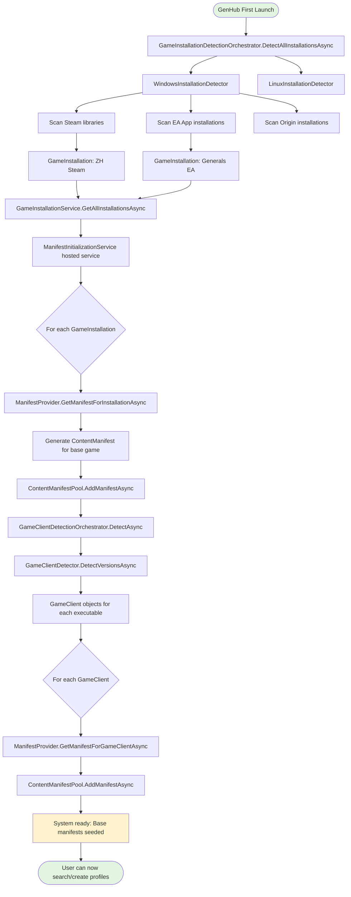
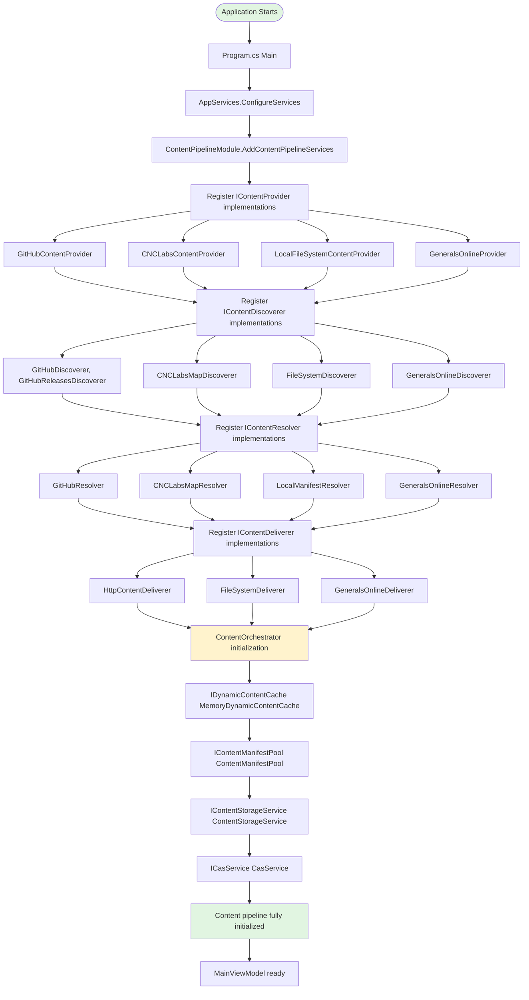
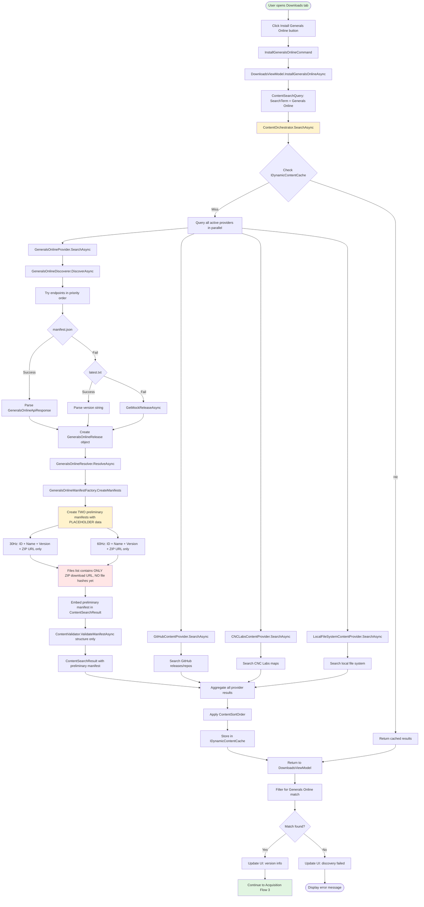
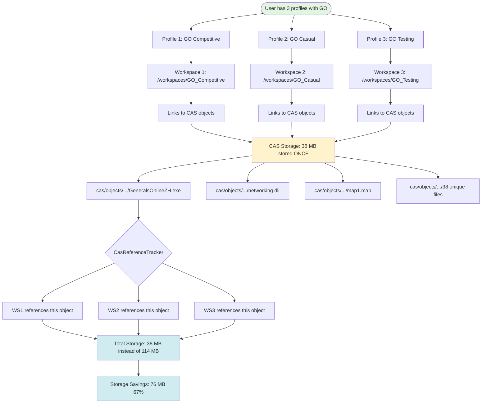
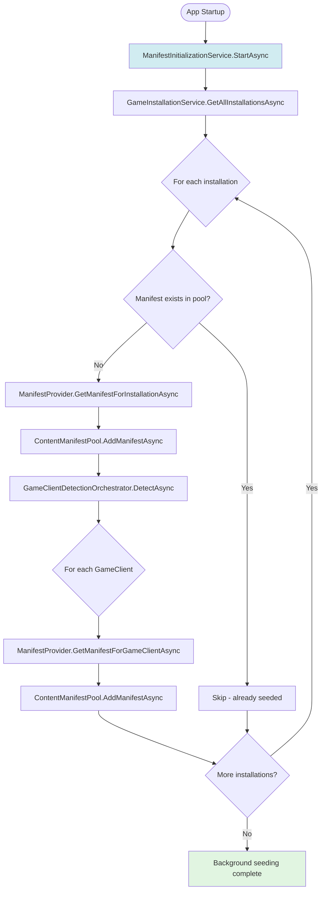
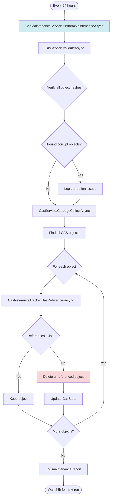

# Publisher Discovery Flow: Complete End-to-End Implementation (Merged & Enhanced)

## Overview

This document provides the **complete publisher discovery flow** for GenHub, merging the core user-facing workflows (from application startup through game launch, multi-profile support, and updates) with essential system initialization, background maintenance, dependency resolution, and facade orchestration details.

The flows represent **concrete implementations** from the GenHub codebase, covering:

- **System Bootstrap** (initial detection and manifest seeding)
- **Provider Registration** (all built-in providers)
- **Content Search** (with caching and parallel execution)
- **Content Resolution** (with manifest factory and fallbacks)
- **Content Delivery & CAS Storage** (with deduplication and progress)
- **Profile Integration & Workspace Preparation** (with full launch phases and facades)
- **Dependency Resolution** (detailed graph building and conflict detection)
- **Multi-Profile Scenario** (CAS deduplication across profiles)
- **Update Scenario** (with hash comparison and GC)
- **Background Services** (manifest initialization and CAS maintenance)

The architecture follows a three-tier model:

- **Tier 3: ContentOrchestrator & Facades** (global coordination)
- **Tier 2: ContentProviders** (source-specific orchestration)
- **Tier 1: Pipeline Components** (discoverers, resolvers, deliverers, strategies)

All flows use Dependency Injection (DI) for services, with `ContentManifestPool` as the central registry for manifests.

---

## Flow 0: Initial System Bootstrap (Game Detection & Manifest Seeding)

This prerequisite flow occurs on first launch, detecting installations and seeding base manifests before user interaction.


```mermaid
graph TB
    Start([GenHub First Launch]) --> Detection[GameInstallationDetectionOrchestrator.DetectAllInstallationsAsync]
    
    Detection --> Win[WindowsInstallationDetector]
    Detection --> Linux[LinuxInstallationDetector]
    
    Win --> Steam[Scan Steam libraries]
    Win --> EA[Scan EA App installations]
    Win --> Origin[Scan Origin installations]
    
    Steam --> Found1[GameInstallation: ZH Steam]
    EA --> Found2[GameInstallation: Generals EA]
    
    Found1 --> Service[GameInstallationService.GetAllInstallationsAsync]
    Found2 --> Service
    
    Service --> ManifestInit[ManifestInitializationService hosted service]
    
    ManifestInit --> GenManifests{For each GameInstallation}
    
    GenManifests --> Provider[ManifestProvider.GetManifestForInstallationAsync]
    Provider --> Generate[Generate ContentManifest for base game]
    Generate --> Pool[ContentManifestPool.AddManifestAsync]
    
    Pool --> ClientDetect[GameClientDetectionOrchestrator.DetectAsync]
    ClientDetect --> Detector[GameClientDetector.DetectVersionsAsync]
    Detector --> Clients[GameClient objects for each executable]
    
    Clients --> ClientManifests{For each GameClient}
    ClientManifests --> ProviderClient[ManifestProvider.GetManifestForGameClientAsync]
    ProviderClient --> PoolClient[ContentManifestPool.AddManifestAsync]
    
    PoolClient --> Ready[System ready: Base manifests seeded]
    Ready --> UIReady([User can now search/create profiles])
    
    style Start fill:#e1f5e1
    style Ready fill:#fff3cd
    style UIReady fill:#e1f5e1
```

**Key Points**:

- Detects base game installations (e.g., Steam ZH v1.04) via platform-specific scanners.
- `ManifestProvider` generates or loads base `ContentManifest`s (e.g., for core files, no mods).
- Seeds `ContentManifestPool` with deterministic IDs (e.g., `CnC_ZeroHour_Base_Steam_v104`).
- Runs as a hosted service on startup; ensures base content is available without user action.
- Integrates with `ManifestInitializationService` for periodic re-seeding (see Flow 7).

---

## Flow 1: Application Startup & Provider Registration

During application initialization, all content providers are registered via dependency injection.


```mermaid
graph TB
    Start([Application Starts]) --> Program[Program.cs Main]
    Program --> AppServices[AppServices.ConfigureServices]
    
    AppServices --> ContentPipeline[ContentPipelineModule.AddContentPipelineServices]
    
    ContentPipeline --> RegProviders[Register IContentProvider implementations]
    
    RegProviders --> GitHub[GitHubContentProvider]
    RegProviders --> CNCLabs[CNCLabsContentProvider]
    RegProviders --> LocalFS[LocalFileSystemContentProvider]
    RegProviders --> GenOnline[GeneralsOnlineProvider]
    
    GitHub --> RegDiscoverers[Register IContentDiscoverer implementations]
    CNCLabs --> RegDiscoverers
    LocalFS --> RegDiscoverers
    GenOnline --> RegDiscoverers
    
    RegDiscoverers --> GitHubDisc[GitHubDiscoverer, GitHubReleasesDiscoverer]
    RegDiscoverers --> CNCLabsDisc[CNCLabsMapDiscoverer]
    RegDiscoverers --> FileDisc[FileSystemDiscoverer]
    RegDiscoverers --> GenOnlineDisc[GeneralsOnlineDiscoverer]
    
    GitHubDisc --> RegResolvers[Register IContentResolver implementations]
    CNCLabsDisc --> RegResolvers
    FileDisc --> RegResolvers
    GenOnlineDisc --> RegResolvers
    
    RegResolvers --> GitHubRes[GitHubResolver]
    RegResolvers --> CNCLabsRes[CNCLabsMapResolver]
    RegResolvers --> LocalRes[LocalManifestResolver]
    RegResolvers --> GenOnlineRes[GeneralsOnlineResolver]
    
    GitHubRes --> RegDeliverers[Register IContentDeliverer implementations]
    CNCLabsRes --> RegDeliverers
    LocalRes --> RegDeliverers
    GenOnlineRes --> RegDeliverers
    
    RegDeliverers --> HttpDel[HttpContentDeliverer]
    RegDeliverers --> FSDel[FileSystemDeliverer]
    RegDeliverers --> GenOnlineDel[GeneralsOnlineDeliverer]
    
    HttpDel --> Orchestrator[ContentOrchestrator initialization]
    FSDel --> Orchestrator
    GenOnlineDel --> Orchestrator
    
    Orchestrator --> Cache[IDynamicContentCache MemoryDynamicContentCache]
    Cache --> Pool[IContentManifestPool ContentManifestPool]
    Pool --> Storage[IContentStorageService ContentStorageService]
    Storage --> CAS[ICasService CasService]
    
    CAS --> Ready[Content pipeline fully initialized]
    Ready --> UIStart[MainViewModel ready]
    
    style Start fill:#e1f5e1
    style Ready fill:#e1f5e1
    style Orchestrator fill:#fff3cd
```

**Three-Tier Architecture**:

1. **Providers (Tier 2)**: Source-specific orchestration
   - GitHubContentProvider
   - CNCLabsContentProvider
   - LocalFileSystemContentProvider
   - GeneralsOnlineProvider
   - ModDBContentProvider (exists but not registered in DI)

2. **Pipeline Components (Tier 1)**:
   - **Discoverers**: Find available content from sources
   - **Resolvers**: Convert discoveries into full manifests
   - **Deliverers**: Download and prepare content files

3. **Orchestrator (Tier 3)**: Global coordination
   - ContentOrchestrator: Coordinates all providers
   - IDynamicContentCache: Performance optimization
   - ContentManifestPool: Central manifest registry
   - ContentStorageService: CAS integration
   - CasService: Content-addressable storage

**Registration Details**:

- All services registered via `ContentPipelineModule.AddContentPipelineServices()`
- Providers injected as `IEnumerable<IContentProvider>` into ContentOrchestrator
- Each provider locates its pipeline components by SourceName/ResolverId matching
- CAS and manifest pool shared across all providers for deduplication

---

## Flow 2: Generals Online Discovery & Resolution

User initiates Generals Online installation from Downloads tab. Discovery finds the release, and resolution creates **preliminary manifests with placeholder data**.


```mermaid
graph TB
    User([User opens Downloads tab]) --> Button[Click Install Generals Online button]
    
    Button --> Command[InstallGeneralsOnlineCommand]
    Command --> ViewModel[DownloadsViewModel.InstallGeneralsOnlineAsync]
    
    ViewModel --> CreateQuery[ContentSearchQuery: SearchTerm = Generals Online]
    CreateQuery --> Orchestrator[ContentOrchestrator.SearchAsync]
    
    Orchestrator --> CheckCache{Check IDynamicContentCache}
    CheckCache -->|Hit| ReturnCached[Return cached results]
    CheckCache -->|Miss| ParallelSearch[Query all active providers in parallel]
    
    ParallelSearch --> GitHub[GitHubContentProvider.SearchAsync]
    ParallelSearch --> CNCLabs[CNCLabsContentProvider.SearchAsync]
    ParallelSearch --> LocalFS[LocalFileSystemContentProvider.SearchAsync]
    ParallelSearch --> GenOnline[GeneralsOnlineProvider.SearchAsync]
    
    GenOnline --> Discoverer[GeneralsOnlineDiscoverer.DiscoverAsync]
    Discoverer --> TryEndpoints[Try endpoints in priority order]
    
    TryEndpoints --> ManifestJSON{manifest.json}
    ManifestJSON -->|Success| FullAPI[Parse GeneralsOnlineApiResponse]
    ManifestJSON -->|Fail| LatestTXT{latest.txt}
    LatestTXT -->|Success| VersionOnly[Parse version string]
    LatestTXT -->|Fail| MockData[GetMockReleaseAsync]
    
    FullAPI --> CreateRelease[Create GeneralsOnlineRelease object]
    VersionOnly --> CreateRelease
    MockData --> CreateRelease
    
    CreateRelease --> Resolver[GeneralsOnlineResolver.ResolveAsync]
    Resolver --> CreateManifests[GeneralsOnlineManifestFactory.CreateManifests]
    
    CreateManifests --> Placeholder[Create TWO preliminary manifests with PLACEHOLDER data]
    
    Placeholder --> Manifest30[30Hz: ID + Name + Version + ZIP URL only]
    Placeholder --> Manifest60[60Hz: ID + Name + Version + ZIP URL only]
    
    Manifest30 --> NoHashes[Files list contains ONLY ZIP download URL, NO file hashes yet]
    Manifest60 --> NoHashes
    
    NoHashes --> EmbedInResult[Embed preliminary manifest in ContentSearchResult]
    EmbedInResult --> Validate[ContentValidator.ValidateManifestAsync structure only]
    Validate --> GenOnlineResult[ContentSearchResult with preliminary manifest]
    
    GitHub --> GitHubResults[Search GitHub releases/repos]
    CNCLabs --> CNCLabsResults[Search CNC Labs maps]
    LocalFS --> LocalResults[Search local file system]
    
    GenOnlineResult --> Aggregate[Aggregate all provider results]
    GitHubResults --> Aggregate
    CNCLabsResults --> Aggregate
    LocalResults --> Aggregate
    
    Aggregate --> Sort[Apply ContentSortOrder]
    Sort --> CacheResults[Store in IDynamicContentCache]
    CacheResults --> Return[Return to DownloadsViewModel]
    
    ReturnCached --> Return
    Return --> Filter[Filter for Generals Online match]
    Filter --> Found{Match found?}
    
    Found -->|Yes| UpdateUI[Update UI: version info]
    Found -->|No| ErrorUI[Update UI: discovery failed]
    
    UpdateUI --> NextPhase[Continue to Acquisition Flow 3]
    ErrorUI --> UserError([Display error message])
    
    style User fill:#e1f5e1
    style NextPhase fill:#e1f5e1
    style Orchestrator fill:#fff3cd
    style Placeholder fill:#fff3cd
    style NoHashes fill:#ffe6e6
```

**Critical Implementation Detail - Lazy Resolution**:

During **Discovery & Resolution** phase:
- `GeneralsOnlineDiscoverer` finds release info from CDN
- `GeneralsOnlineResolver` calls `GeneralsOnlineManifestFactory.CreateManifests(release)`
- Factory creates **TWO preliminary manifests** with:
  - ✅ Manifest ID (e.g., `1.1015255.generalsonline.gameclient.30hz`)
  - ✅ Name, Version, ContentType, TargetGame
  - ✅ Publisher info, metadata, dependencies
  - ✅ **ONE file entry**: The ZIP download URL with placeholder size
  - ❌ **NO individual file hashes** - files haven't been downloaded yet!

**Why This Works**:
- The manifest is valid structurally (passes `ValidateManifestAsync`)
- It contains enough info to display in UI (name, version, description)
- The ZIP URL is all that's needed to start acquisition
- **Full file list populated later** during delivery (Flow 3)

**Example Preliminary Manifest**:
```json
{
  "Id": "1.1015255.generalsonline.gameclient.30hz",
  "Name": "GeneralsOnline 30Hz",
  "Version": "101525_QFE5",
  "Files": [
    {
      "RelativePath": "GeneralsOnline_Portable.zip",
      "DownloadUrl": "https://cdn.playgenerals.online/.../GeneralsOnline_Portable.zip",
      "Size": 38000000,
      "Hash": ""  // EMPTY - will be populated during delivery
    }
  ]
}
```

---

## Flow 3: Content Acquisition & Delivery 

Following discovery, the orchestrator downloads content and **transforms preliminary manifests into complete manifests** with full file lists and hashes.


```mermaid
graph TB
    Start([Discovery complete with preliminary manifest]) --> ViewModel[DownloadsViewModel continues acquisition]
    
    ViewModel --> CallAcquire[ContentOrchestrator.AcquireContentAsync]
    
    CallAcquire --> ExtractManifest[Extract preliminary manifest from result]
    ExtractManifest --> ValidateStructure[ContentValidator.ValidateManifestAsync structure]
    
    ValidateStructure --> StructureOK{Valid?}
    StructureOK -->|No| ValidationFail[Return validation errors]
    StructureOK -->|Yes| CreateStaging[Create staging directory temp/GenHub/Staging/manifestId]
    
    CreateStaging --> PrepareContent[Provider.PrepareContentAsync]
    
    PrepareContent --> DeliverContent[GeneralsOnlineDeliverer.DeliverContentAsync]
    
    DeliverContent --> ReadZipUrl[Read ZIP URL from preliminary manifest.Files]
    ReadZipUrl --> DownloadZIP[DownloadService.DownloadFileAsync ZIP to staging]
    DownloadZIP --> ExtractZIP[ZipFile.ExtractToDirectory staging/extracted]
    
    ExtractZIP --> ListExtracted[Directory.GetFiles enumerate all extracted files]
    ListExtracted --> HashAll[SHA256.HashDataAsync compute hash for each file]
    
    HashAll --> ClassifyFiles[Classify files by variant]
    
    ClassifyFiles --> Files30Hz[30Hz: GeneralsOnlineZH.exe + shared files]
    ClassifyFiles --> Files60Hz[60Hz: GeneralsOnlineZH_60.exe + shared files]
    
    Files30Hz --> UpdateFactory30[GeneralsOnlineManifestFactory.UpdateManifestsWithExtractedFiles]
    Files60Hz --> UpdateFactory60[GeneralsOnlineManifestFactory.UpdateManifestsWithExtractedFiles]
    
    UpdateFactory30 --> CompleteManifest30[COMPLETE 30Hz manifest with all file hashes]
    UpdateFactory60 --> CompleteManifest60[COMPLETE 60Hz manifest with all file hashes]
    
    CompleteManifest30 --> Register30[ContentManifestPool.AddManifestAsync 30Hz]
    CompleteManifest60 --> Register60[ContentManifestPool.AddManifestAsync 60Hz]
    
    Register30 --> StorageSvc30[ContentStorageService.StoreContentAsync]
    Register60 --> StorageSvc60[ContentStorageService.StoreContentAsync]
    
    StorageSvc30 --> IterateFiles30{For each file in complete 30Hz manifest}
    StorageSvc60 --> IterateFiles60{For each file in complete 60Hz manifest}
    
    IterateFiles30 --> CheckCAS30{Hash in CAS?}
    IterateFiles60 --> CheckCAS60{Hash in CAS?}
    
    CheckCAS30 -->|Yes| SkipFile30[Skip - deduplicated]
    CheckCAS30 -->|No| StoreCAS30[CasService.StoreAsync from staging/extracted]
    
    CheckCAS60 -->|Yes| SkipFile60[Skip - deduplicated]
    CheckCAS60 -->|No| StoreCAS60[CasService.StoreAsync from staging/extracted]
    
    StoreCAS30 --> CASPath[Store in cas/objects/XX/hash]
    StoreCAS60 --> CASPath
    
    SkipFile30 --> NextFile30{More files?}
    SkipFile60 --> NextFile60{More files?}
    
    NextFile30 -->|Yes| IterateFiles30
    NextFile30 -->|No| Complete30[30Hz complete manifest in pool]
    
    NextFile60 -->|Yes| IterateFiles60
    NextFile60 -->|No| Complete60[60Hz complete manifest in pool]
    
    Complete30 --> BothDone[Both complete manifests registered]
    Complete60 --> BothDone
    
    BothDone --> ValidateFiles[ContentValidator.ValidateAllAsync verify hashes]
    ValidateFiles --> Cleanup[Delete staging directory]
    Cleanup --> Success([Installation complete - 2 variants available for profiles])
    
    ValidationFail --> Error([Display error to user])
    
    style Start fill:#e1f5e1
    style Success fill:#e1f5e1
    style CompleteManifest30 fill:#d4edda
    style CompleteManifest60 fill:#d4edda
    style CASPath fill:#d1ecf1
```

**Critical Transformation - Preliminary → Complete Manifests**:

**BEFORE Delivery (preliminary manifest from Flow 2)**:
```json
{
  "Id": "1.1015255.generalsonline.gameclient.30hz",
  "Name": "GeneralsOnline 30Hz",
  "Files": [
    {
      "RelativePath": "GeneralsOnline_Portable.zip",
      "DownloadUrl": "https://cdn.../GeneralsOnline_Portable.zip",
      "Size": 38000000,
      "Hash": ""  // EMPTY
    }
  ]
}
```

**AFTER Delivery (complete manifest)**:
```json
{
  "Id": "1.1015255.generalsonline.gameclient.30hz",
  "Name": "GeneralsOnline 30Hz",
  "Files": [
    {
      "RelativePath": "GeneralsOnlineZH.exe",
      "Size": 5242880,
      "Hash": "a3f4b2...1d9e8c",  // REAL SHA-256
      "SourceType": "ContentAddressable",
      "IsExecutable": true
    },
    {
      "RelativePath": "data/maps/map001.map",
      "Size": 1048576,
      "Hash": "7c8d9e...2f3a4b",  // REAL SHA-256
      "SourceType": "ContentAddressable"
    }
    // ... +36 more files with real hashes
  ]
}
```

**Implementation Steps**:

1. **Download**: `DownloadService` fetches single ZIP (38 MB)
2. **Extract**: `ZipFile.ExtractToDirectory` unpacks all files to staging
3. **Hash All Files**: Loop through extracted files, compute SHA-256 for each
4. **Classify**: Separate files into 30Hz (with `GeneralsOnlineZH.exe`) and 60Hz (with `GeneralsOnlineZH_60.exe`) sets
5. **Update Manifests**: `UpdateManifestsWithExtractedFiles` replaces preliminary file list with complete file list
6. **Pool Registration**: Both complete manifests added to ContentManifestPool
7. **CAS Storage**: Files copied from staging to CAS (deduplicated by hash)
8. **Cleanup**: Staging directory deleted

**Why Two-Phase Approach**:
- Discovery needs to be fast (no downloads) to show results in UI
- Acquisition can be slow (downloads, extraction, hashing) with progress reporting
- Preliminary manifest provides metadata for user decision
- Complete manifest provides CAS hashes for actual storage

---

## Flow 4: Profile Creation & Launch (with Dependency Resolution & CAS Preflight)

Merges profile integration, workspace preparation, dependency resolution, and facades with CAS preflight validation.


```mermaid
graph TB
    User([User creates profile: GO Multiplayer]) --> Facade[ProfileEditorFacade.CreateProfileAsync]
    
    Facade --> Validate1[Validate CreateProfileRequest]
    Validate1 --> Manager[GameProfileManager.CreateProfileAsync]
    
    Manager --> Repository[GameProfileRepository.SaveProfileAsync]
    Repository --> ProfileCreated[GameProfile persisted]
    
    ProfileCreated --> AutoEnable{Auto-enable base content}
    
    AutoEnable --> FindInstall[Find matching GameInstallation by GameType]
    FindInstall --> PoolSearch[ContentManifestPool.GetManifestByTypeAsync]
    PoolSearch --> InstallManifest[Found base installation manifest]
    
    InstallManifest --> FindClient{GameClient available?}
    FindClient -->|Yes| ClientManifest[Found GameClient manifest]
    FindClient -->|No| SkipClient[No client manifest]
    
    ClientManifest --> EnableBoth[Add both to profile.EnabledContentIds]
    SkipClient --> EnableInstall[Add installation to profile.EnabledContentIds]
    
    EnableBoth --> ResolveDeps[DependencyResolver.ResolveDependenciesAsync]
    EnableInstall --> ResolveDeps
    
    ResolveDeps --> GetManifests[Get all ContentManifests for EnabledContentIds]
    GetManifests --> BuildGraph[Build dependency graph]
    
    BuildGraph --> Extract[Extract all ContentDependency objects]
    Extract --> Group[Group by DependencyType: Required/Optional/Conflicting]
    
    Group --> CheckRequired{For each required dep}
    CheckRequired --> InPool{Exists in ContentManifestPool?}
    
    InPool -->|No| Error[Add error: Missing required dep]
    InPool -->|Yes| ValidateVersion[Check version constraints]
    
    ValidateVersion --> VersionOK{Compatible?}
    VersionOK -->|No| Error
    VersionOK -->|Yes| AddResolved[Add to resolved list]
    
    Group --> CheckOptional{For each optional dep}
    CheckOptional --> InPoolOpt{Exists?}
    InPoolOpt -->|Yes| AddResolved
    InPoolOpt -->|No| SkipOpt[Skip]
    
    Group --> CheckConflict{For each conflict}
    CheckConflict --> InPoolConf{Exists?}
    InPoolConf -->|Yes| Error2[Add error: Conflicting content]
    InPoolConf -->|No| SkipConf[No conflict]
    
    AddResolved --> Next1{More deps?}
    SkipOpt --> Next1
    SkipConf --> Next1
    Error --> Next2{More to check?}
    Error2 --> Next2
    
    Next1 -->|No| ResolutionResult[Return DependencyResolutionResult]
    Next2 -->|No| ResolutionResult
    
    ResolutionResult --> HasErrors{Has errors?}
    HasErrors -->|Yes| FailProfile[Profile validation fails - user sees errors]
    HasErrors -->|No| CASPreflight[Perform CAS preflight check]
    
    CASPreflight --> CollectHashes[Collect all CAS hashes from manifests]
    CollectHashes --> CheckExistence{For each hash}
    CheckExistence --> Exists[CasService.ExistsAsync]
    Exists --> Available{Hash exists?}
    Available -->|Yes| NextHash{More hashes?}
    Available -->|No| PreflightFail[CAS preflight failed - missing content]
    
    NextHash -->|Yes| CheckExistence
    NextHash -->|No| PreflightPass[CAS preflight passed]
    
    PreflightFail --> UserError([Show error: Content not fully downloaded])
    PreflightPass --> PrepWorkspace[WorkspaceManager.PrepareWorkspaceAsync]
    
    PrepWorkspace --> BuildConfig[WorkspaceConfiguration]
    BuildConfig --> AddBaseManifest[Add base game manifest]
    AddBaseManifest --> AddGOManifest[Add GO manifest]
    AddGOManifest --> SelectStrategy[Strategy: profile.PreferredStrategy HybridCopySymlink]
    
    SelectStrategy --> Strategy[HybridCopySymlinkStrategy.PrepareAsync]
    
    Strategy --> ClassifyFiles{Classify each file}
    
    ClassifyFiles --> Essential[Executables, DLLs, configs → COPY]
    ClassifyFiles --> Media[Maps, textures, audio → SYMLINK]
    
    Essential --> CopyFromCAS[FileOperationsService.CopyFromCasAsync]
    Media --> LinkFromCAS[FileOperationsService.CreateSymlinkAsync to CAS]
    
    CopyFromCAS --> TrackRef[CasReferenceTracker.AddReferenceAsync]
    LinkFromCAS --> TrackRef
    
    TrackRef --> ValidateWorkspace[WorkspaceValidator.ValidateWorkspaceAsync]
    ValidateWorkspace --> WorkspaceReady[WorkspaceInfo with executables, symlinks]
    
    WorkspaceReady --> UserLaunch([User clicks Launch])
    UserLaunch --> LauncherFacade[ProfileLauncherFacade.LaunchProfileAsync]
    
    LauncherFacade --> Launcher[GameLauncher.LaunchProfileAsync]
    
    Launcher --> ValidatePhase[LaunchPhase: ValidatingProfile]
    ValidatePhase --> LoadProfile[Load GameProfile from repository]
    LoadProfile --> ResolvingPhase[LaunchPhase: ResolvingContent]
    
    ResolvingPhase --> WorkspaceReady
    
    WorkspaceReady --> LaunchProcess[GameProcessManager.StartProcessAsync]
    LaunchProcess --> Running[LaunchPhase: Running]
    Running --> RegisterSession[LaunchRegistry.RegisterLaunchAsync]
    RegisterSession --> GameRunning([Generals Online running in isolated workspace])
    
    style User fill:#e1f5e1
    style GameRunning fill:#e1f5e1
    style Facade fill:#fff3cd
    style LauncherFacade fill:#fff3cd
    style ClassifyFiles fill:#d1ecf1
    style Error fill:#f8d7da
    style Error2 fill:#f8d7da
    style CASPreflight fill:#fff3cd
    style PreflightFail fill:#f8d7da
```

**Key Points** (Merged Enhancements with CAS Preflight):

- `ProfileEditorFacade`/`ProfileLauncherFacade` orchestrate creation/launch, auto-enabling base manifests via `ManifestProvider`.
- `DependencyResolver` builds graph, validates required/optional/conflicts (e.g., GO requires ZH v1.04, conflicts with incompatible mods).
- **CAS Preflight**: Validates all CAS hashes referenced by manifests exist before workspace preparation (fail early).
- `HybridCopySymlinkStrategy`: Copies essentials (to avoid breakage), symlinks assets (for space efficiency).
- Launches in isolated `/workspaces/{profileId}` with `CasReferenceTracker` for ref counting.
- Errors (e.g., missing deps, missing CAS content) surface to UI early.

---

## Flow 5: Multi-Profile Scenario (CAS Deduplication)


```mermaid
graph TB
    Start([User has 3 profiles with GO]) --> Profile1[Profile 1: GO Competitive]
    Start --> Profile2[Profile 2: GO Casual]
    Start --> Profile3[Profile 3: GO Testing]
    
    Profile1 --> WS1[Workspace 1: /workspaces/GO_Competitive]
    Profile2 --> WS2[Workspace 2: /workspaces/GO_Casual]
    Profile3 --> WS3[Workspace 3: /workspaces/GO_Testing]
    
    WS1 --> Link1[Links to CAS objects]
    WS2 --> Link2[Links to CAS objects]
    WS3 --> Link3[Links to CAS objects]
    
    Link1 --> CAS[CAS Storage: 38 MB stored ONCE]
    Link2 --> CAS
    Link3 --> CAS
    
    CAS --> Obj1[cas/objects/.../GeneralsOnlineZH.exe]
    CAS --> Obj2[cas/objects/.../networking.dll]
    CAS --> Obj3[cas/objects/.../map1.map]
    CAS --> ObjN[cas/objects/.../38 unique files]
    
    Obj1 --> Refs1{CasReferenceTracker}
    
    Refs1 --> Ref1[WS1 references this object]
    Refs1 --> Ref2[WS2 references this object]
    Refs1 --> Ref3[WS3 references this object]
    
    Ref1 --> Stats[Total Storage: 38 MB instead of 114 MB]
    Ref2 --> Stats
    Ref3 --> Stats
    
    Stats --> Savings[Storage Savings: 76 MB 67%]
    
    style Start fill:#e1f5e1
    style CAS fill:#fff3cd
    style Stats fill:#d1ecf1
    style Savings fill:#d1ecf1
```

**Key Points**:

- Shared CAS objects across workspaces via symlinks/hardlinks.
- `CasReferenceTracker` increments/decrements refs on workspace prep/teardown.
- Enables efficient multi-profile use without redundant storage.

---

## Flow 6: Update Scenario (GO QFE5 → QFE6)


```mermaid
graph TB
    Start([GO Team releases QFE6]) --> CDN[Update cdn.playgenerals.online/manifest.json]
    
    CDN --> Poll[GenHub polls API every 24h]
    Poll --> Detect[Detect new version available]
    Detect --> Notify[Notify user: Update available]
    
    Notify --> UserAccept([User clicks: Update Generals Online])
    
    UserAccept --> Search[ContentOrchestrator.SearchAsync]
    Search --> Discover[GeneralsOnlineDiscoverer finds QFE6]
    Discover --> Resolve[GeneralsOnlineResolver creates new manifest]
    
    Resolve --> NewManifests[Two new manifests created]
    
    NewManifests --> NewManifest30[ManifestId: 1.1016256.generalsonline.gameclient.30hz]
    NewManifests --> NewManifest60[ManifestId: 1.1016256.generalsonline.gameclient.60hz]
    
    NewManifest30 --> Acquire[ContentOrchestrator.AcquireContentAsync]
    NewManifest60 --> Acquire
    
    Acquire --> Download[Download QFE6 ZIP]
    Download --> ExtractHash[Extract and hash all files]
    
    ExtractHash --> CompareHashes{For each file compare hash}
    
    CompareHashes --> Unchanged[File hash matches QFE5 → Reuse CAS object]
    CompareHashes --> Changed[File hash different → Store new in CAS]
    
    Unchanged --> SkipStorage[Skip download/storage - already in CAS]
    Changed --> StoreNew[CasService.StoreAsync new version]
    
    SkipStorage --> NewManifestComplete[Complete QFE6 manifest]
    StoreNew --> NewManifestComplete
    
    NewManifestComplete --> UpdateProfile[User updates profile to enable QFE6]
    UpdateProfile --> DisableQFE5[Disable QFE5 in profile]
    DisableQFE5 --> EnableQFE6[Enable QFE6 in profile]
    
    EnableQFE6 --> RecreateWS[WorkspaceManager.PrepareWorkspaceAsync]
    RecreateWS --> Relink[Relink workspace to new CAS objects]
    
    Relink --> UnrefQFE5[CasReferenceTracker unreference QFE5 objects]
    UnrefQFE5 --> RefQFE6[CasReferenceTracker reference QFE6 objects]
    
    RefQFE6 --> GC{CAS Garbage Collection}
    
    GC --> KeepQFE5[QFE5 objects kept if other profiles use them]
    GC --> RemoveQFE5[QFE5 objects removed if no references]
    
    KeepQFE5 --> Updated([User launches with QFE6])
    RemoveQFE5 --> Updated
    
    style Start fill:#e1f5e1
    style Updated fill:#e1f5e1
    style CompareHashes fill:#fff3cd
    style GC fill:#d1ecf1
```

**Key Points**:

- Polling via background service detects updates.
- Hash comparison minimizes downloads/storage (only changed files).
- Profile swap triggers workspace recreation; GC via `CasReferenceTracker`.

---

## Flow 7: Background Services (Manifest Initialization & CAS Maintenance)

Hosted services for autonomous system health.

### Sub-Flow 7.1: ManifestInitializationService


```mermaid
graph TB
    Startup([App Startup]) --> Hosted[ManifestInitializationService.StartAsync]
    
    Hosted --> DetectInstalls[GameInstallationService.GetAllInstallationsAsync]
    DetectInstalls --> Iterate{For each installation}
    
    Iterate --> CheckPool{Manifest exists in pool?}
    CheckPool -->|No| Generate[ManifestProvider.GetManifestForInstallationAsync]
    CheckPool -->|Yes| Skip[Skip - already seeded]
    
    Generate --> AddPool[ContentManifestPool.AddManifestAsync]
    AddPool --> DetectClients[GameClientDetectionOrchestrator.DetectAsync]
    
    DetectClients --> ClientManifests{For each GameClient}
    ClientManifests --> ClientProvider[ManifestProvider.GetManifestForGameClientAsync]
    ClientProvider --> ClientPool[ContentManifestPool.AddManifestAsync]
    
    ClientPool --> Next{More installations?}
    Skip --> Next
    Next -->|Yes| Iterate
    Next -->|No| Complete[Background seeding complete]
    
    style Hosted fill:#d1ecf1
    style Complete fill:#e1f5e1
```

**Key Points**:

- Re-runs on startup or schedule to re-seed if installations change (e.g., new Steam game).
- Ensures base manifests are always pool-ready.

### Sub-Flow 7.2: CasMaintenanceService


```mermaid
graph TB
    Schedule([Every 24 hours]) --> Service[CasMaintenanceService.PerformMaintenanceAsync]
    
    Service --> Validate[CasService.ValidateAsync]
    Validate --> CheckHashes{Verify all object hashes}
    
    CheckHashes --> Corrupt{Found corrupt objects?}
    Corrupt -->|Yes| LogCorrupt[Log corruption issues]
    Corrupt -->|No| GC[CasService.GarbageCollectAsync]
    
    LogCorrupt --> GC
    
    GC --> FindObjects[Find all CAS objects]
    FindObjects --> CheckRefs{For each object}
    
    CheckRefs --> HasRefs[CasReferenceTracker.HasReferencesAsync]
    HasRefs --> RefsExist{References exist?}
    
    RefsExist -->|Yes| Keep[Keep object]
    RefsExist -->|No| Delete[Delete unreferenced object]
    
    Keep --> Next{More objects?}
    Delete --> RecordStats[Update CasStats]
    RecordStats --> Next
    
    Next -->|Yes| CheckRefs
    Next -->|No| Report[Log maintenance report]
    Report --> Done([Wait 24h for next run])
    
    style Service fill:#d1ecf1
    style Delete fill:#f8d7da
```

**Key Points**:

- Validates integrity and GCs unreferenced objects (e.g., old mod versions).
- Runs periodically; logs stats (e.g., space reclaimed).

---

## Summary: Complete Publisher Discovery Ecosystem

### Built-in Content Providers

- **GitHubContentProvider** → GitHub releases, repositories
- **CNCLabsContentProvider** → C&C Labs maps
- **ModDBContentProvider** → ModDB mods
- **LocalFileSystemContentProvider** → Local archives/directories
- **GeneralsOnlineProvider** → GO multiplayer client (built-in)

### Pipeline Flow

1. **Discovery**: All providers queried in parallel
2. **Resolution**: Selected content resolved to full manifest
3. **Delivery**: Files downloaded to staging
4. **Storage**: Files stored in CAS (deduplicated)
5. **Pooling**: Manifests persisted in pool
6. **Integration**: Content enabled in profiles
7. **Workspace**: Files assembled via strategy
8. **Launch**: Game runs in isolated environment

### Key Architectural Benefits

- ✅ **Dynamic provider registration** - all via DI container
- ✅ **Unified search** - single interface for all sources
- ✅ **CAS deduplication** - massive storage savings
- ✅ **Multi-profile support** - shared content across profiles
- ✅ **Update-friendly** - version tracking and rollback
- ✅ **Isolated execution** - no conflicts between profiles
- ✅ **Background maintenance** - autonomous system health
- ✅ **Dependency resolution** - conflict detection and validation
- ✅ **Facade coordination** - high-level orchestration for UI

This is the **complete end-to-end publisher discovery flow** using actual GenHub implementations, with GeneralsOnline as a built-in content provider alongside the existing providers.
