<!-- filepath: .vs\docs\flowcharts\Resolution-Flow.md -->
# Flowchart: Content Resolution Layer

This flowchart details the process of resolving a lightweight `DiscoveredContent` object into a detailed, installable `GameManifest`.

```mermaid
%%{init: {
  'theme': 'base',
  'themeVariables': {
    'primaryColor': '#e2e8f0',
    'primaryTextColor': '#1a202c',
    'primaryBorderColor': '#4a5568',
    'lineColor': '#2d3748',
    'secondaryColor': '#f7fafc',
    'tertiaryColor': '#edf2f7',
    'background': '#ffffff',
    'mainBkg': '#f7fafc',
    'secondBkg': '#edf2f7',
    'nodeBorder': '#4a5568',
    'clusterBkg': '#f7fafc',
    'clusterBorder': '#a0aec0',
    'edgeLabelBackground': '#ffffff'
  }
}}%%

graph TB
    subgraph UA ["👤 User Action"]
        A["👤 User Clicks<br/>Install Button<br/>Content Selected
<br>"]
    end

    subgraph SO ["🔧 Service Orchestration"]
        B["🎯 Installation<br/>Process<br/>Triggered
<br>"]
        C["🔄 ContentDiscovery<br/>Service.Install<br/>ContentAsync
<br>"]
        D["🎯 Resolver<br/>Selection<br/>By ResolverId
<br>"]
        E["⚡ ResolveManifest<br/>Async Method<br/>Execution
<br>"]
    end

    subgraph RI ["🔌 Resolver Implementations"]
        F1["📁 LocalManifest<br/>Resolver<br/>File System
<br>"]
        F2["🐙 GitHub<br/>Resolver<br/>API Client
<br>"]
        F3["🌐 ModDB<br/>Resolver<br/>Web Scraper
<br>"]
    end

    subgraph RR ["📋 Resolution Results"]
        G1["📋 Local GameManifest<br/>Direct File Paths<br/>Copy Operations
<br>"]
        G2["🔗 Remote GameManifest<br/>Download URLs<br/>Remote Operations
<br>"]
        G3["📦 Package GameManifest<br/>Archive URL<br/>Package Operations
<br>"]
    end

    subgraph SR ["📤 Service Response"]
        H["✅ Resolved<br/>GameManifest<br/>Ready for Acquisition
<br>"]
        I["📦 ContentOperation<br/>Result Wrapper<br/>Error Handling
<br>"]
        J["🔄 Return to<br/>Discovery Service<br/>Next Pipeline Stage
<br>"]
    end

    A -->|Click Event| B
    B -->|Initiate| C
    C -->|Route| D
    D -->|Select| E
    
    E -->|Local Path| F1
    E -->|GitHub URL| F2
    E -->|ModDB URL| F3
    
    F1 -->|Manifest| G1
    F2 -->|Assets| G2
    F3 -->|Package| G3
    
    G1 -->|Success| H
    G2 -->|Success| H
    G3 -->|Success| H
    
    H -->|Wrap| I
    I -->|Complete| J

    classDef userAction fill:#3182ce,stroke:#2c5282,stroke-width:4px,color:#ffffff
    classDef service fill:#38a169,stroke:#2f855a,stroke-width:2px,color:#ffffff
    classDef resolver fill:#e53e3e,stroke:#c53030,stroke-width:2px,color:#ffffff
    classDef result fill:#805ad5,stroke:#6b46c1,stroke-width:2px,color:#ffffff
    classDef response fill:#ed8936,stroke:#dd6b20,stroke-width:2px,color:#ffffff

    class A userAction
    class B,C,D,E service
    class F1,F2,F3 resolver
    class G1,G2,G3 result
    class H,I,J response
```

**Resolution Strategy Matrix:**

| Resolver Type | Input Source | Processing Method | Output Manifest | SourceType |
|---------------|--------------|-------------------|-----------------|------------|
| **LocalManifest** | `*.manifest.json` files | Direct file reading | File paths | `Copy` |
| **GitHub** | Release API endpoints | Asset enumeration | Download URLs | `Remote` |
| **ModDB** | Web page scraping | HTML parsing | Archive URL | `Package` |
