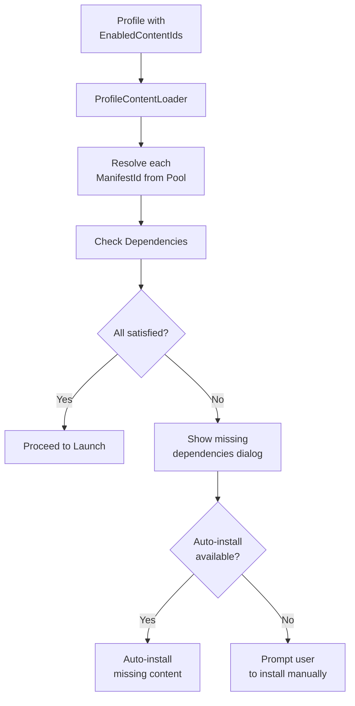

# Content Dependencies

GenHub supports a rich dependency system that allows content creators to specify requirements, conflicts, and optional enhancements for their content.

## ContentDependency Model

**Location**: `GenHub.Core/Models/Manifest/ContentDependency.cs`

```csharp
public class ContentDependency
{
    // Identity
    public ManifestId Id { get; set; }
    public string Name { get; set; }
    public ContentType DependencyType { get; set; }

    // Publisher constraints
    public string? PublisherType { get; set; }
    public bool StrictPublisher { get; set; }
    public List<string> RequiredPublisherTypes { get; set; }
    public List<string> IncompatiblePublisherTypes { get; set; }

    // Version constraints
    public string? MinVersion { get; set; }
    public string? MaxVersion { get; set; }
    public string? ExactVersion { get; set; }
    public List<string> CompatibleVersions { get; set; }
    public List<GameType> CompatibleGameTypes { get; set; }

    // Behavior
    public DependencyInstallBehavior InstallBehavior { get; set; }
    public bool IsOptional { get; set; }
    public bool IsExclusive { get; set; }
    public List<ManifestId> ConflictsWith { get; set; }
}
```

## Dependency Install Behaviors

| Behavior | Description | User Experience |
|----------|-------------|-----------------|
| `RequireExisting` | User must already have this installed | Error if missing |
| `AutoInstall` | GenHub downloads automatically | Seamless install |
| `OptionalEnhancement` | Nice-to-have, not required | Suggested prompt |
| `ConflictsWithOther` | Cannot coexist with specified content | Conflict warning |

## Common Dependency Patterns

### Base Game Requirement

Most mods require a base game installation:

```csharp
// In your manifest factory:
builder.AddDependency(
    id: ManifestId.Create("1.0.zerohour.gameinstallation"),
    name: "Zero Hour",
    dependencyType: ContentType.GameInstallation,
    installBehavior: DependencyInstallBehavior.RequireExisting);
```

### Specific Version Requirement

When your mod only works with certain game versions:

```csharp
builder.AddDependency(
    id: ManifestId.Create("1.0.zerohour.gameinstallation"),
    name: "Zero Hour 1.04",
    dependencyType: ContentType.GameInstallation,
    installBehavior: DependencyInstallBehavior.RequireExisting,
    minVersion: "1.04",
    compatibleVersions: ["1.04", "1.06"]);
```

### Steam-Only Requirement

Some content requires a specific distribution:

```csharp
var dependency = new ContentDependency
{
    Id = ManifestId.Create("1.0.zerohour.gameinstallation"),
    Name = "Zero Hour (Steam)",
    DependencyType = ContentType.GameInstallation,
    PublisherType = "steam",
    StrictPublisher = true,  // MUST be Steam version
    InstallBehavior = DependencyInstallBehavior.RequireExisting
};
```

### Optional Enhancement

Content that enhances but isn't required:

```csharp
builder.AddDependency(
    id: ManifestId.Create("1.20240101.genpatcher.addon.controlbar"),
    name: "ControlBar",
    dependencyType: ContentType.Addon,
    installBehavior: DependencyInstallBehavior.OptionalEnhancement);
```

### Conflicting Content

When your mod is incompatible with another:

```csharp
builder.AddDependency(
    id: ManifestId.Create("1.0.otherpublisher.mod.conflictingmod"),
    name: "Conflicting Mod",
    dependencyType: ContentType.Mod,
    installBehavior: DependencyInstallBehavior.ConflictsWithOther,
    conflictsWith: [ManifestId.Create("current-mod-id")]);
```

## For Content Creators

### Option 1: Auto-Generated Dependencies

When your content is discovered from ModDB, CNC Labs, or other supported publishers, GenHub automatically adds:

- Base game dependency (Generals or Zero Hour)
- Publisher information
- Content type classification

### Option 2: Embedded Manifest

Include a `.genhub.manifest.json` in your content package:

```json
{
  "ManifestVersion": "1.0",
  "Name": "My Awesome Mod",
  "Version": "2.0.0",
  "ContentType": "Mod",
  "TargetGame": "ZeroHour",
  "Dependencies": [
    {
      "Id": "1.0.zerohour.gameinstallation",
      "Name": "Zero Hour",
      "DependencyType": "GameInstallation",
      "InstallBehavior": "RequireExisting"
    },
    {
      "Id": "1.20240101.genpatcher.patch.controlbar",
      "Name": "ControlBar",
      "DependencyType": "Addon",
      "InstallBehavior": "AutoInstall",
      "IsOptional": true
    }
  ]
}
```

### Option 3: API Registration (Future)

A publisher API for registering content metadata and dependencies directly.

## Dependency Resolution

When a profile is launched, GenHub resolves dependencies:



## GameType Constraints

Use `CompatibleGameTypes` to restrict content to specific games:

```csharp
var dependency = new ContentDependency
{
    Id = ManifestId.Create("1.0.generalsonline.gameclient"),
    Name = "Generals Online",
    DependencyType = ContentType.GameClient,
    CompatibleGameTypes = [GameType.ZeroHour],  // ZH only
    InstallBehavior = DependencyInstallBehavior.RequireExisting
};
```

## Related Documentation

- [Content Pipeline](./content-pipeline.md) - How content flows through the system
- [Manifest ID System](../dev/manifest-id-system.md) - How IDs are generated
- [Provider Configuration](./provider-configuration.md) - Publisher settings
