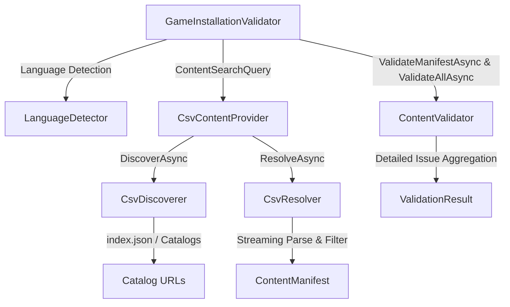

# CSV Validation Pipeline

The **CSV Validation Pipeline** provides a high-performance, manifest-driven mechanism for validating vanilla *Command & Conquer: Generals* (v1.08) and *Zero Hour* (v1.04) game installations against unified remote or cached CSV catalogs across all 10 official game language editions.

---

## Architecture Overview

The pipeline integrates with GenHub's modular content provider architecture and validation engine:



---

## Core Components

### 1. `LanguageDetector` (`ILanguageDetector`)
Located in `GenHub.Core.Features.GameInstallations`:
- Analyzes game directory layout and file patterns to determine the installed language.
- Checks language directories: `Data\english\`, `Data\german\`, `Data\deutsch\`, `Data\french\`, `Data\spanish\`, `Data\italian\`, `Data\korean\`, `Data\polish\`, `Data\PortugueseBrazil\`, `Data\chinese\`, `Data\chinesetraditional\`.
- Checks BIG archive patterns: `German.big`, `French.big`, `Spanish.big`, `Italian.big`, `Korean.big`, `Polish.big`, `PortugueseBrazil.big`, `Chinese.big`, `ChineseTraditional.big`, and their Zero Hour counterparts (`GermanZH.big`, `FrenchZH.big`, etc.).
- Normalizes language codes to uppercase (`EN`, `DE`, `FR`, `ES`, `IT`, `KO`, `PL`, `PT-BR`, `ZH-CN`, `ZH-TW`) with fallback to `EN`.

### 2. `CsvDiscoverer` (`IContentDiscoverer`)
Located in `GenHub.Features.Content.Services.ContentDiscoverers`:
- Discovers remote CSV catalogs matching the requested game type (`Generals` or `ZeroHour`) and language.
- First queries remote `index.json` metadata if available, falling back to configuration catalog URLs (`CsvConstants.DefaultGeneralsCsvUrl` / `DefaultZeroHourCsvUrl`).
- Generates language-specific manifest IDs (e.g., `csv-generals-1.08-de`).

### 3. `CsvResolver` (`IContentResolver`)
Located in `GenHub.Features.Content.Services.ContentResolvers`:
- Streams and parses RFC-4180 compliant CSV catalogs using `CsvHelper`.
- Filters rows matching the requested `TargetGame` and `Language`.
- Always includes shared files tagged with language `All` (such as `game.dat` or shared executables) alongside the language-specific assets.
- Produces a strongly typed `ContentManifest`.

### 4. `CsvContentProvider` (`IContentProvider`)
Located in `GenHub.Features.Content.Services.ContentProviders`:
- Facade registered under source name `csv-registry` (`PublisherTypeConstants.CsvRegistry`).
- Exposes `SearchAsync(ContentSearchQuery)` returning `ContentSearchResult` objects populated with `ContentManifest`.

### 5. `GameInstallationValidator` (`IGameInstallationValidator`)
Located in `GenHub.Features.Validation`:
- Orchestrates multi-target validation across both Generals and Zero Hour directories within an installation.
- Auto-detects language if not specified explicitly, or accepts an explicit language code.
- Normalizes input language parameters regardless of casing.
- Performs manifest validation, hash verification, file size checks, and directory structure validation.
- Aggregates issues and calculates detailed counts in `ValidationResult`.

---

## Detailed Validation Result Metrics

`ValidationResult` includes comprehensive metrics for diagnosing game installation health:

```csharp
public sealed record ValidationResult(
    string Path,
    IReadOnlyList<ValidationIssue> Issues,
    TimeSpan Elapsed = default,
    int TotalFilesValidated = 0)
{
    public bool IsValid => Issues.All(i => i.Severity != ValidationSeverity.Error && i.Severity != ValidationSeverity.Critical);
    public int CriticalIssueCount => Issues.Count(i => i.Severity == ValidationSeverity.Critical || i.Severity == ValidationSeverity.Error);
    public int WarningIssueCount => Issues.Count(i => i.Severity == ValidationSeverity.Warning);

    public int MissingFilesCount => Issues.Count(i => i.IssueType == ValidationIssueType.MissingFile);
    public int CorruptedFilesCount => Issues.Count(i => i.IssueType == ValidationIssueType.CorruptedFile || i.IssueType == ValidationIssueType.MismatchedFileSize);
    public int ExtraFilesCount => Issues.Count(i => i.IssueType == ValidationIssueType.UnexpectedFile);
}
```

---

## Supported Language Matrix

| Language Code | Display Name | Directory Marker | Primary BIG File Marker |
| :--- | :--- | :--- | :--- |
| `EN` | English | `Data\English\` | `English.big` / `EnglishZH.big` |
| `DE` | German | `Data\German\`, `Data\Deutsch\` | `German.big` / `GermanZH.big` |
| `FR` | French | `Data\French\` | `French.big` / `FrenchZH.big` |
| `ES` | Spanish | `Data\Spanish\` | `Spanish.big` / `SpanishZH.big` |
| `IT` | Italian | `Data\Italian\` | `Italian.big` / `ItalianZH.big` |
| `KO` | Korean | `Data\Korean\` | `Korean.big` / `KoreanZH.big` |
| `PL` | Polish | `Data\Polish\` | `Polish.big` / `PolishZH.big` |
| `PT-BR` | Portuguese (Brazil) | `Data\PortugueseBrazil\` | `PortugueseBrazil.big` / `PortugueseZH.big` |
| `ZH-CN` | Chinese (Simplified) | `Data\Chinese\` | `Chinese.big` / `ChineseZH.big` |
| `ZH-TW` | Chinese (Traditional) | `Data\ChineseTraditional\` | `ChineseTraditional.big` |

---

## Dependency Injection Setup

In `ValidationModule.cs`:
```csharp
services.AddTransient<IContentValidator, ContentValidator>();
services.AddTransient<IGameInstallationValidator, GameInstallationValidator>();
```

In `GameInstallationModule.cs`:
```csharp
services.AddSingleton<ILanguageDetector, LanguageDetector>();
services.AddSingleton<IGameInstallationService, GameInstallationService>();
```

In `ContentPipelineModule.cs`:
```csharp
services.AddTransient<CsvContentProvider>();
services.AddTransient<IContentProvider>(sp => sp.GetRequiredService<CsvContentProvider>());
services.AddTransient<CsvDiscoverer>();
services.AddTransient<IContentDiscoverer, CsvDiscoverer>();
services.AddTransient<CsvResolver>();
services.AddTransient<IContentResolver, CsvResolver>();
```
