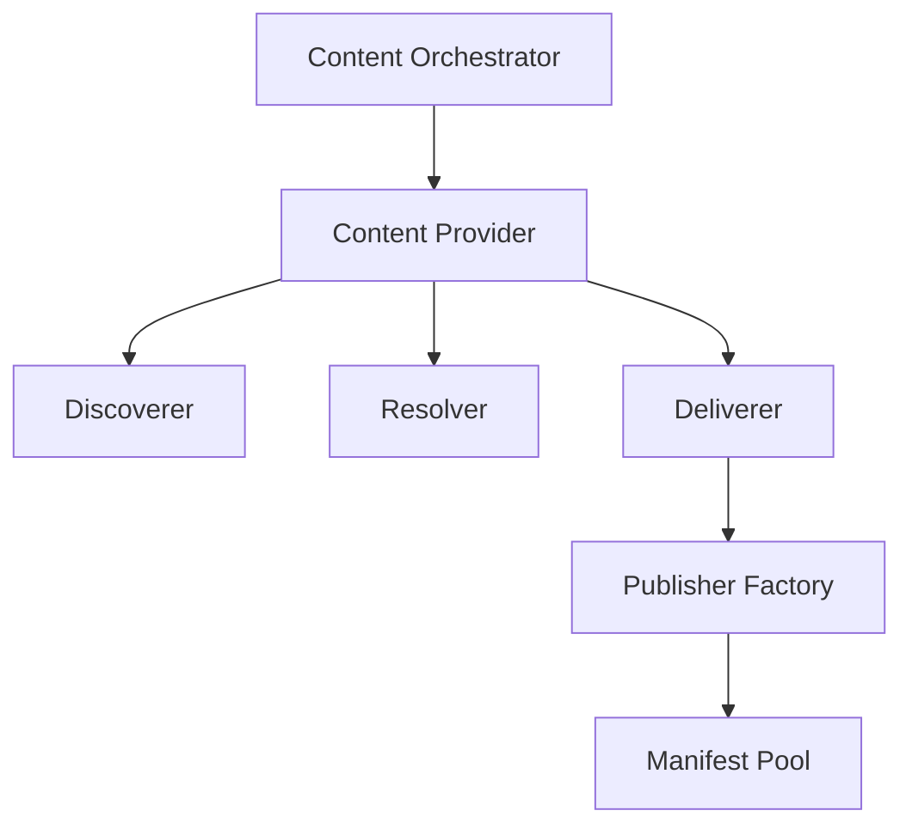

# Content Features

The GenHub content system provides a flexible, extensible architecture for discovering, acquiring, and managing game content from various sources.

## Core Documentation

- [Content Pipeline Architecture](./content-pipeline.md) - Three-tier pipeline for discovering, resolving, and acquiring content
- [Provider Configuration](./provider-configuration.md) - Data-driven provider configuration for flexible content pipeline customization
- [Publisher Manifest Factories](./publisher-manifest-factories.md) - Extensible architecture for publisher-specific content handling
- [Content Dependencies](./content-dependencies.md) - Dependency system for mods and content packages
- [Downloads Flow](../FlowCharts/Downloads-Flow.md) - User journey from browsing to installation

## Architecture

The content system follows a layered architecture with clear separation of concerns:

1. **Content Orchestrator**: Coordinates all content operations
2. **Content Providers**: Publisher-specific facades (GitHub, CNCLabs, ModDB)
3. **Pipeline Components**:
   - **Discoverers**: Find available content
   - **Resolvers**: Transform lightweight results into full manifests
   - **Deliverers**: Download and extract content files
4. **Publisher Factories**: Handle publisher-specific manifest generation
5. **Provider Configuration**: Data-driven JSON-based settings (see [Provider Configuration](./provider-configuration.md))

## Key Features

### Multi-Source Content Support

- GitHub releases
- CNCLabs maps
- AODMaps (Age of Defense Maps)
- Community Outpost (GenPatcher)
- Local file system
- Future: ModDB, Steam Workshop

### Publisher-Agnostic Architecture

- Factory pattern for extensibility
- Support for any publisher without code changes
- Support for all content types (GameClient, Mod, Patch, Addon, etc.)

### Multi-Variant Content

- Single release can generate multiple manifests
- Example: TheSuperHackers releases → Generals + Zero Hour manifests
- Example: GeneralsOnline releases → 30Hz + 60Hz variants

### Content Types

- GameClient: Complete game executables
- Mod: Game modifications
- Patch: Bug fixes and updates
- Addon: Additional content packs
- MapPack: Map collections
- LanguagePack: Translation files
- Mission: Campaign missions
- Map: Individual maps
- ModdingTool: Standalone modding utilities and tools
- ContentBundle: Meta-packages

## Content Pipeline

### Discovery Phase

- Scan configured sources for available content
- Return lightweight search results

### Resolution Phase

- Transform search results into full ContentManifests
- Fetch detailed metadata from APIs
- Build manifest structures

### Delivery Phase

- Download content files
- Extract archives
- Use factory to generate manifests
- Store to content pool

## Publisher Factory System

The Publisher Manifest Factory pattern enables extensible content handling:

### Key Components

1. **IPublisherManifestFactory**: Interface for factory implementations
2. **SuperHackersManifestFactory**: Handles multi-game releases
3. **PublisherManifestFactoryResolver**: Selects appropriate factory

### Factory Selection

Factories self-identify via `CanHandle(manifest)`:

- SuperHackers GameClient → SuperHackersManifestFactory
- Custom publishers → Custom factories (when implemented)

### Benefits

✅ Add new publishers without modifying core code
✅ Support complex release structures (multi-game, multi-variant)
✅ Isolate publisher-specific logic
✅ Easy testing with mock factories

See [Publisher Manifest Factories](./publisher-manifest-factories.md) for detailed documentation.

## Content Storage

Content is stored in the **Content Pool**:

- Manifest files stored separately from content files
- Deterministic ManifestId generation
- Hash-based validation
- Duplicate detection

## Integration Points

### Game Profiles

- Profiles reference content via ManifestId
- Content acquired on-demand during profile setup
- Automatic dependency resolution

### Workspace System

- Content deployed to workspace directories
- Strategy-based file management
- Isolation between profiles

### Launching System

- Launcher resolves content references
- Validates content integrity
- Launches with correct executable

## Adding Publisher Support

To add support for a new publisher:

1. Create factory class implementing `IPublisherManifestFactory`
2. Implement `CanHandle()` to identify your publisher
3. Implement `CreateManifestsFromExtractedContentAsync()` for manifest generation
4. Register factory in `ContentPipelineModule.cs`

**Zero changes required to:**

- GitHubContentDeliverer
- Content orchestrator
- Other factories

See [Publisher Manifest Factories - Adding Support](./publisher-manifest-factories.md#adding-support-for-new-publishers) for step-by-step guide.

## Future Enhancements

- [ ] ModDB content provider
- [ ] Steam Workshop integration
- [ ] Automatic content updates
- [ ] Content dependency resolution
- [ ] Multi-language support
- [ ] Content rating/review system
