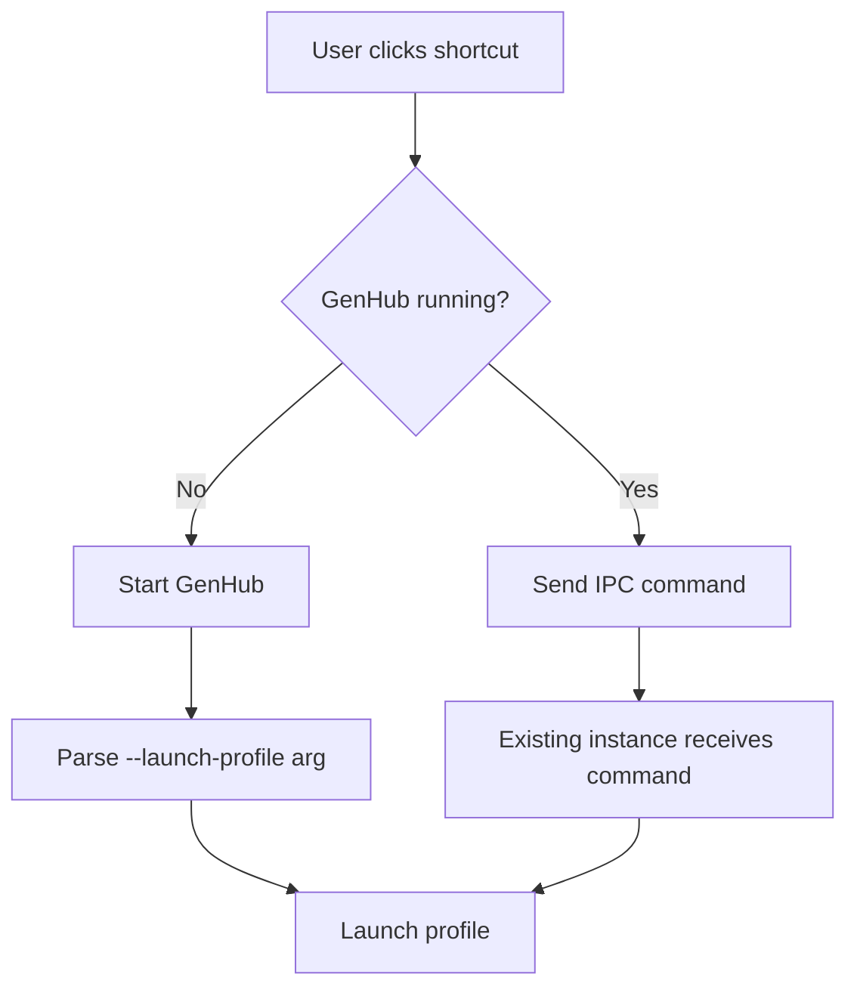

Desktop shortcuts provide native OS shortcuts that launch game profiles directly, bypassing the GenHub interface for quick access to your favorite configurations.

## Overview

Desktop shortcuts provide:

- **One-click launching**: Start your profile directly from the desktop
- **Single-instance handling**: If GenHub is already running, the profile launches without opening a second window
- **Platform support**: Native `.lnk` files on Windows, `.desktop` files on Linux
- **Profile-specific**: Each shortcut launches a specific game profile with all its configured mods and settings

## Creating Shortcuts

### From the Launcher

1. Navigate to the **Game Profiles** section
2. Enable **Edit Mode** using the pencil icon
3. Click the **link icon** on the profile card you want to create a shortcut for
4. The shortcut is created on your desktop automatically

### Shortcut Location

| Platform | Location |
|----------|----------|
| Windows  | `%USERPROFILE%\Desktop` |
| Linux    | `~/Desktop` |

## How It Works

### Shortcut Arguments

When you create a shortcut, GenHub generates a native shortcut file that:

1. Points to the GenHub executable
2. Includes the `--launch-profile "{ProfileId}"` command-line argument
3. Uses the profile name as the shortcut display name

### Launch Flow



### Single-Instance Behavior

GenHub uses a single-instance pattern to prevent multiple windows:

1. **First launch**: GenHub starts normally and processes the `--launch-profile` argument
2. **Subsequent launches**: If GenHub is already running, the shortcut sends an IPC command to the existing instance via Named Pipes, which then launches the profile

## Technical Implementation

### Windows Shortcuts

Windows shortcuts use the IWshRuntimeLibrary COM interop to create `.lnk` files:

```plaintext
Shortcut Target: GenHub.Windows.exe
Arguments: --launch-profile "profile-id-here"
Working Directory: GenHub installation folder
```

### Linux Shortcuts

Linux shortcuts create XDG-compliant `.desktop` files:

```ini
[Desktop Entry]
Type=Application
Name=Profile Name
Exec=/path/to/GenHub.Linux --launch-profile "profile-id-here"
Terminal=false
```

## Architecture

### Components

| Component | Purpose |
|-----------|---------|
| `IShortcutService` | Platform-agnostic interface for shortcut operations |
| `WindowsShortcutService` | Windows `.lnk` file creation using COM interop |
| `LinuxShortcutService` | Linux `.desktop` file creation |
| `SingleInstanceManager` | Named Pipe IPC for single-instance coordination |

### Service Registration

Shortcut services are registered in platform-specific DI modules:

- **Windows**: `WindowsServicesModule.RegisterServices()`
- **Linux**: `LinuxServicesModule.RegisterServices()`

### IPC Communication

The single-instance IPC uses Named Pipes:

- **Pipe Name**: `GenHub_SingleInstance_Pipe`
- **Protocol**: Simple text-based commands (e.g., `launch-profile:{profileId}`)
- **Threading**: Commands are dispatched to the UI thread via `Dispatcher.UIThread.Post()`

## Usage Scenarios

### Quick Launch Profiles

Create shortcuts for your most-used profiles:

- **Vanilla Generals**: Base game with no mods
- **ROTR with Gentool**: Rise of the Reds mod with community tools
- **Competitive Zero Hour**: Balance patches for ranked play

### Multiple Game Configurations

Switch between different setups instantly:

- **Modded**: Full mod experience with all add-ons
- **Clean**: Minimal configuration for troubleshooting
- **LAN Party**: Optimized settings for local multiplayer

## Troubleshooting

### Shortcut Doesn't Launch Profile

1. Verify the profile still exists in GenHub
2. Check that GenHub is installed in the expected location
3. Try deleting and recreating the shortcut

### GenHub Opens But Profile Doesn't Start

1. Check the GenHub logs for error messages
2. Verify the profile's workspace is prepared
3. Ensure the game installation is valid

### IPC Not Working (Windows)

If clicking a shortcut while GenHub is running doesn't launch the profile:

1. Check Windows Firewall isn't blocking Named Pipes
2. Verify the GenHub process has proper permissions
3. Try restarting GenHub completely

## Related Features

- [Game Profiles](./gameprofiles) - Create and manage game configurations
- [Workspace Management](./workspace) - Prepare isolated game environments
- [Launching](./launching) - Advanced game launching options
