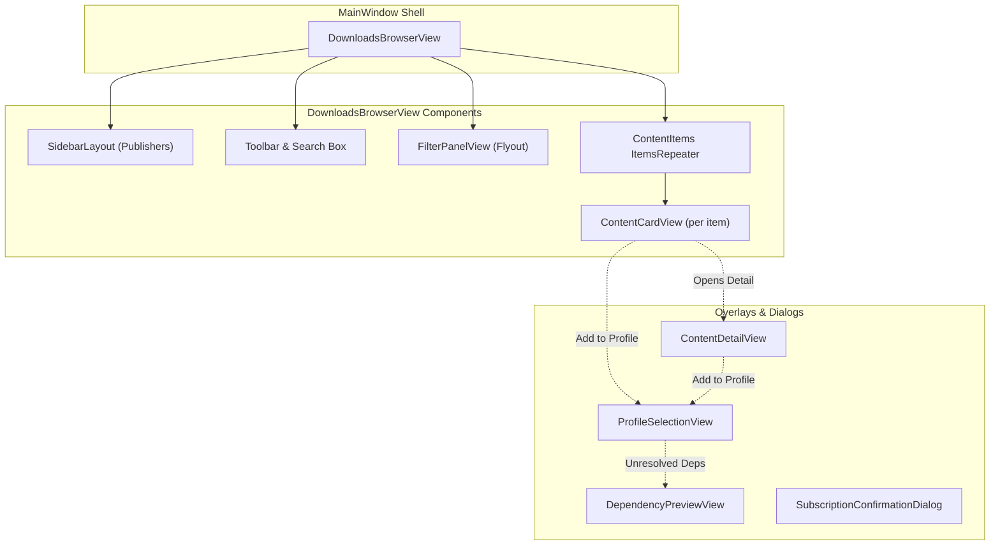

# Downloads UI Architecture & Views

The Downloads UI in GenHub provides a responsive, desktop-optimized interface for browsing, filtering, inspecting, and installing community modifications, patches, game clients, and tools. Built with Avalonia UI and CommunityToolkit MVVM, it replaces legacy publisher card interfaces with a unified master-detail browser experience.

For pipeline architecture, background downloading, and service mechanics, see the [Downloads Feature Guide](./downloads.md).

---

## Component Architecture

The Downloads UI consists of seven specialized Avalonia views and dialogs coordinated by MVVM ViewModels:

---

## 1. DownloadsBrowserView

**Source**: `GenHub/Features/Downloads/Views/DownloadsBrowserView.axaml`  
**DataContext**: `DownloadsBrowserViewModel`

`DownloadsBrowserView` is the primary tab view. It is structured around an Avalonia `SidebarLayout` containing a collapsible publisher pane and a main scrollable content area.

### Visual Structure

1. **Left Sidebar Pane (`SidebarLayout`)**:
   - Displays available publishers: built-in static providers (Generals Online, TheSuperHackers, Community Outpost), built-in dynamic providers (GitHub), and user-subscribed creator catalogs.
   - Each item displays the publisher logo (via `infraControls:ImageLoader`), publisher display name, and content count badge.
   - Footer contains a "Manifests Folder" button (`OpenManifestsFolderCommand`) to open local manifests in file manager.

2. **Top Header & Toolbar**:
   - Page title dynamically displaying the selected publisher's name.
   - Search box (`TextBox.search-box`) with two-way binding to `SearchTerm` and reactive search debouncing.
   - Filter toggle button (`ToggleButton.filter-toggle-btn`) visible when the active publisher supports filtering (`CanShowFilters`).
   - Refresh button and in-flight loading spinners.

3. **Flyout Filter Panel**:
   - Embeds `FilterPanelView`, bound to `CurrentFilterViewModel`.
   - Slides down or toggles open when the user clicks the Filter button.

4. **Content Cards Grid**:
   - An adaptive responsive grid presenting `ContentCardView` cards for each item in `ContentItems`.
   - Handles empty states ("No content found") and loading shimmer indicators.

5. **Load More Footer**:
   - Displays a "Load More" button when `CanLoadMore` is true and more content is available from the publisher.

6. **Detail View Modal Layer**:
   - Renders `ContentDetailView` in a full overlay when `IsDetailViewVisible` is true (`SelectedContent != null`).

---

## 2. ContentCardView

**Source**: `GenHub/Features/Downloads/Views/ContentCardView.axaml`  
**DataContext**: `ContentGridItemViewModel`

`ContentCardView` represents an individual downloadable item in the browser grid.

### Key Card Elements

- **Preview Media**: Thumbnail image with fallback icon when no screenshot is provided.
- **Header Badges**:
  - **Content Type Badge**: Styled using `ContentTypeToBrushConverter` (for border and foreground text against `CardBackground`) to visually identify `Mod`, `Patch`, `GameClient`, `Tool`, `Map`, etc. (Tinted background via `ContentTypeToBadgeBackgroundConverter` is featured in `ContentDetailView`).
  - **Publisher Identifier**: Pill identifying the source publisher.
- **Title & Description**: Title with two-line character ellipsis truncation, and clean summary text formatted by `ReleaseDescriptionHelper`.
- **Variant Selector**: Dropdown selector displayed when `HasVariants` is true (e.g. resolution variants, game-client variants for Generals vs Zero Hour).
- **Bundle Components Indicator**: Displays component count and individual completion status when `HasBundleComponents` is true.
- **State-Driven Action Buttons**:
  - **Download Button** (visible when `CurrentState == NotDownloaded`): Triggers `DownloadContentCommand` via `IContentDownloadCoordinator`.
  - **Progress Indicator** (visible when `IsDownloading == true`): Displays live progress bar and status text (`DownloadStatus`).
  - **Update Available Button** (visible when `CurrentState == UpdateAvailable`): Orange highlight to acquire the latest version.
  - **Add to Profile Button** (visible when `CurrentState == Downloaded`): Opens `ProfileSelectionView` modal.

---

## 3. ContentDetailView

**Source**: `GenHub/Features/Downloads/Views/ContentDetailView.axaml`  
**DataContext**: `ContentDetailViewModel`

`ContentDetailView` provides an immersive modal overlay with tabbed navigation, rich media carousels, and version management.

### Tab Organization

1. **Overview Tab**:
   - Hero banner and screenshot carousel.
   - Rich Markdown description rendered via Markdown.Avalonia.
   - **Markdown Security**: Employs `SafeMarkdownHyperlinkCommand` (restricting navigation strictly to HTTP/HTTPS URLs) and `SafeMarkdownPathResolver` to prevent arbitrary URL scheme execution or UNC exploits.
2. **Releases Tab**:
   - Detailed list of releases, changelogs, file sizes, and release dates.
3. **Addons Tab**:
   - Discovered compatible addons, map packs, and complementary files.
4. **Dynamic Custom Tabs**:
   - Populated dynamically at runtime via `ITabProviderRegistry` and `CatalogTabProvider`.
   - Allows creator catalogs to define dedicated documentation, server configuration, or extra information tabs directly in their `catalog.json`.

---

## 4. FilterPanelView

**Source**: `GenHub/Features/Downloads/Views/FilterPanelView.axaml`  
**DataContext**: `IFilterPanelViewModel` (e.g. `GitHubFilterViewModel`, `CommunityOutpostFilterViewModel`, `SuperHackersFilterViewModel`)

Provides a collapsible drawer of publisher-specific filters.

- **Reactive Filtering**: Raising `FiltersApplied` updates the content collection without full-page reloads.
- **Clear All Filters**: Resets filters to defaults and re-runs the baseline discovery query.

---

## 5. ProfileSelectionView

**Source**: `GenHub/Features/Downloads/Views/ProfileSelectionView.axaml`  
**DataContext**: `ProfileSelectionViewModel`

A modal dialog that appears when a user clicks "Add to Profile" on downloaded content.

- **Game Compatibility Categorization**:
  - **Compatible Profiles**: Highlighted profiles matching the content's target game (Generals or Zero Hour).
  - **Other Profiles**: Incompatible profiles shown with cautionary badges to avoid accidental cross-game attachment.
- **Direct Command Selection**: Directly binds `SelectProfileCommand` with the selected `ProfileOptionViewModel` parameter.
- **Quick Create Profile**: Allows one-click creation of a new game profile preconfigured with the downloaded content.

---

## 6. DependencyPreviewView

**Source**: `GenHub/Features/Downloads/Views/DependencyPreviewView.axaml`  
**DataContext**: `DependencyPreviewViewModel`

Shown before attaching content to a profile if unresolved dependencies or conflicts exist.

- Displays hierarchical dependency requirements (e.g. requires specific patches or base clients).
- Highlights already satisfied dependencies vs missing dependencies that must be downloaded first.

---

## 7. SubscriptionConfirmationDialog

**Source**: `GenHub/Features/Downloads/Views/SubscriptionConfirmationDialog.axaml`  
**DataContext**: `SubscriptionConfirmationViewModel`

Modal dialog displayed when the application intercepts a `genhub://subscribe?url=<catalog_url>` protocol link or when the user enters a catalog subscription URL manually.

- Fetches and previews catalog metadata (publisher name, avatar, catalog version, description, content item count) using `CatalogDocumentReader`.
- Confirms user intent before saving the subscription to `IPublisherSubscriptionStore`.

---

## UI Converters and Theme Resources

The Downloads UI utilizes several custom Avalonia converters located in `GenHub.Infrastructure.Converters`:

| Converter | Type | Role in Downloads UI |
| :--- | :--- | :--- |
| `ContentTypeToBrushConverter` | `IValueConverter` | Translates `ContentType` enum values into vivid accent brushes for badge borders, text, and card outlines. |
| `ContentTypeToBadgeBackgroundConverter` | `IValueConverter` | Produces a 14.5% opacity tinted background brush (alpha 0x25 / 37) matching the content type accent color. |
| `ProfileSelectionConverter` | `IMultiValueConverter` | Legacy multi-value converter packaging content item and target `GameProfile` into command parameters for profile assignment. |
| `SafeMarkdownHyperlinkCommand` | `ICommand` | Sanitizes markdown hyperlinks to ensure only external HTTP/HTTPS browser links can be triggered. |

All styling tokens, including brush keys (`SurfaceElevatedBrush`, `SurfaceHoverBrush`, `AccentBrush`, `BorderBrush`), are defined in `GenHub/Assets/Styles/ThemeResources.axaml`.
