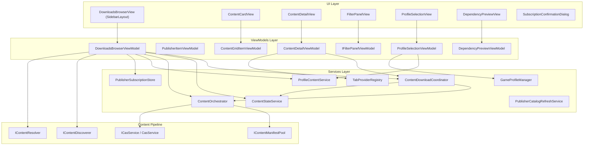
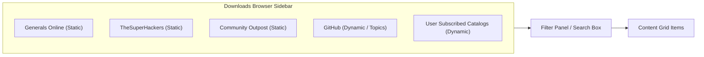
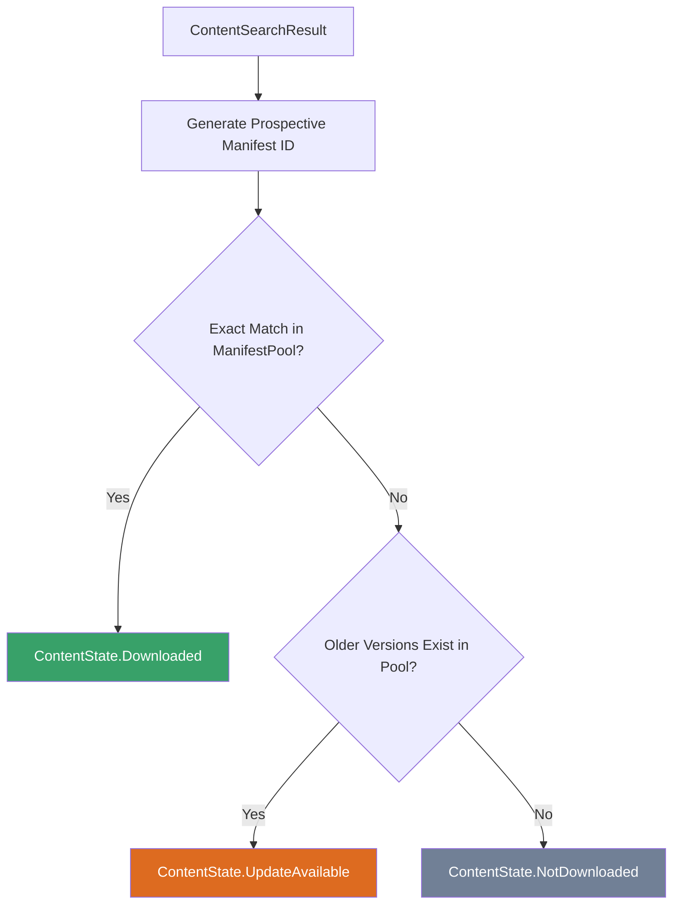
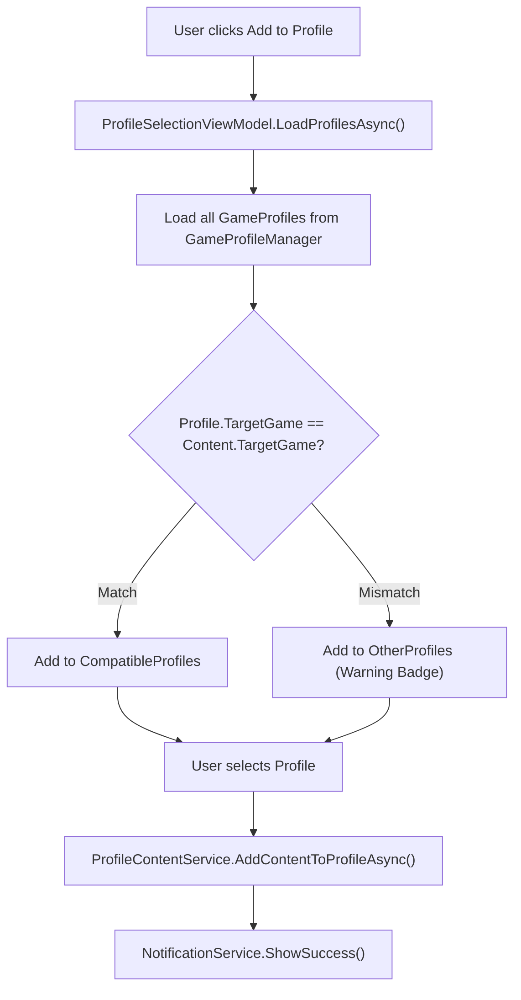

# Downloads Browser

The Downloads browser is GenHub's unified content discovery and acquisition interface. It provides a modern, desktop-optimized way to browse, discover, download, and install game content from multiple publishers through a single, cohesive interface.

> [!NOTE]
> This document details the **Unified Downloads Browser and Acquisition Architecture** introduced in PR #443 (`feat/downloads-browser`, carved from PR #265 `feat/ui-downloads`). It describes the MVVM browser interface, active publishers, filter panels, content detail presentation, dynamic catalog tabs, security-hardened markdown rendering, and the centralized `ContentDownloadCoordinator` and `ContentStateService` lifecycle.

---

## Overview

The Downloads browser replaces the legacy publisher card view with a master-detail browsing experience. It serves as the primary entry point for users to discover and acquire game content including mods, maps, patches, game clients, and tools. It integrates directly with GenHub's content pipeline to provide seamless access to content across built-in publishers and community creator catalogs.

### Key Features

- **Unified Master-Detail Browser**: Browse all content sources from a clean sidebar layout with an adaptive card grid and modal detail views.
- **Active Built-In Publishers**: Out-of-the-box support for Generals Online, TheSuperHackers, Community Outpost, and GitHub.
- **Creator Subscriptions**: Dynamic discovery and resolution for third-party creator catalogs published via standard `catalog.json` and subscribed through `genhub://subscribe?url=...`.
- **Deduplicated Background Downloads**: Coordinated by `ContentDownloadCoordinator`, supporting multiplexed progress reporting and avoiding concurrent duplicate downloads.
- **Centralized State Detection**: Powered by `ContentStateService` and `IContentManifestPool` to detect whether items are `NotDownloaded`, `UpdateAvailable`, or `Downloaded`.
- **Multi-Release Update Reconciliation**: Intelligently matches releases within a content family to highlight update availability.
- **Variant & Bundle Support**: First-class handling of game-client variants (Generals vs Zero Hour), resolution variants, and composite bundle components.
- **Dynamic Catalog Tabs**: Extensible tab system (`ITabProviderRegistry` / `CatalogTabProvider`) that renders custom documentation or addon tabs specified in publisher catalogs.
- **Safe Markdown Rendering**: Displays rich release notes with `SafeMarkdownHyperlinkCommand` and `SafeMarkdownPathResolver`, mitigating URI scheme and path traversal vulnerabilities.
- **Seamless Profile Integration**: One-click "Add to Profile" modal workflow (`ProfileSelectionViewModel`) with game compatibility verification.

---

## Architecture

The Downloads browser follows the Model-View-ViewModel (MVVM) pattern and integrates with GenHub's content pipeline through several key components:



### Component Responsibilities

| Component | Responsibility |
| :--- | :--- |
| `DownloadsBrowserViewModel` | Main coordinator for the browser; manages publisher selection, catalog caching, filter routing, content grid population, variant swapping, and bundle downloads. |
| `ContentCardView` / `ContentGridItemViewModel` | Represents individual content cards in the grid; manages action buttons (Download, Update, Add to Profile), variant selection, and progress reporting. |
| `ContentDetailView` / `ContentDetailViewModel` | Full-screen detail overlay featuring media carousels, release notes, addons, and dynamic custom tabs. |
| `FilterPanelView` / `IFilterPanelViewModel` | Provides publisher-tailored filtering options (e.g. `GitHubFilterViewModel`, `CommunityOutpostFilterViewModel`, `SuperHackersFilterViewModel`). |
| `ProfileSelectionView` / `ProfileSelectionViewModel` | Manages adding acquired content to compatible game profiles with validation warnings for mismatched game types. |
| `DependencyPreviewView` / `DependencyPreviewViewModel` | Displays prerequisite and conflicting dependencies prior to installation. |
| `ContentDownloadCoordinator` | In-flight download multiplexer; coordinates `AcquireContentAsync`, deduplicates concurrent requests, tracks progress, and updates `ContentStateService`. |
| `ContentStateService` | Inspects local manifests in `IContentManifestPool` to evaluate whether content is `Downloaded`, `UpdateAvailable`, or `NotDownloaded`. |
| `CatalogTabProvider` / `TabProviderRegistry` | Dynamically loads and injects custom tabs into `ContentDetailViewModel` from catalog metadata. |

---

## Supported Publishers

### Active Publishers (PR #443)

The Downloads browser activates four built-in publishers plus dynamic user-subscribed creator catalogs:



| Publisher | Type | Discoverer | Resolver / Manifest Strategy | Primary Content |
| :--- | :--- | :--- | :--- | :--- |
| **Generals Online** | Built-in Static | `GeneralsOnlineDiscoverer` | `GeneralsOnlineResolver` | Community multiplayer game client & tools |
| **TheSuperHackers** | Built-in Static | `GitHubReleasesDiscoverer` | `GitHubResolver` + `SuperHackersManifestFactory` | Game patches, utility tools, client binaries |
| **Community Outpost** | Built-in Static | `CommunityOutpostDiscoverer` | `CommunityOutpostResolver` | GenPatcher, community fixes, and patches |
| **GitHub** | Built-in Dynamic | `GitHubTopicsDiscoverer` | `GitHubResolver` | Open-source community projects & mods |
| **Subscribed Creators** | Subscribed Dynamic | `GenericCatalogDiscoverer` | `GenericCatalogResolver` + `GenericCatalogManifestFactory` | Community mods, map packs, and total conversions |

#### Game-Client Variants (TheSuperHackers)

TheSuperHackers releases package both Generals and Zero Hour executables in the same archive release. Rather than presenting an ambiguous card, the discoverer emits **one grid card per game-client variant** (e.g., `"SuperHackers Weekly &lt;date&gt; — Generals"` and `"SuperHackers Weekly &lt;date&gt; — Zero Hour"`).

- Each variant card has its own `TargetGame` (`GameType.Generals` or `GameType.ZeroHour`).
- Manifest IDs carry distinct suffixes (`...gameclient.generals` vs `...gameclient.zerohour`).
- Downloading either variant downloads the archive once; `SuperHackersManifestFactory` extracts and registers the appropriate client binary for the targeted game type.

#### Subscribed Creator Catalogs

Creators can distribute content without modifying GenHub's source code by publishing a standard `catalog.json`. When a user subscribes via `genhub://subscribe?url=&lt;catalog_url&gt;`:
1. `SubscriptionConfirmationDialog` previews publisher details and content counts via `CatalogDocumentReader`.
2. The subscription is saved to disk via `PublisherSubscriptionStore`.
3. `DownloadsBrowserViewModel` creates a `GenericCatalogDiscoverer` instance for the subscription.
4. Content is discovered, resolved via `GenericCatalogResolver`, and cached seamlessly.

---

## Roadmap & Planned Publishers

The GenHub content acquisition roadmap includes web-scraping discoverers for external community repositories that require HTML parsing and bot protection mitigation:

- **ModDB**: Community mods, addons, and maps scraped via Playwright and AngleSharp. Features headed browser fallback to pass Cloudflare bot challenges and persist clearance cookies.
- **CNC Labs**: Map and mission repository scraped from CNCLabs.net with player-count and terrain tagging.
- **AOD Maps**: Dedicated Art of Defense map repository.

> [!NOTE]
> These web scrapers are maintained as part of the broader content ingestion architecture and will be exposed in the browser once their scraper sandboxes and update loops are finalized.

---

## Filter Panels

Each publisher exposes customized filtering options through `IFilterPanelViewModel`:

- **GitHub (`GitHubFilterViewModel`)**: Sorts repositories by recent updates, stars, and release types.
- **Community Outpost (`CommunityOutpostFilterViewModel`)**: Filters by content type (tools vs. patches).
- **TheSuperHackers (`SuperHackersFilterViewModel`)**: Filters by game client vs. patch releases.
- **Static Publishers (`StaticPublisherFilterViewModel`)**: Standard content type filtering.

Search query filtering is controlled per publisher:
- `CanSearch`: True for GitHub (dynamic API searches) and subscribed catalogs that support search. For static curated publishers, the search bar is suppressed or locked to client-side filtering.
- `CanShowFilters`: Controls visibility of the filter toggle button.

---

## State Management

### ContentStateService

`ContentStateService` (`GenHub.Features.Downloads.Services.ContentStateService`) centralizes content state determination across the browser by querying `IContentManifestPool`:

```csharp
public enum ContentState
{
    NotDownloaded,    // Show "Download" button
    UpdateAvailable,  // Show "Update" button (orange accent)
    Downloaded        // Show "Add to Profile" button
}
```

#### State Determination Flow



#### Event Notifications

`ContentStateService` implements `NotifyStateChanged` and exposes the `ContentStateChanged` event:

```csharp
public interface IContentStateService
{
    event EventHandler<ContentStateChangedEventArgs>? ContentStateChanged;

    void NotifyStateChanged(string contentId, ContentState newState, string? manifestId = null);

    Task<ContentState> GetStateAsync(ContentSearchResult item, CancellationToken cancellationToken = default);

    Task<ContentState> GetStateAsync(
        string publisher,
        ContentType contentType,
        string contentName,
        DateTime releaseDate,
        CancellationToken cancellationToken = default);

    Task<string?> GetLocalManifestIdAsync(ContentSearchResult item, CancellationToken cancellationToken = default);

    Task<ContentState> GetStateByManifestIdAsync(string manifestId, CancellationToken cancellationToken = default);
}
```

Whenever content finishes downloading or is uninstalled, `NotifyStateChanged` broadcasts the new state so that both grid cards and detail views instantly refresh their action buttons.

---

## Download Flow & Coordination

Downloads are orchestrated by `ContentDownloadCoordinator`, ensuring concurrent deduplication, live progress updates, and transactional manifest storage:

```mermaid
sequenceDiagram
    actor User
    participant Card as ContentCardView
    participant GridVM as ContentGridItemViewModel
    participant DBVM as DownloadsBrowserViewModel
    participant CDC as ContentDownloadCoordinator
    participant CO as ContentOrchestrator
    participant Pool as IContentManifestPool
    participant CSS as ContentStateService

    User->>Card: Click "Download"
    Card->>GridVM: DownloadContentCommand
    GridVM->>GridVM: IsDownloading = true
    GridVM->>DBVM: DownloadContentAsync(item)

    DBVM->>CDC: DownloadContentAsync(item.SearchResult, progress, token)
    Note over CDC: Deduplicates against _inFlightDownloads

    CDC->>CO: AcquireContentAsync(searchResult, progress, token)
    Note over CO: Downloads archives, extracts payload, writes CAS files, generates manifest

    CO->>Pool: Register acquired ContentManifest
    CO-->>CDC: OperationResult&lt;ContentManifest&gt;

    CDC->>CSS: NotifyStateChanged(manifest.Id, ContentState.Downloaded)
    CDC-->>DBVM: OperationResult&lt;ContentManifest&gt;

    DBVM->>DBVM: HandleSuccessfulAcquisitionAsync(item, manifest)
    DBVM->>GridVM: CurrentState = Downloaded, IsDownloaded = true
    DBVM->>GridVM: IsDownloading = false
    GridVM-->>Card: Render "Add to Profile" button
```

### In-Flight Deduplication

When a user initiates a download (or when multiple views reference the same package):
1. `ContentDownloadCoordinator` computes a download key (`{ProviderName}::{Id}` or `{ProviderName}::{Name}`).
2. If a download with that key is already in progress, the coordinator attaches the new `IProgress` reporter to the existing task instead of initiating a duplicate HTTP request.
3. Once completed, all listeners are notified and the in-flight record is cleared.

### Composite Bundle Component Downloads

Certain catalog items represent composite bundles (e.g. full game conversions with separate audio, map, and patch packs).
- `CatalogBundleComponentBuilder` extracts individual component manifests.
- In `DownloadsBrowserViewModel`, `DownloadBundleComponentsAsync` downloads all bundle parts and monitors component-level progress via `BundleComponentViewModel`.

---

## Detail View & Dynamic Custom Tabs

When a user selects a card, `ContentDetailViewModel` loads rich metadata:

- **Screenshot & Media Carousel**: Full-size previews and gallery browsing.
- **Sanitized Markdown Rendering**: Release notes and overview descriptions are rendered with `SafeMarkdownHyperlinkCommand` (restricting hyperlinks strictly to `http:` and `https:`) and `SafeMarkdownPathResolver` (preventing directory traversal in image tags).
- **Dynamic Catalog Tabs**: Implemented via `ITabProviderRegistry`:

```csharp
public interface ITabProvider
{
    string ProviderId { get; }
    bool CanProvideTabsFor(ContentSearchResult searchResult);
    Task<IReadOnlyList<CustomTabDefinition>> GetTabsAsync(
        ContentSearchResult searchResult,
        CancellationToken cancellationToken = default);
}
```

`CatalogTabProvider` reads publisher-defined tabs from `catalog.json` (such as dedicated server guides, system requirements, or custom credits), allowing creators to present rich multi-tab pages within GenHub.

---

## Add to Profile Workflow

Once content is in the `Downloaded` state, clicking "Add to Profile" opens `ProfileSelectionView`:



- **Safety Checks**: Incompatible profiles (e.g. adding a Zero Hour mod to a Generals profile) are visually quarantined in `OtherProfiles` with explicit warning badges.
- **Quick Creation**: If no suitable profile exists, "Create New Profile" creates a dedicated profile with the target game and pre-enables the content.
- **Profile Selection**: `ProfileSelectionView` binds `SelectProfileCommand` directly with the selected `ProfileOptionViewModel`.

---

## UI Converters Reference

The Downloads browser uses specialized Avalonia converters from `GenHub.Infrastructure.Converters`:

| Converter | Type | Description |
| :--- | :--- | :--- |
| `ContentTypeToBrushConverter` | `IValueConverter` | Converts a `ContentType` enum value into a solid accent brush for badges and card borders (e.g. Cyan for GameClient, Purple for Mod, Amber for Patch, Green for Map). |
| `ContentTypeToBadgeBackgroundConverter` | `IValueConverter` | Produces a 14.5% opacity tinted background brush (alpha 0x25 / 37) matching the content type accent color. |
| `ProfileSelectionConverter` | `IMultiValueConverter` | Legacy multi-value converter combining content item and profile into parameters for profile assignment. |

---

## ViewModel Reference

### DownloadsBrowserViewModel

**Location**: `GenHub/Features/Downloads/ViewModels/DownloadsBrowserViewModel.cs`

| Property / Command | Type | Description |
| :--- | :--- | :--- |
| `Publishers` | `ObservableCollection<PublisherItemViewModel>` | Available content sources. |
| `SelectedPublisher` | `PublisherItemViewModel?` | Currently active publisher. |
| `ContentItems` | `ObservableCollection<ContentGridItemViewModel>` | Grid of discovered content items. |
| `SelectedContent` | `ContentDetailViewModel?` | Active content detail view overlay. |
| `IsDetailViewVisible` | `bool` | Whether the detail view overlay is visible. |
| `SearchTerm` | `string` | Search query text. |
| `CanSearch` | `bool` | Whether active publisher supports text search. |
| `CanShowFilters` | `bool` | Whether active publisher provides filter options. |
| `IsFilterPanelVisible` | `bool` | Toggle state of the filter panel drawer. |
| `CurrentFilterViewModel` | `IFilterPanelViewModel?` | Active publisher filter view model. |
| `IsLoading` | `bool` | Content discovery in progress. |
| `CanLoadMore` | `bool` | Whether more pages can be requested. |
| `OpenManifestsFolderCommand` | `IRelayCommand` | Opens the local manifests folder in file explorer. |
| `SearchCommand` | `IAsyncRelayCommand` | Executes a content search with active terms and filters. |
| `LoadMoreCommand` | `IAsyncRelayCommand` | Requests next page of content from current publisher. |
| `UpdateContentCommand` | `IAsyncRelayCommand` | Updates an installed item to its prospective newer version. |
| `ViewContentCommand` | `IRelayCommand` | Opens the content detail view overlay for selected item. |
| `CloseDetailCommand` | `IRelayCommand` | Closes the content detail view overlay. |
| `DownloadContentCommand` | `IAsyncRelayCommand` | Downloads selected content item via `ContentDownloadCoordinator`. |
| `AddContentToProfileCommand` | `IAsyncRelayCommand` | Opens profile selection modal and attaches content. |

> [!NOTE]
> - `TogglePaneCommand` is provided on the shared [`SidebarLayout`](../Common/Controls/SidebarLayout.cs) control rather than the view model.
> - Filter drawer opening/closing is bound directly to the `IsFilterPanelVisible` property.
> - Download and search cancellation is handled internally via cancellation tokens rather than a separate public command.

---

## Related Documentation

- [Downloads UI Architecture & Views](./downloads-ui.md) - Detailed guide to Avalonia views, templates, and controls.
- [Downloads Flow Diagram](../FlowCharts/Downloads-Flow.md) - Interactive visual workflow of downloads, state transitions, and caching.
- [Content Pipeline Architecture](./content/content-pipeline.md) - Three-tier discovery, resolution, and acquisition pipeline.
- [Content Addressable Storage (CAS)](./storage.md) - CAS deduplication, hashing, and storage architecture.
- [Hosting Model for Creators](./content/hosting-model.md) - Guide for creating and hosting community `catalog.json` files.
