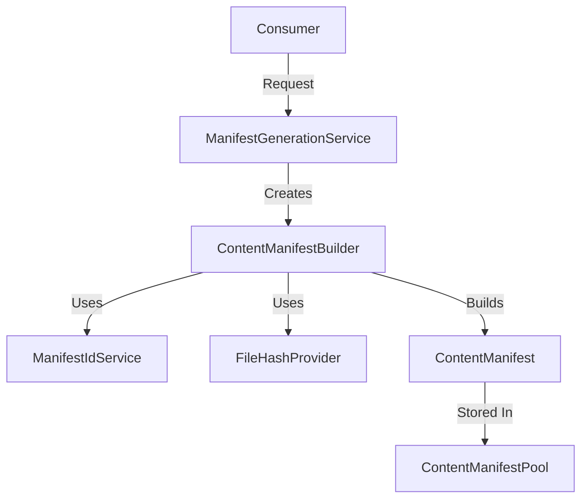

The **Manifest Service** is the declarative backbone of GeneralsHub. It provides a robust, type-safe, and deterministic way to describe every piece of content in the ecosystem—from base game installations to complex community mods.

## Architecture

The system follows a **Builder Pattern** architecture to construct immutable manifest objects, ensuring validity at every step.



### Core Components

| Component | Responsibility |
| :--- | :--- |
| **ManifestGenerationService** | High-level factory. Orchestrates the creation of builders for specific scenarios (Game Clients, Content Packages, Referrals). |
| **ContentManifestBuilder** | Fluent API for constructing manifests. Handles file scanning, hashing, and dependency mapping. |
| **ManifestIdService** | Generates deterministic, collision-resistant 5-segment IDs (e.g., `1.0.genhub.mod.rotr`). |
| **ContentManifest** | The final Data Transfer Object (DTO). Represents the "Source of Truth" for a content package. |

## Content Manifest Structure

A `ContentManifest` is a JSON-serializable object that describes *what* a package is and *how* to use it.

```json
{
  "manifestVersion": "1.1",
  "id": "1.87.genhub.mod.rotr",
  "name": "Rise of the Reds",
  "version": "1.87",
  "contentType": "Mod",
  "targetGame": "ZeroHour",
  "publisher": {
    "name": "SWR Productions",
    "publisherType": "genhub"
  },
  "dependencies": [
    {
      "id": "1.04.steam.gameinstallation.zerohour",
      "dependencyType": "GameInstallation",
      "installBehavior": "Required"
    }
  ],
  "files": [
    {
      "relativePath": "Data/INIZH.big",
      "hash": "sha256:e3b0c44298fc1c149afbf4c8996fb924...",
      "size": 10240,
      "sourceType": "ContentAddressable"
    }
  ]
}
```

## API Reference

### IManifestGenerationService

The entry point for creating manifests. It abstracts away the complexity of configuring the builder.

```csharp
public interface IManifestGenerationService
{
    // Scans a directory and builds a manifest for a Mod/Map/Patch
    Task<IContentManifestBuilder> CreateContentManifestAsync(...);

    // Creates a manifest for a detected base game (Generals/ZH)
    Task<IContentManifestBuilder> CreateGameInstallationManifestAsync(...);

    // Creates a "Pointer" manifest that refers to another publisher or content
    Task<ContentManifest> CreatePublisherReferralAsync(...);
}
```

### IContentManifestBuilder (Fluent API)

The builder allows for chaining methods to construct complex manifests programmatically.

```csharp
var manifest = builder
    .WithBasicInfo("swr", "Rise of the Reds", "1.87")
    .WithContentType(ContentType.Mod, GameType.ZeroHour)
    .WithMetadata("The ultimate expansion mod for Zero Hour.")
    .AddDependency(baseGameId, "Zero Hour", ContentType.GameInstallation, DependencyInstallBehavior.Required)
    .Build();
```

#### Key Methods

- **`AddFilesFromDirectoryAsync`**: Recursively scans a folder. It automatically:
  - Computes SHA256 hashes for file integrity.
  - Detects executable files (`.exe`, `.dll`) and sets permission flags.
  - Classifies files (e.g., maps go to `UserMapsDirectory`).
- **`WithInstallationInstructions`**: Defines how the workspace should be assembled (e.g., `HybridCopySymlink`).
- **`AddPatchFile`**: Registers a file that should be applied as a binary patch during installation.

## Implementation Details

### ID Generation Logic

IDs are generated centrally by `ManifestIdService` to ensure determinism.

- **Format**: `schema.version.publisher.type.name`
- **Normalization**: User versions like "1.87" are normalized to "187" to maintain the dot-separated schema structure.

### Hash Optimization

To improve performance when scanning large game installations (which can be several GBs):

- **Content Packages**: Full SHA256 hashing is performed.
- **Game Installations**: Hashing is selectively optimized. The system is designed to eventually support CSV-based authority (pre-calculated hashes) to skip runtime hashing entirely.

### Verification & Validation

The builder performs validation *during construction*:

- **ManifestIdValidator**: Ensures the generated ID is valid before setting it.
- **Dependency checks**: Ensures circular dependencies or invalid version ranges are caught early.

## Usage Scenarios

### 1. Mod Packaging (Dev Tool)

Developers use the `CreateContentManifestAsync` flow to package their mods. The builder scans their `Output/` directory, hashes every file, and produces a `manifest.json` that can be distributed.

### 2. Game Detection (Runtime)

When GenHub detects a new Game Installation (e.g., Steam), it calls `CreateGameInstallationManifestAsync`. This scans the folder on disk and creates a "Virtual Manifest" in memory, allowing the rest of the system to treat the local game files exactly like a downloaded mod.
