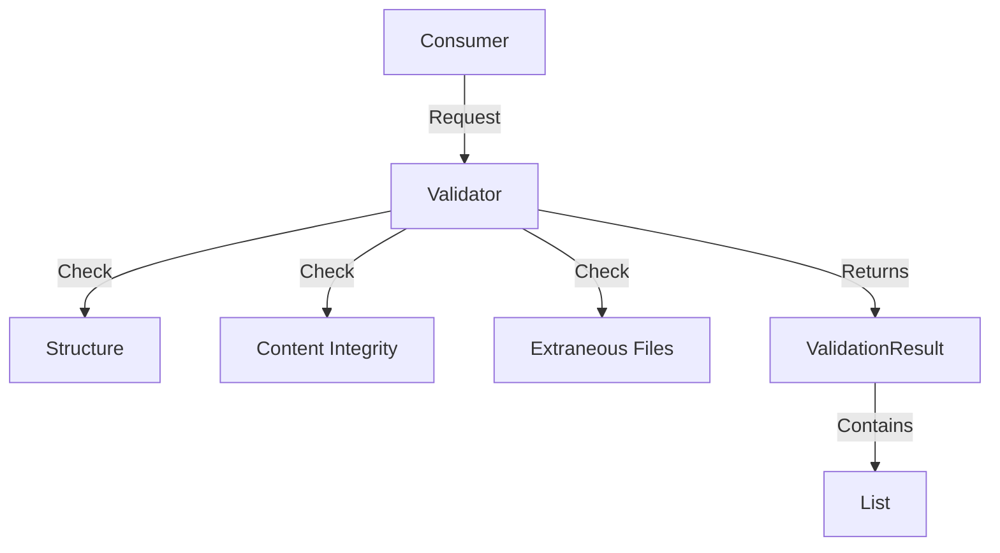

The **Validation System** ensures that game installations, content packages, and assembled workspaces are complete and safe to use. It employs a **multi-level integrity check** strategy, distinguishing between critical failures (missing files) and non-critical warnings (extraneous files).

## Architecture

The validation system is built on a specific `Result Pattern` that allows for granular issue tracking rather than simple boolean pass/fail.



### Core Components

| Component | Interface | Responsibility |
| :--- | :--- | :--- |
| **ContentValidator** | `IContentValidator` | Validates a folder against a `ContentManifest`. Checks file existence, hashes, and extra files. |
| **GameInstallationValidator** | `IGameInstallationValidator` | Specialized wrapper for base games. Orchestrates manifest retrieval and directory validation. |
| **FileSystemValidator** | `Base Class` | Provides shared logic for file existence and hash verification. |
| **ValidationResult** | `Model` | Aggregates a list of `ValidationIssue` objects and determines overall success. |

## The Validation Logic

### 1. Structure Validation

Checks if the `ContentManifest` itself is valid.

- **Critical Errors**: Missing `Id`, `Files` list is null/empty.
- **Rules**: IDs must match the [Manifest ID Schema](./manifest.md) (e.g., `1.87.swr.mod.rotr`).

### 2. Content Integrity

Verifies that the files on disk match the manifest.

- **Existence**: Every file listed in `Files` must exist. (**Error**)
- **Content Addressable Storage (CAS)**: If source type is `ContentAddressable`, verifies the hash exists in the CAS index.
- **Hash Verification**:
  - Calculates SHA256 hash of on-disk files.
  - Compares against `manifest.Files[i].Hash`.
  - **Behavior**: Currently, hash mismatches are treated as **Warnings** rather than Errors in some contexts to allow for minor user modifications (like config tweaks) without breaking the game.

### 3. Extraneous File Detection

Scans the target directory for files *not* in the manifest.

- **Purpose**: Essential for keeping game folders clean, especially when using symbolic links.
- **Behavior**:
  - Creates a `HashSet` of all expected file paths.
  - Recursively scans the directory.
  - Any file not in the set is flagged.
  - **Severity**: **Warning**. Use these warnings to suggest a "Cleanup" action to the user.

## The Result Pattern

Validation does not throw exceptions for validity failures; it returns a structured result object.

```csharp
public class ValidationResult : ResultBase
{
    public bool IsValid => !Issues.Any(i => i.Severity == ValidationSeverity.Error);
    public IReadOnlyList<ValidationIssue> Issues { get; }
}

public class ValidationIssue
{
    public ValidationSeverity Severity { get; } // Info, Warning, Error, Critical
    public string Message { get; }
    public string Path { get; }
}
```

### Success Logic

The `DetermineSuccess` method defines that a result is **Success (Valid)** if there are **zero** issues with `Severity >= Error`.

- **Success**: 0 Issues.
- **Success**: 5 Warnings (e.g., "Extraneous file: dirty_map.map").
- **Failure**: 1 Error (e.g., "Missing file: Data/generals.ctr").

## Usage Flow

### Automatic Validation

Validation is triggered automatically in these key workflows:

1. **Import**: When adding new content, it is fully validated before being registered in the pool.
2. **Game Detection**: When a new game installation is detected, `GameInstallationValidator` ensures it isn't corrupted.
3. **Pre-Launch**: A "Flight Check" runs quickly before launching to ensure no files were deleted since the last play session.

### Performance

To handle large mods (GBs of data):

- **Parallel Processing**: `ValidateContentIntegrityAsync` uses `SemaphoreSlim` to hash files in parallel (up to logical processor count).
- **Progress Reporting**: All methods accept `IProgress<ValidationProgress>` to drive UI progress bars.
