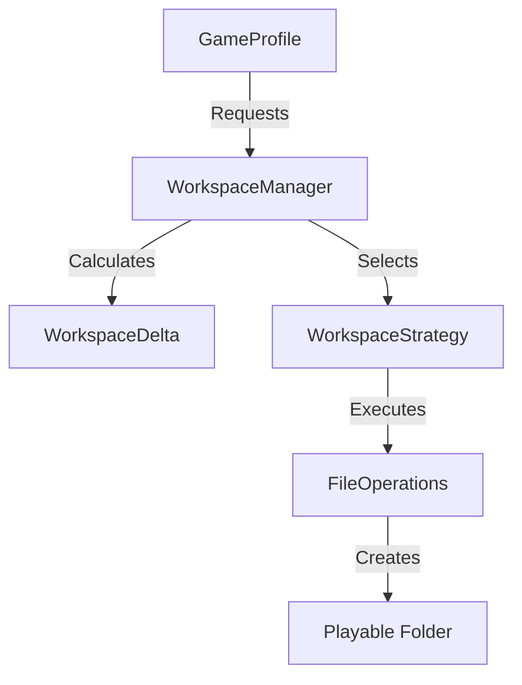

The **Workspace System** is the "Virtual File System" of GeneralsHub. It assembles a playable game folder on demand by combining the base game files with enabled mods, maps, and patches, all without modifying the original installation.

## Architecture

The system uses a **Strategy Pattern** to create workspaces, allowing for different trade-offs between isolation, speed, and disk usage.

## Reconciliation System

Before creating a workspace, the `WorkspaceReconciler` analyzes the existing folder to determine the minimal set of operations needed. This enables **Incremental Updates** (delta patching) rather than full rebuilds.

### Delta Logic

The reconciler compares the `TargetConfiguration` (what files should exist) against the `CurrentState` (what files currently exist).

1. **Conflict Resolution**: If multiple manifests provide the same file (e.g., a mod overwrites `INIZH.big`), the winner is chosen based on **Priority**:
   * `Mod` > `Patch` > `Addon` > `GameInstallation`.
2. **Delta Operations**:
   * **Add**: File is missing.
   * **Update**: File exists but is outdated (Size mismatch, Hash mismatch, or Broken Symlink).
   * **Remove**: File exists but is not in the new configuration.
   * **Skip**: File is already up to date.

> [!TIP]
> **Performance Optimization**: The reconciler primarily uses **File Size** and **Modification Time** to detect changes. Deep SHA256 hashing is skipped during routine launches to ensure the game starts almost instantly.

## Workspace Strategies

The system supports multiple assembly strategies. The `HybridCopySymlink` strategy is the default and recommended choice.

### 1. Hybrid Copy-Symlink (Default)

Balances compatibility with disk usage.

* **Rule**:
  * **Essential Files** (Executables, DLLs, INIs, Scripts, files < 1MB): **Copied**.
  * **Asset Files** (.big archives, Audio, Maps): **Symlinked**.
* **Admin Rights**: Required on Windows for Symlinks.
* **Fallback**: If Admin rights are missing, it attempts to use **Hard Links**. If that fails (cross-volume), it falls back to **Full Copy**.

### 2. Full Copy

Maximum compatibility, maximum disk usage.

* **Mechanism**: Physically copies every file.
* **Pros**: 100% isolation; Modifying the workspace never affects the source.
* **Cons**: Slowest creation time; High disk usage (2GB+ per profile).

### 3. Hard Link

High speed, low disk usage, no Admin rights required.

* **Mechanism**: Creates NTFS Hard Links.
* **Constraints**: Source and Workspace must be on the **same drive volume** (e.g., both on `C:`).
* **Risk**: Modifying the file content in the workspace *changes the source file* because they point to the same data on disk.

### 4. Symlink Only

Minimum disk usage.

* **Mechanism**: Symlinks everything.
* **Pros**: Instant creation.
* **Cons**: Some game engines (like SAGE) behave unexpectedly when essential config files are symlinked.

## CAS Integration

Workspaces are fully integrated with **Content Addressable Storage (CAS)**.

* Manifests can reference files by **Hash** (SHA256).
* Strategies can pull files directly from the CAS pool (`.gemini/antigravity/cas/`).
* This allows multiple mods to share common assets without duplication.
